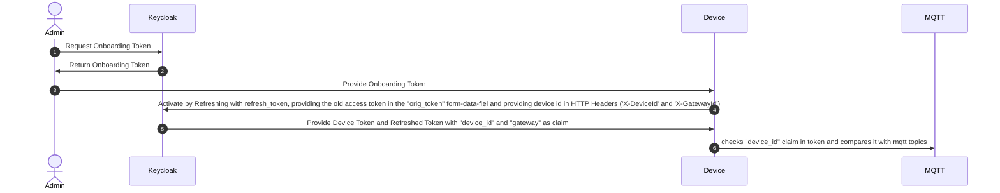

# IFF IoT Agent


The agent sends metrics data to the IFF-PDT.

## Utils
The utils directory contains bash scripts to setup and activate a device.
### init-device.sh
This script is setting up the default device-file and metadata.
```bash
Usage: init-device.sh[-k keycloakurl] [-r realmId] [-d additionalDeviceIds] <deviceId> <gatewayId>
Defaults: 
keycloakurl=http://keycloak.local/auth/realms
realmid=iff

```
Example:
```bash
./init-device.sh urn:iff:deviceid:1 gatewayid
./init-device.sh -d urn:iff:subdeviceid:1 -d urn:iff:subdeviceid:2 urn:iff:deviceid:1 gatewayid
```
First example creates a device with a single urn and a gateway id. Second example creates a device with subcomponents `urn:iff:subdeviceid:1` and `urn:iff:subdeviceid:2`.
Note that `deviceid` and `additionalDeviceIds` must be compliant wiht URN format.
### get-onboarding-token.sh
This script assumes a setup device-file, creates an onboarding token and stores it in the data directory.
```bash
Usage: get-onboarding-token.sh [-p password] [-s secret-file-name] <username>
-p provide password through commandline. If missing, password will requested interactively
-s if set, it puts the token into a k8s secret with name 'secret-file-name' otherwise it will be dumped to file ../data/onboard-token.json.
```
example
```
Usage: ./get-onbaording-token.sh -p LhCU0Jd9zwoHD40izcf6s10hdLUiOuqQ realm_user
```
The secret of the realm_user can be retrieve from K8s by using:
```bash
kubectl -n iff get secret/credential-iff-realm-user-iff -o jsonpath='{.data.password}'| base64 -d | xargs echo
```

### activate.sh
This script assumes a setup device-file and a onboarding-token either dumped to file or a kubernetes secret. I takes an obaording secret an created a device token which is stored in the `data` directory
```bash
Usage: activate.sh [-s] [-f]
```
Example:
```bash
./activate.sh -f
```

### send-data.sh
This script sends data to a device. It uses as default the UDP API (see below) to communicate to the Agent. If no id is given, it is assumed to use the default `deviceId`. If data is sent to subcomponents, the `-i` switch is used together with the URN of the respective subdevice id.
```bash
Usage: send_data.sh [-a] [-t] [-y <attribute type>] [-d datasetId] [-i subdeviceid] [<propertyname> <value>]+ 
-a: send array of values
-t: use tcp connection to agent (default: udp)
-d: give ngsild datasetId (must be iri)
-i: id of subdevice
-y: attribute types are {Literal, Iri, Relationship, Json, List}
```

### Use tools alltogether to activate a device and send data
On a test system with a local kubernetes installed the following flow creates a default test device

```bash
./init-device.sh urn:iff:deviceid:1 gatewayid
password=$(kubectl -n iff get secret/credential-iff-realm-user-iff -o jsonpath='{.data.password}'| base64 -d)
./get-onboarding-token.sh -p ${password} realm_user
./activate.sh -f
./send_data.sh "https://example.com/state" "ON"
```

Send data in combination of subdevices looks as follows:

```bash
./init-device.sh -d urn:iff:subdeviceid:1 -d urn:iff:subdeviceid:2 urn:iff:deviceid:1 gatewayid
./get-onboarding-token.sh -p ${password} realm_user
./activate.sh -f
./send_data.sh "https://example.com/state" "ON" # sends data to root/main device urn:iff:deviceid:1
./send_data.sh -i urn:iff:subdeviceid:1 "https://example.com/state" "OFF" # sends data to subdevice/subcomponent urn:iff:subdeviceid:1
```

### iff-agent
This is a "agent" program intended to run as a service. You can send a very simple NGSI-LD component message, such as
```
{"n": "<uri>", "v": 26.9, "t": "Property"}
{"n": "<uri>", "v": "<urn>, "t": "Relationship"}
```
or an array like this
```
[{"n": "<uri>", "v": 26.9, "on": 1618325707931, "t": "Property"},{"n": "<url>", "v": 27.2, "on": 1618325787105, "t": "Property}]
```
to a UDP socket on port 41234 or TCP socket on port 7070. The agent will handle secure communication with the upstream IFF instance.
Note that the `<uri>` is the fully expanded JSON-LD field name of the property or relationship. E.g. The NGSI-LD object looks like

```json
{
  "id": "urn:iff:deviceid:1",
  "type": "type",
  "http://example.com/state": "state" 
}

```
then the state can be updated by
```json
{"n": "http://example.com/state", "v": "ON", "t": "Property"}
```
Note that the `t` paramter can be left out. In this case the default value for `t` is `Property`. 

### IFF-agent with Subcomponents

In the example above the metrics were sent directly to the main or root deviceId. But when subcomponents are involved, the specific subcomponent IDs need to be addressed. This can be done by the addiontal `"i"` paremeter:

```
{"n": "<uri>", "v": 26.9, "t": "Property", "i": "<subcomponentId>"}
{"n": "<uri>", "v": "<urn>, "t": "Relationship", "i": "subcomponentId>}
```
for instance:
```
{"n": "http://example.com/state", "v": "ON", "t": "Property", "i": "urn:iff:subdeviceid:1"}

```

## Installing
``` bash
npm install
```

#### Configuration
Before using the agent you need to configure it so it knows how to communicate with your OISP instance. The agent looks for the configuration file 'config.json' in the 'config' directory. A template is provided in the 'config' directory which you can copy and modify using your favourite text editor.

``` bash
cp config/config.json.template config/config.json
```

#### Starting the Agent

To start the oisp-agent service simply execute the start script:
``` bash
./iff-agent.js
```


### Configure SparkPlugB Standard 

1. To enable SparkplugB standard data format, you need to update the agent config as below:

``` bash
 "mqtt": {
              "host": "emqx-listeners",
              "port": 1883,
              "qos": 1,
              "retain": false,
              "secure": false,
              "strictSSL": false,
              "retries": 5,
              "sparkplugB": true, 
              "version": "spBv1.0"            
          }
```
 - "SparkplugB":true -> enables the sparkplugB feature of agent
 - "version": "spBv1.0", -> version of spB standard, default is spBv1.0
 
 2.  CID is used as alias, as sparkplugB standard suggest unique id as alias in data metric element.
   Data message looks like below:

``` bash
    var cid = "0c574252-31d5-4b76-bce6-53f2c56b544d";
    var DataMessage = {
            timestamp: 12345,
            metrics: [{
                name : "temp",
                alias : cid,
                timestamp : 12345,
                dataType : "float",
                value: 123
            }],
            seq: 1
         };
```

3. Sending NGSI-LD compatible data over Mqtt-SparkplugB
- Register devices for custom Relationship and Property catalog
- Use device name for Relationship as " Name : Relationship/Name_of_device",

    Datatype is iri (String):

    Eg. Name: "Relationship/https://industry-fusion.com/types/v0.9/hasFilter"

- Use device name format for Property as " Name: Property/Name_of_device"

  Datatype can be literals(string, integer,boolean) and iri(string)

  Eg. Name: "Property/https://industry-fusion.com/types/v0.9/state"


## Using Docker

To build and run the Docker container for the agent, run the below 'make' commands with necessary metadata required for the onboarding scripts.

** To Build the Image

Before build, edit the config.json.template in the config folder with appropriate host and port values.

````bash
cd util

make build IMAGE_NAME=<dockerImageName>
````

** To Run the Image

The below makefile command initiates the device locally, creates device file wth credentials locally, starts the Docker image with device.json mount from local connected to digital twin keycloak at local URL. Pass the ACTIVATION_MODE=file to make command for Docker only local execution.

Relam user password from digital twin:

`$(kubectl -n iff get secret/credential-iff-realm-user-iff -o jsonpath='{.data.password}'| base64 -d)`

````bash
cd util

make start ACTIVATION_MODE=<file or secret> IMAGE_NAME=<dockerImageName> DEVICE_ID=<Device ID> GATEWAY_ID=<gateway id> PASSWORD=<realm user password>
````

Note: For Kubernetes, before using the Docker image in Pod, the device activation and onboarding token generation steps must be done on the device using individual scripts. Use secrets for onboarding token and pass the ACTIVATION_MODE=secret to container directly.


#### Known limitations
 
* TBD


## Onboarding

The onboarding is designed to work with the direct OIDC API from Keycloak. The `direct_grant` flow is used to generate an `offline` session. Every session is assigned to a single device

### Onbarding Flow


There are two kinds of tokens:
1. Onboarding Token - A token which is not yet assigned to a specific device and can be used to onboard any device.
2. Device Token - A token which has assigned a specific device and can be refreshed with a `refresh token`. A Device Token is generated by refreshing an Onboarding Token, adding the old `access_token` to the `orig_token` form-field and set in this request the headers `X-DeviceId` and `X-GatewayId`

(1) Example for payload of Onboarding Token
```
{
  "exp": 1702836209,
  "iat": 1702835909,
  "jti": "5e19faa2-f03b-448d-a3bb-177d4332e6a2",
  "iss": "http://keycloak.local/auth/realms/iff",
  "aud": "mqtt-broker",
  "sub": "542f92bb-6f7c-485c-bb21-8e3da1eb1d87",
  "typ": "Bearer",
  "azp": "device",
  "session_state": "52d52892-8486-4af7-9d2b-438c528e70c8",
  "scope": "device_id gateway mqtt-broker offline_access",
  "sid": "52d52892-8486-4af7-9d2b-438c528e70c8"
}
```
(2) Example for payload of Device Token
```
{
  "exp": 1702836294,
  "iat": 1702835994,
  "jti": "2702cd10-0726-44b0-8c4d-2c4d4e93bbe9",
  "iss": "http://keycloak.local/auth/realms/iff",
  "aud": "mqtt-broker",
  "sub": "542f92bb-6f7c-485c-bb21-8e3da1eb1d87",
  "typ": "Bearer",
  "azp": "device",
  "session_state": "52d52892-8486-4af7-9d2b-438c528e70c8",
  "scope": "device_id gateway mqtt-broker offline_access",
  "sid": "52d52892-8486-4af7-9d2b-438c528e70c8",
  "device_id": "deviceidx",
  "gateway": "gatewayid"
}
```
(3) Example for payload of Tainted (and thus invalidated) Token
```
{
  "exp": 1702836361,
  "iat": 1702836061,
  "jti": "f0b66d6b-3ae9-4a78-b16a-c13b0ddffcbf",
  "iss": "http://keycloak.local/auth/realms/iff",
  "aud": "mqtt-broker",
  "sub": "542f92bb-6f7c-485c-bb21-8e3da1eb1d87",
  "typ": "Bearer",
  "azp": "device",
  "session_state": "52d52892-8486-4af7-9d2b-438c528e70c8",
  "scope": "device_id gateway mqtt-broker offline_access",
  "sid": "52d52892-8486-4af7-9d2b-438c528e70c8",
  "device_id": "TAINTED",
  "gateway": "TAINTED"
}
```
