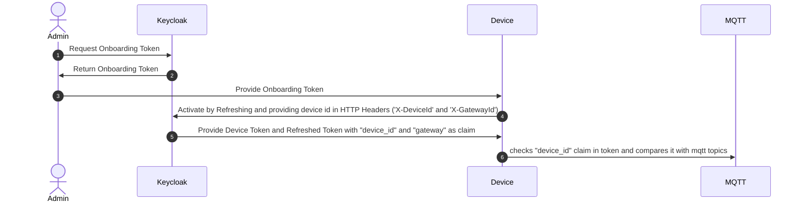

# IFF IoT Agent


The agent sends metrics data to the IFF-PDT.

## Utils
The utils directory contains bash scripts to setup and activate a device.
### init-device.sh
This script is setting up the default device-file and metadata.
```bash
Usage: init-device.sh <deviceId> <gatewayId> [-k keycloakurl] [-r realmId]
Defaults: 
keycloakurl=http://keycloak.local/auth/realms/iff
realmid=iff
```
Example:
```bash
./init-device.sh deviceid gatewayid
```

### get-onbaording-token.sh
This script assumes a setup device-file, creates an onboarding token and stores it in the data directory.
```bash
Usage: get-onbaording-token.sh [-p password] [-s secret-file-name] <username>
-p provide password through commandline. If missing, password will requested interactively
-s if set, it puts the token into a k8s secret with name 'secret-file-name' otherwise it will be dumped to file ../data/onboard-token.json.
```
example
```
Usage: ./get-onbaording-token.sh -p LhCU0Jd9zwoHD40izcf6s10hdLUiOuqQ realm_user
```
The secret of the realm_user can be retrieve from K8s by using:
```bash
kubectl -n iff get secret/credential-iff-realm-user-iff -o jsonpath='{.data.password}'| base64 -d | xargs echo
```

### activate.sh
This script assumes a setup device-file and a onboarding-token either dumped to file or a kubernetes secret. I takes an obaording secret an created a device token which is stored in the `data` directory
```bash
Usage: activate.sh [-s] [-f]
```
Example:
```bash
./activate.sh -f
```

### send-data.sh

### Use tools alltogether
On a test system with a local kubernetes installed the following flow creates a default test device

```bash
./init-device.sh deviceid gatewayid
password=$(kubectl -n iff get secret/credential-iff-realm-user-iff -o jsonpath='{.data.password}'| base64 -d)
./get-onbaording-token.sh -p ${password} realm_user
./activate.sh -f
./send_data.sh "https://example.com/state" "ON"
```

### oisp-agent
This is a "agent" program intended to run as a service. You can send a very simple message, such as
```
{"n": "temp", "v": 26.9}
```
or an array like this
```
[{"n": "temp", "v": 26.9, "t": 1618325707931},{"n": "temp", "v": 27.2, "t": 1618325787105}]
```
or a component registration
```
{"n": "temp", "t": "temperature.v1.0"}
```
or a device update
```
{"attributes": {"owner": "Scott Ware"}, "tags": ["home","intel","x86_64"], "loc": [32.149989, -110.835842, 0]}
```
to a UDP socket on port 41234 or TCP socket on port 7070. The agent will handle secure communication with the upstream OISP instance.

## Installing
``` bash
npm install
```

#### Configuration
Before using the agent you need to configure it so it knows how to communicate with your OISP instance. The agent looks for the configuration file 'config.json' in the 'config' directory. A template is provided in the 'config' directory which you can copy and modify using your favourite text editor.

``` bash
cp config/config.json.template config/config.json
```
  
#### Testing the connection
Run the following command to test the connection: 
``` bash
./oisp-admin.js test
```

#### Configuring and Activating the Agent

Set a unique Device Id with this command:
``` bash
./oisp-admin.js set-device-id <device_id>
```

You can also set a different Device name with this command:
``` bash
./oisp-admin.js set-device-name <device_name>
```

After the device registration, copy the activation code in _My Account_ UI, tab _Details_ (in _Account_ menu) and execute the activation command:
``` bash
./oisp-admin.js activate <activation_code>     
```
To verify activation, go back to your OISP dashboard and verify the status of the device previously registered.

#### Adding Sensors and Actuators

View in _My Account_ the _Catalog_ tab. You see predefined Sensors and Actuators but can also define your own types. For instance a default sensor is the _temperature.v1.0_ sensor. It can be added by the following command with the name _temp_:
``` bash
./oisp-admin.js register <name> <type>
```
e.g.
``` bash
./oisp-admin.js register temp temperature.v1.0
```

You can also register a component by sending
```
{"n": "temp", "t": "temperature.v1.0"}
```
to a UDP socket on port 41234 or TCP socket on port 7070.

#### Sending Metrics

After that, values for the component _temp_ can be sent by either the _oisp-admin_ to test, e.g.
```
./oisp-admin.js observation temp 22.1
```

or when the oisp-agent is running by sending
```
{"n": "temp", "v": 26.9}
```
or an array like this
```
[{"n": "temp", "v": 26.9, "t": 1618325707931},{"n": "temp", "v": 27.2, "t": 1618325787105}]
```
to a UDP socket on port 41234 or TCP socket on port 7070.

Dependent of the configuration, the agent sends data with REST or MQTT. If MQTT is configured, agent and admin always try to use MQTT for data submission and control. All other calls, like activation of devices or registration of components is always done with REST.

#### Starting the Agent

To start the oisp-agent service simply execute the start script:
``` bash
./oisp-agent.js
```
## Usage

For examples of how to use the 'oisp-agent' please see the [Examples](https://github.com/Open-IoT-Service-Platform/oisp-iot-agent/tree/master/examples) provided.

### Enabling SparkPlugB Standard 

1. To enable SparkplugB standard data format, you need to update the agent config as below:

``` bash
 "mqtt": {
              "host": "emqx",
              "port": 1883,
              "qos": 1,
              "retain": false,
              "secure": false,
              "strictSSL": false,
              "retries": 5,
              "sparkplugB": true, 
              "version": "spBv1.0"            
          }
```
 - "SparkplugB":true -> enables the sparkplugB feature of agent
 - "version": "spBv1.0", -> version of spB standard, default is spBv1.0
 
 2.  CID is used as alias, as sparkplugB standard suggest unique id as alias in data metric element.
   Data message looks like below:

``` bash
    var cid = "0c574252-31d5-4b76-bce6-53f2c56b544d";
    var DataMessage = {
            timestamp: 12345,
            metrics: [{
                name : "temp",
                alias : cid,
                timestamp : 12345,
                dataType : "float",
                value: 123
            }],
            seq: 1
         };
```

3. Sending NGSI-LD compatible data over Mqtt-SparkplugB
- Register devices for custom Relationship and Property catalog
- Use device name for Relationship as " Name : Relationship/Name_of_device",

    Datatype is iri (String):

    Eg. Name: "Relationship/https://industry-fusion.com/types/v0.9/hasFilter"

- Use device name format for Property as " Name: Property/Name_of_device"

  Datatype can be literals(string, integer,boolean) and iri(string)

  Eg. Name: "Property/https://industry-fusion.com/types/v0.9/state"

## Test

The oisp-agent project uses [gruntjs](http://gruntjs.com/) [mocha](http://visionmedia.github.io/mocha/) as its test framework. 
To run all tests:
``` bash
npm install 
./node_modules/grunt-cli/bin/grunt
```

## Certificates

> Do not use the default certificates in production.

The OISP Agent includes default certificates to provide "out of the box" connectivity. These are fine for public data submissions but should not be used for production deployments.

## Using Docker

### Build the image
````bash
make
````

### Start container with bash to configure agent
````bash
make configure
````

### Start container (connect to production server)
````bash
make start
````

### Start container (connect to local server)
````bash
make start-local
````

### Stop container
````bash
make stop
````

### Remove container and image 
````bash
make clean
````
#### Known limitations
 
* Components registered through the OISP Cloud API will not be known by the oisp-agent.


## Onboarding

The onboarding is designed to work with the direct OIDC API from Keycloak. The `direct_grant` flow is used to generate an `offline` session. Every session is assigned to a single device

### Onbarding Flow


There are two kinds of tokens:
1. Onboarding Token - A token which is not yet assigned to a specific device and can be used to onboard any device.
2. Device Token - A token which has assigned a specific device and can be refreshed with a `refresh token`. A Device Token is generated by refreshing an Onboarding Token and set in this request the headers `X-DeviceId` and `X-GatewayId`

(1) Example for payload of Onboarding Token
```
{
  "exp": 1702836209,
  "iat": 1702835909,
  "jti": "5e19faa2-f03b-448d-a3bb-177d4332e6a2",
  "iss": "http://keycloak.local/auth/realms/iff",
  "aud": "mqtt-broker",
  "sub": "542f92bb-6f7c-485c-bb21-8e3da1eb1d87",
  "typ": "Bearer",
  "azp": "device",
  "session_state": "52d52892-8486-4af7-9d2b-438c528e70c8",
  "scope": "device_id gateway mqtt-broker offline_access",
  "sid": "52d52892-8486-4af7-9d2b-438c528e70c8"
}
```
(2) Example for payload of Device Token
```
{
  "exp": 1702836294,
  "iat": 1702835994,
  "jti": "2702cd10-0726-44b0-8c4d-2c4d4e93bbe9",
  "iss": "http://keycloak.local/auth/realms/iff",
  "aud": "mqtt-broker",
  "sub": "542f92bb-6f7c-485c-bb21-8e3da1eb1d87",
  "typ": "Bearer",
  "azp": "device",
  "session_state": "52d52892-8486-4af7-9d2b-438c528e70c8",
  "scope": "device_id gateway mqtt-broker offline_access",
  "sid": "52d52892-8486-4af7-9d2b-438c528e70c8",
  "device_id": "deviceidx",
  "gateway": "gatewayid"
}
```
(3) Example for payload of Tainted (and thus invalidated) Token
```
{
  "exp": 1702836361,
  "iat": 1702836061,
  "jti": "f0b66d6b-3ae9-4a78-b16a-c13b0ddffcbf",
  "iss": "http://keycloak.local/auth/realms/iff",
  "aud": "mqtt-broker",
  "sub": "542f92bb-6f7c-485c-bb21-8e3da1eb1d87",
  "typ": "Bearer",
  "azp": "device",
  "session_state": "52d52892-8486-4af7-9d2b-438c528e70c8",
  "scope": "device_id gateway mqtt-broker offline_access",
  "sid": "52d52892-8486-4af7-9d2b-438c528e70c8",
  "device_id": "TAINTED",
  "gateway": "TAINTED"
}
```