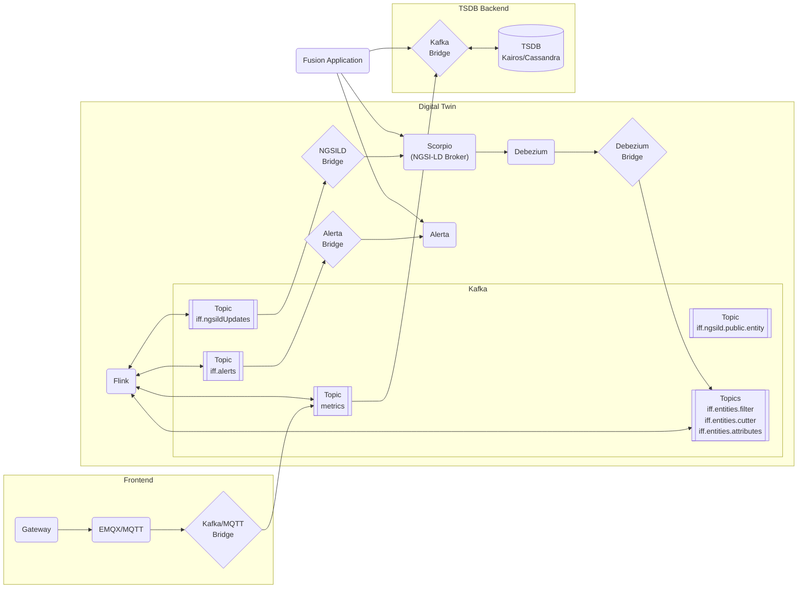

# Digital Twin of Industry Fusion

---

 

This repository contains the ingredients for the Ditigal Twin Concept of Industry Fusion. The Digital Twin allows to manage NGSI-LD based entities and allow StreamingSQL and SHACL based descriptions of the processes.

## Architecture

## Contents

* [E2E tests](test/README.md)
* [Kafka Bridges](KafkaBridge/README.md)
* [Helm Deployment](helm/README.md)
