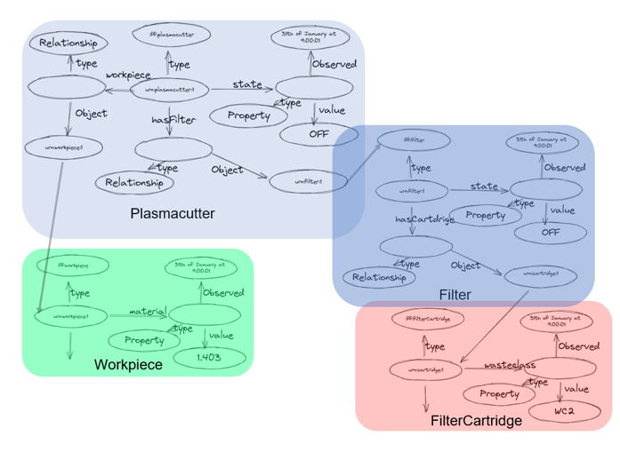
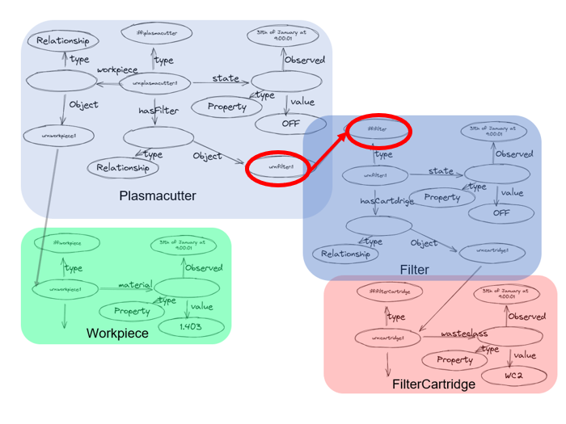
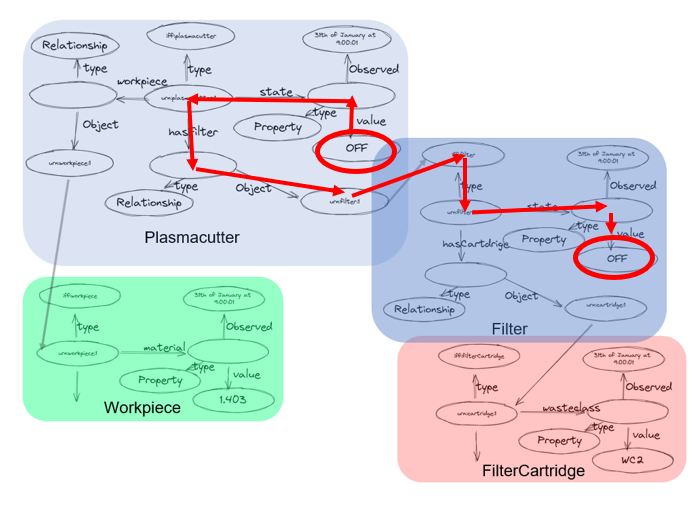
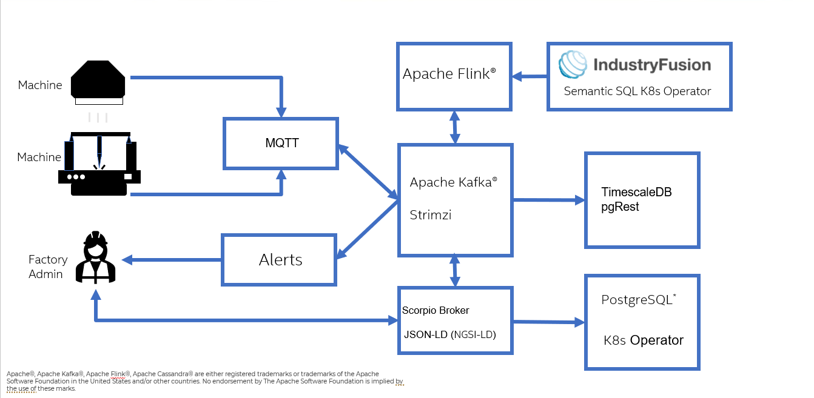
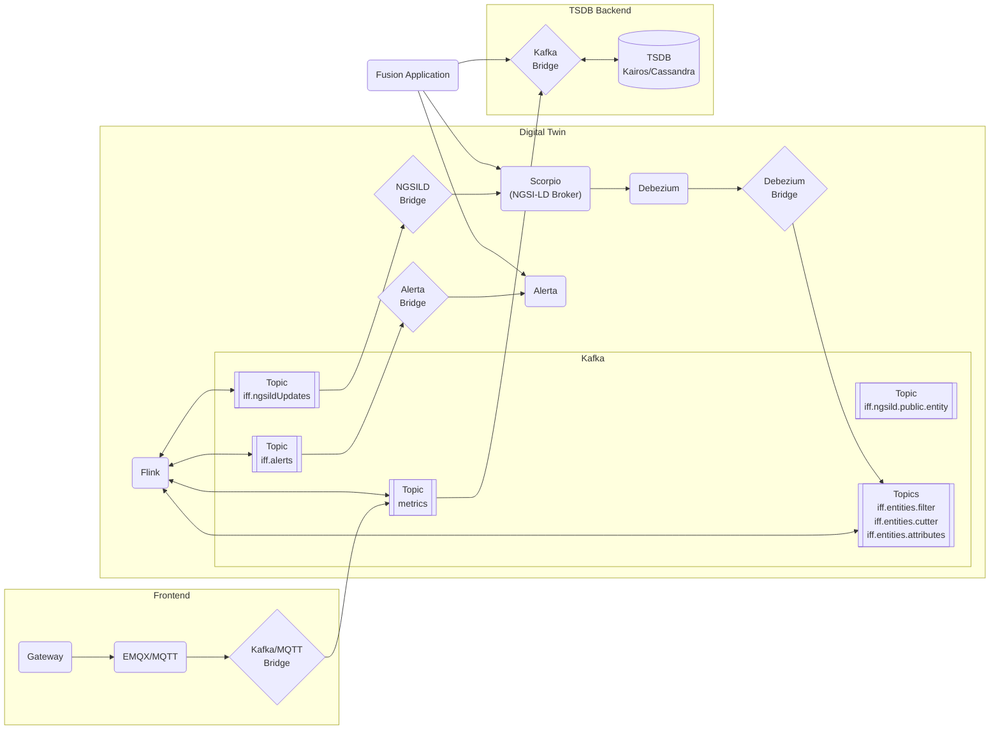

# IndustryFusion Process Data Twin

---

 

Welcome to the **Industry Process Data Twin** repository, an open-source initiative by the IndustryFusion Foundation (IFF). This project aims to revolutionize the manufacturing industry by leveraging cutting-edge semantic data technologies and cloud-native principles to create a scalable, interoperable, and highly automated platform for factory digitalization.

## What is the IndustrFusion Process Data Twin?

The Process Data Twin Architecture is designed to address the challenges of digital transformation in the manufacturing sector. It provides a framework that bridges the gap between diverse factory systems, devices, and processes by introducing a standardized, semantic data-driven approach. This platform enables seamless integration, real-time monitoring, and advanced analytics, paving the way for smart factories and Industry 4.0 advancements.

### Key Features
- **Semantic Data Model**: At the core of the architecture lies a semantic data framework built on **JSON-LD**/**NGSI-LD**, **RDF**, **OWL**, and **SHACL**. These technologies ensure that data is machine-readable, interoperable, and consistent across diverse systems.
- **Cloud-Native Scalability**: The architecture is deployed on Kubernetes, ensuring it can scale effortlessly across edge, on-premises, and cloud environments.
- **Real-Time Data Processing**: Factory processes are monitored and managed using Apache Flink, defined declaratively with Streaming SQL, for real-time analytics and optimization.
- **Open Standards**: The platform adheres to CNCF-certified Kubernetes clusters and open-source principles, promoting vendor independence and community-driven development.

## Why Semantic Technologies?

Semantic technologies provide the foundation for creating a unified and meaningful representation of manufacturing data:

1. **JSON-LD**/**NGSI-LD**: Simplifies data integration by embedding linked data into a lightweight, JSON-compatible format.
2. **RDF**: Models data as a graph of relationships, enabling flexible and extensible representations of factory processes.
3. **OWL**: Adds reasoning capabilities to derive insights and ensure logical consistency.
4. **SHACL**: Ensures data quality and compliance by validating data against predefined constraints.

By adopting these technologies, the architecture ensures interoperability, adaptability, and high data quality, critical for modern manufacturing environments.

## Why This Matters

Manufacturing ecosystems often involve heterogeneous systems and devices with limited interoperability. This architecture provides a standardized approach to:
- **Break Down Silos**: Enable seamless communication between different systems.
- **Improve Data Quality**: Ensure consistent, accurate, and validated data across the board.
- **Enable Advanced Analytics**: Lay the groundwork for predictive maintenance, process optimization, and more.
- **Promote Sustainability**: Facilitate data-driven decisions for energy efficiency and carbon neutrality.

## Copncept

This repository contains the ingredients for the Digital Twin Concept of IndustryFusion. 

The IndustryFusion Foundation (IFF) employs a semantic data approach to enhance interoperability and data integration within manufacturing environments. This methodology utilizes Semantic Web frameworks, including the Resource Description Framework (RDF) and JSON-LD, to create a standardized, machine-interpretable data model. By defining clear relationships between data points, this approach facilitates seamless communication across diverse systems and devices. In the context of IFF's Cloud Native Digital Twin architecture, this semantic data model enables the precise representation of factory processes and equipment, ensuring consistent data inter# Cloud Native Digital Twin Architecturepretation across various platforms. 
The concept is described in a KubeCon presentation [here](https://kccncna2022.sched.com/event/182Gu/energizing-the-manufacturing-industry-with-kubernetes-and-cloud-native-marcel-wagner-intel).
A basic set of entities is shown here:

This shows 4 simple Entities, a Cutter, a Workpiece, a Filter and a FilterCartridge. The Entities are linked to each other and build a graph. Since the Entities are represented in JSON-LD(NGSI-LD) they can be interpreted as subgraph of the whole graph. Since such a graph can become vera large it is important that it can be validated. A first simple validation is to make sure that the Entities are linked together correctly, e.g. that the Plasmacutter is connected to the right filter. This can be validated with SHACL, e.g. the following picture shows a simple type validation:

But since this builds a large graph, there can be arbitrary graph based rules and constraints. For instance, the next image shows a case when the state of the Plasmacutter is compared with the state of the Filter. This can be formulated in a SHACL rule and supervised in real-time:

The Digital Twin allows to apply SHACL rules in real-time to NGSI-LD models. The scaling is achieved by tranlating the SHACL rules into StreamingSQL on Apache Flink. This allows to monitor a large amount of entities with a large amount of rules with minimal latency. 

## Get Started

The building and deployment of the platform is described [here](./helm/README.md)

## Architecture

On high level, the data is streamed to the PDT through MQTT and mapped directly to Kafka. 
On Kafka the data is mapped to the different databases (e.g. Scorpio for the current state of the PDT, TimescaleDB for the history of Properties and Relationship, Alerta for the Alerts, etc.) and is analyised by Flink based on the StreamingSQL which is createt from the SHACL rules and constraints:

The detailed flow of data is shown below.

## Other Links

* [E2E tests](test/README.md)
* [Kafka Bridges](KafkaBridge/README.md)
* [Helm Deployment](helm/README.md)

## License

