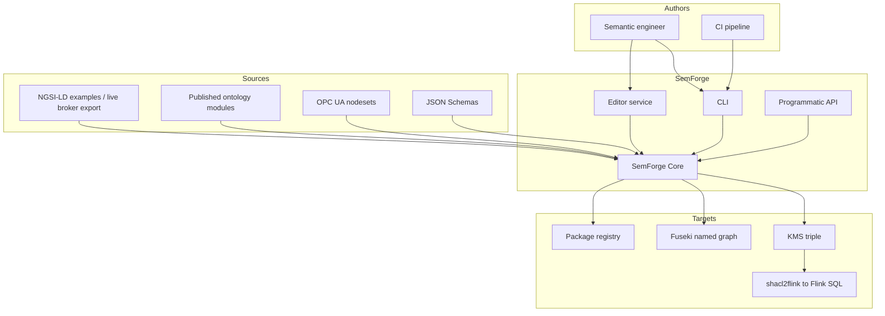
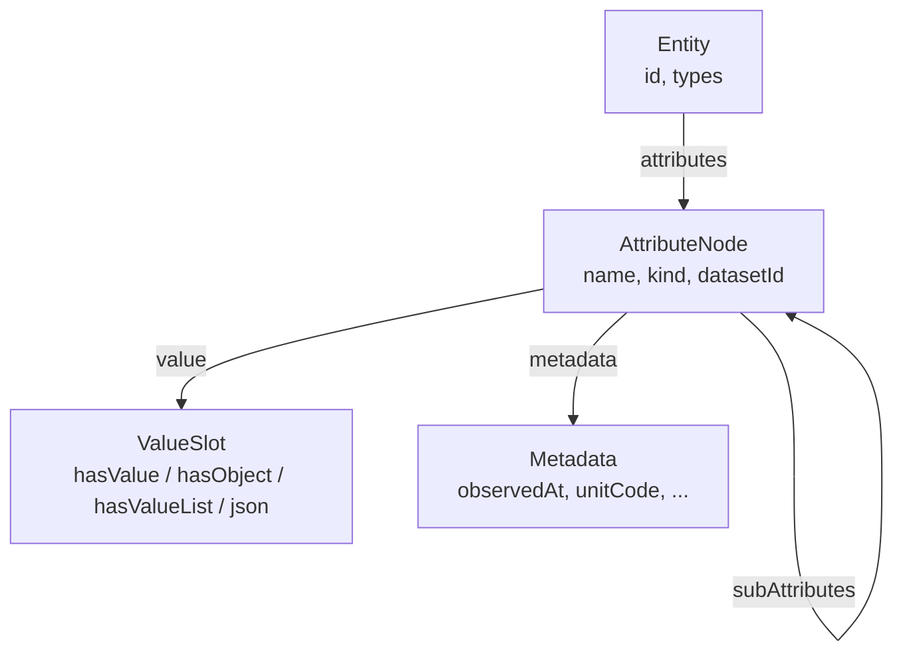
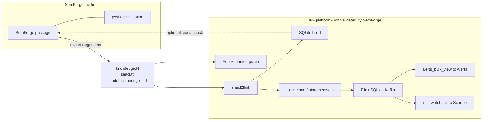

# SemForge Architecture

Companion to [`manifest.md`](./manifest.md). The manifest states *what* SemForge
must be and *why*. This document states *how* it is built: the components, the
central data structure, the interfaces between them, and the invariants that
must hold across all of them.

It is written against the existing IndustryFusion
[DigitalTwin](https://github.com/IndustryFusion/DigitalTwin) KMS toolchain,
because SemForge is not a greenfield system: KMS already defines the artifact
triple, the NGSI-LD-to-RDF encoding, the constraint compilation model and the
test methodology that SemForge generalises. Section 2 summarises what KMS is
today; the rest of the document builds on it. Where a mechanism already exists
it is named; where SemForge must add one it is marked **(new)**.

---

## 1. Architectural drivers

The manifest yields six drivers that shape every decision below.

| # | Driver | Source | Consequence |
|---|---|---|---|
| D1 | One semantic interpretation, many clients | §2.1, §8 | All semantics live in Core. CLI, LSP, VS Code, CI are adapters with no semantic logic of their own. |
| D2 | Raw and cooked are two views of one state | §2.2 | No cooked-only or raw-only information. Every cooked edit must round-trip losslessly to standards artifacts. |
| D3 | Observed ≠ proposed ≠ declared | §2.3, §6 | Provenance is part of the model, not a report generated over it. |
| D4 | Examples are executable specifications | §2.4, §2.5, §4.6 | The expectation store is a first-class artifact with the same lifecycle as shapes. |
| D5 | Escape hatches everywhere | §2.7 | The interpretation model must be a *projection* of RDF, never a replacement. Unrepresentable input must survive edit/save. |
| D6 | Arbitrary attribute nesting | §10.1 | The node model is recursive with no depth constant. Depth limits belong to *compilation targets*, not to Core. |

Two further drivers come from the KMS reality rather than from the manifest:

| # | Driver | Source | Consequence |
|---|---|---|---|
| D7 | A constraint that never ran looks exactly like a constraint that passed | `shacl2flink/docs/supported-features.md` §"Unsupported shapes fail the build" | Silence is never success. Every validation result must distinguish *conformant* from *not evaluated*. |
| D8 | SemForge validates offline; the platform executes | manifest §1, §11, §12 | pyshacl is *the* validator and SHACL is *the* semantics. Streaming execution is a downstream deployment target, not something Core validates against. |

---

## 2. What KMS is today

### 2.1 The triple

KMS is three artifacts, held in `semantic-model/kms/`:

- **K** — `knowledge.ttl`: OWL/RDF. Classes, object properties, individuals,
  taxonomies. Open-world.
- **M** — `model-instance.jsonld`: NGSI-LD entities. The instance data.
- **S** — `shacl.ttl`: SHACL shapes, SPARQL constraints, SPARQL rules.
  Closed-world.

`knowledge.ttl` and `shacl.ttl` are not hand-authored monoliths. `make
ontology2kms` fetches the published ontology tree from `ontology.baseUri` and
flattens it with `rdfpipe`, following a three-file-per-domain convention:

```
<domain>_entities.ttl    OWL vocabulary   -> merged into knowledge.ttl
<domain>_knowledge.ttl   individuals      -> merged into knowledge.ttl
<domain>_shacl.ttl       shapes           -> merged into shacl.ttl
```

Observed domains: `base`, `filter`, `material`, `bindings/base_test`. **KMS is
therefore already a flattened composition of modules** — it just has no
manifest describing the composition, no versioning of it, and no way back from
the flattened file to the module that contributed a triple.

### 2.2 The NGSI-LD-in-RDF encoding

This encoding is the single most load-bearing fact in the system, and it is why
KMS shapes look the way they do. An NGSI-LD attribute becomes a blank node:

```
<urn:filter:1>  base:hasStrength  _:b  .
_:b             ngsild:hasValue   0.6  .
_:b             ngsild:observedAt "2024-02-27T13:54:55.400Z" .
```

Relationships use `ngsild:hasObject` (IRI), list properties `ngsild:hasValueList`.
Sub-attributes hang off the same blank node, recursively. Every KMS shape has
the resulting two-layer form — an outer property shape asserting cardinality and
`sh:nodeKind sh:BlankNode` on the *attribute*, and an inner property shape on
`ngsild:hasValue`/`ngsild:hasObject` constraining the *value*:

```turtle
sh:property [ sh:path base:hasStrength ; sh:minCount 1 ; sh:maxCount 1 ;
              sh:nodeKind sh:BlankNode ;
              sh:property [ sh:path ngsild:hasValue ;
                            sh:minInclusive 0.0 ; sh:maxInclusive 100.0 ] ] .
```

Two consequences SemForge inherits:

- A cooked-mode edit such as "strength is between 0 and 100" touches *two*
  nested property shapes, not one. Cooked/raw synchronisation (D2) must be
  defined over this encoding, not over generic SHACL.
- Path expressions must be written through the encoding. `CartridgeShape`'s
  "a cartridge sits in at most one filter" is `( [sh:inversePath ngsild:hasObject]
  [sh:inversePath base:hasCartridge] )` — a bare inverse of `hasCartridge`
  matches nothing. Any cooked-mode path builder must generate the hop pair.

### 2.3 The three jobs SHACL does

KMS uses SHACL for three architecturally distinct purposes that SemForge must
keep distinct:

1. **Core constraints** — cardinality, datatype, value range, class of an IRI
   value. Compiled into count/datatype/range checks. Report through
   `constraint_trigger_table`.
2. **SPARQL constraints** (`sh:sparql`) — cross-entity conditions no Core shape
   can express: `StateOnCutterShape` ("cutter PROCESSING while its filter is not
   ON"), `FilterStrengthShape` (required strength as a function of workpiece
   height). They carry `sh:severity` drawn from the knowledge graph
   (`severityCritical`, `severityWarning`) and write **straight to the alerts
   sink**, bypassing `constraint_trigger_table`.
3. **SPARQL rules** (`sh:rule`, `sh:construct`) — *derivation*, not validation.
   `TimestampCartridgeFromRulesShape` stamps `isUsedFrom` the first time its
   filter turns ON; `ChangeWasteClassRulesShape` escalates a cartridge's
   `hasWasteclass` when the material being cut has a higher hazard class, guarded
   by `FILTER NOT EXISTS { ?wasteclass higherHazardLevel ?new_wasteclass }` over
   a transitive ordering. Their CONSTRUCT output is written *back* into entity
   state and out to the broker.

Job 3 makes the model a feedback loop: rule output becomes model input.

### 2.4 Knowledge carries semantics, not just vocabulary

`hasState`'s value is an IRI into the knowledge graph, and its legality is a
*derived* fact: `StateValueShape` fails a state that has no `isValidFor` reaching
the entity's type through `rdfs:subClassOf*`. `higherHazardLevel` is an
`owl:TransitiveProperty` whose closure decides whether a waste class escalation
fires. Constraints are therefore evaluated against an **inference closure of the
knowledge graph**, not against its asserted triples
(`create_knowledge_closure.py`).

### 2.5 Bindings: a fourth artifact class

`base_knowledge` defines `Binding` / `BoundMap` / `boundBy`, mapping connector
attributes to NGSI-LD attributes with a datatype and an embedded SPARQL logic
fragment that also computes a `trustLevel`:

```turtle
base:hasState base:boundBy test:stateBindingCutter .
test:stateBindingCutter  base:bindsMap test:_map1, test:_map2 ;
    base:bindsLogic """WHERE { BIND(IF(?var1 = true, ... ) as ?value) ... }""" .
```

This is data-acquisition configuration living inside the knowledge graph. It is
not validation and not ontology; SemForge treats it as a **domain extension**
(§10), not as a core concept.

### 2.6 Compilation and deployment

`shacl2flink` compiles the triple into two SQL dialects **from one set of
templates**: SQLite (offline oracle) and Flink SQL (streaming, deployed as a
Helm chart of statementsets over Kafka). Knowledge closure and instances become
tables; shapes become continuous queries; results land in `alerts_bulk_view` as
`(resource, event, severity, text)` where `event` is the derived constraint
identity, e.g. `SPARQLConstraintComponent(StateOnCutterShape)` or
`CountConstraintComponent(<path> ==> <subpath>)`. `shacl.ttl` and
`knowledge.ttl` are additionally published into a Fuseki named graph for
ad-hoc SPARQL.

Compilation is governed by rules SemForge adopts wholesale:

- **Unsupported shapes fail the build**, naming every problem at once. Rationale
  is D7.
- **Shapes are not rewritten.** The old `shacl_normalized.ttl` pass is gone;
  connectives are evaluated over a Tseitin boolean circuit instead. Only
  `sh:node` resolution remains, and it is verified by byte-identical SQL between
  an inlined and a referenced fixture.
- **Depth is one number.** `MAX_SUBPROPERTY_DEPTH` in `lib/utils.py` (currently
  2, i.e. three levels) drives both the constraint table's path columns and the
  join chain. It is a target-profile knob, not a semantic limit.

### 2.7 The existing test methodology

`tests/sql-tests/` is the manifest's examples-and-expectations idea in
primitive form, and it works:

```
kms-constraints/<case>/   knowledge.ttl  shacl.ttl  context.jsonld
                          model1.jsonld  model1.jsonld_result
                          model2.jsonld  model2.jsonld_result   ...
kms-rules/<case>/         same shape, asserting rule output
kms-udf/<case>/           same shape, asserting UDF behaviour
sql-cases/<case>/         attributes.sql + expected   (states no model can express)
```

A `_result` file is the sorted `(resource, event, severity)` projection of
`alerts_bulk_view`. Four properties of this design are worth preserving
verbatim:

- **`kms-constraints/kms/` symlinks the production KMS.** Fixtures cannot drift
  onto last month's shapes. (A *copy* is how the `sql-core` chart ended up
  running SQL the generator had already fixed.)
- **`sql-cases` pins `text`.** The alert message is a product surface; an
  unasserted message shipped `Found 0 relationships instead of [[1, 1]!` on a
  Property check and every test stayed green.
- **`pyshacl-compare/compare.py`** re-validates every fixture with an
  independent SHACL implementation. Fixtures say what we *expected*; only a
  spec-conforming engine says what SHACL *requires*. Note where this check
  lives: it is `shacl2flink`'s own guard on its own compiler, and it stays
  there (§7.4).
- **`tests/e2e-kms/`** is a throwaway KMS compiled and deployed to a live Flink
  for `make test-flink-e2e`, then undeployed — the production KMS is never
  touched.

What it lacks is exactly what the manifest asks for: no declared expectation of
*which* constraint should fail and why, no negative/positive classification, no
regression diff — a changed `_result` file is a textual diff a human must
interpret, in which an incidental change and a real regression look the same.
What it gets *right*, and what §7.5 preserves, is that the expected output pins
the entire verdict projection rather than only the line under test.

### 2.8 Adjacent generators

Two importers already produce KMS artifacts and are the template for SemForge's
importer port:

- **`semantic-model/opcua/`** — `nodeset2owl.py` turns OPC UA nodesets into OWL;
  `owl2vt.py` derives Virtual Types; a shape generator emits SHACL whose entire
  output is compile-tested by `make test-opcua-shapes` (a generator that starts
  emitting something untranslatable fails there, not by hand later).
  `check_consistency.py` runs the HermiT DL reasoner over the built ontologies —
  **this is the manifest's §5.2 ontology consistency check, already existing**,
  with the caveat that `owlready2` is LGPL and deliberately not in
  `requirements.txt`.
- **`semantic-model/datamodel/tools/`** — Node.js: `jsonschema2owl.js`,
  `jsonschema2shacl.js`, `jsonldConverter.js`, `validate.js`. The older
  JSON-Schema-driven generation path.

---

## 3. System context



SemForge sits **upstream of KMS**. It does not replace `shacl2flink`, Flink,
Scorpio or Fuseki; it produces the triple they consume, and it can invoke
`shacl2flink` as one validation backend among several (§7.4).

---

## 4. Layered decomposition

```mermaid
flowchart TB
    subgraph L4["Clients"]
        VSC[VS Code extension]
        CLIC[CLI]
        CIC["CI / programmatic API"]
    end
    subgraph L3["Service layer"]
        LSP[LSP server]
        SFAPI["SemForge protocol - non-LSP ops"]
        SESS[Session and workspace state]
    end
    subgraph L2["Core"]
        SIM[Semantic Interpretation Model]
        PROV[Provenance graph]
        EXPECT[Expectation store]
        ORCH[Validation orchestrator]
        DERIVE[Derivation engine]
        DIFF[Semantic diff]
        COMPILE[Compilation manager]
        PKG["Package loader / writer"]
    end
    subgraph L1["Ports"]
        IMP["Importer port"]
        VAL[Validator port]
        REASON[Reasoner port]
        TGT[Target profile port]
        SER[Serializer port]
    end
    subgraph L0["Adapters"]
        A1[NGSI-LD importer]
        A2[OPC UA importer]
        A3[JSON Schema importer]
        A4[pyshacl validator]
        A5["shacl2flink SQLite validator"]
        A6["shacl2flink Flink profile"]
        A7["HermiT / owlready2 reasoner"]
        A8["Turtle / JSON-LD serializers"]
    end

    L4 --> L3 --> L2 --> L1 --> L0
```



**Rule (D1):** dependencies point downward only. No adapter may be referenced by
name above L1. No client may hold semantic state that Core does not hold.

### 4.1 Component responsibilities

| Component | Owns | Does not own |
|---|---|---|
| **Package loader/writer** | On-disk layout, `semforge.yaml`, module resolution, round-trip fidelity | Validation, derivation |
| **SIM** | The canonical typed graph: entities, recursive attribute nodes, OWL elements, shapes, rules, paths | Persistence, execution |
| **Provenance graph** | Origin of every SIM element, confidence tier, supporting evidence | Semantics of what it annotates |
| **Expectation store** | Example classification, expected violations, test selection metadata | Running the tests |
| **Validation orchestrator** | Which validators run on which scope, result normalisation, evaluation-coverage accounting | The validation algorithms |
| **Derivation engine** | Candidate structures/constraints from examples, tier assignment | Promoting anything to `declared` |
| **Semantic diff** | Model-level change classification, impact analysis over examples | Textual diffing |
| **Compilation manager** | Target profile selection, capability checking, artifact emission | Target-specific SQL generation |

---

## 5. The Semantic Interpretation Model

The SIM is the object D1 refers to when it says "one semantic interpretation".
Everything else in Core reads or annotates it.

### 5.1 Core principle: projection, not replacement

The SIM is a **typed, indexed projection over an RDF dataset that remains the
ground truth.** Core holds the dataset; the SIM holds navigable structures
pointing into it.

This directly serves D5. An expert who adds an OWL axiom SemForge has no
concept for must still be able to save, validate and diff the package. Under a
replacement model that axiom is lost on the next write. Under a projection
model it is simply not projected: it sits in the dataset, participates in
reasoning and validation, and appears in raw mode. Cooked mode renders what it
can and marks the rest.

**Invariant P1 (round-trip):** for every package, `load` then `save` with no
edits must produce a dataset isomorphic to the input (blank-node labelling
aside). This is testable and must be a test.

**Invariant P2 (edit locality):** an edit through the cooked API must change
only the triples backing the edited element. Formatting and unrelated triples
in a hand-authored file are preserved.

P2 is why serialization is a port. A naive rdflib round-trip reorders and
reformats an entire Turtle file, which makes every cooked edit produce an
unreviewable git diff and destroys the comments KMS shapes carry — comments
that are load-bearing documentation there (see `CartridgeShape`).

### 5.2 The node model



`AttributeNode` is recursive with **no depth constant anywhere in Core** (D6).
Depth limits are properties of a target profile and are reported as such:
"this constraint exceeds the `shacl2flink` profile's depth of 3", never
"too deep".

`kind` ∈ {Property, Relationship, GeoProperty, ListProperty, JsonProperty}. Each
kind fixes the value slot and hence the RDF projection, so the encoding of §2.2
lives in exactly one place: the `AttributeNode` ↔ RDF mapping.

### 5.3 Paths

A `SemanticPath` addresses any node in that tree and is the *only* way
constraints, expectations, diffs and UI selections refer to a location:

```
Machine / hasFilter                          attribute
Machine / hasFilter / hasTrust               sub-attribute of a relationship
Machine / hasFilter -> Filter / hasCartridge cross-entity traversal
FilterCartridge <- hasCartridge <- hasObject inverse (the §2.2 hop pair)
```

A path compiles to a SHACL property path, and the inverse form emits the
two-hop `ngsild:hasObject` / attribute pair automatically. Paths are the
substrate of D2: a cooked selection *is* a path, and a raw `sh:path` parses
*into* a path.

### 5.4 Constraint identity

The manifest (§4.4) requires stable constraint IDs; KMS derives them
structurally (`CountConstraintComponent(<path> ==> <subpath>)`). Derived IDs
change whenever the path changes, which makes the very expectation
`violates="machine.filter.required"` unstable across exactly the edits
regression testing is meant to catch.

**Decision:** SemForge assigns every constraint a **declared, stable ID** and
persists it in the SHACL as an annotation on the shape:

```turtle
[] a sh:PropertyShape ;
   semforge:id "machine.filter.required" ;
   sh:path base:hasFilter ; sh:minCount 1 .
```

Rules:
- IDs are stable across path and parameter changes; only explicit rename
  changes one, and rename is a diff-visible operation.
- IDs are generated on creation from path + component, then frozen.
- The derived KMS identity is retained as a *secondary* key so alerts coming
  back from a deployed Flink can be attributed to a declared constraint.
- `semforge:` annotations are non-normative: stripping them yields valid
  standard SHACL, and every consumer must ignore them (per manifest §9,
  project-specific metadata is confined to what standards do not cover).

### 5.5 Provenance and tiers

Every SIM element carries a **tier** (D3):

| Tier | Meaning | Participates in validation | Written to `shacl.ttl` |
|---|---|---|---|
| `observed` | Seen in example data | no | no |
| `proposed` | Derivation engine suggests it | no | no |
| `declared` | Explicitly stated by a human or an accepted proposal | yes | yes |

Only `declared` compiles. `Machine.temperature.observed.datatypes` and
`Machine.temperature.constraints` are different accessors over the same node
because they read different tiers — manifest §2.3, mechanised.

Provenance records origin (`imported-ontology`, `imported-shacl`,
`imported-example`, `derived-proposal`, `sdk-declaration`, `manual-rdf`,
`extension`), source locator (file + line, or importer + input), timestamp, and
supporting/contradicting example references. `Machine.temperature.why()` is a
query over this graph; observed evidence stays attached after promotion, so
"why does this exist" answers with both the declaration and the data that
motivated it.

Provenance is stored **out of band**, in a sidecar under the package (§6), not
as triples in `knowledge.ttl`/`shacl.ttl`. Reason: those two files are consumed
by `shacl2flink`, closure computation and Fuseki, all of which would otherwise
see provenance triples as domain knowledge — and `higherHazardLevel`-style
transitive closure over a graph polluted with tooling triples is a defect
waiting to happen.

---

## 6. Package architecture

### 6.1 Layout

Extending manifest §3 with what §2 showed is needed:

```text
machine-semforge/
├── manifest.md
├── semforge.yaml              package identity, modules, profiles, deps
├── contexts/
│   └── context.jsonld
├── ontology/                  -> knowledge.ttl (entities + individuals)
│   ├── base_entities.ttl
│   ├── base_knowledge.ttl
│   └── material.ttl
├── constraints/               -> shacl.ttl (Core shapes)
│   └── base_shacl.ttl
├── rules/                     -> shacl.ttl (sh:sparql + sh:rule)
│   └── filter_rules.ttl
├── examples/                  arbitrary user-defined subtrees (§4.7)
│   ├── machine-basics/
│   ├── filter-cases/
│   └── regression-2026-09/
├── expectations/
│   └── validation.yaml
├── .semforge/
│   ├── provenance.jsonl       generated, committed
│   ├── residue/               generated, committed  (§7.5)
│   │   └── <example>.yaml
│   ├── derived.ttl            proposed tier, never compiled — git-ignored
│   └── cache/                 git-ignored
└── tests/
```

The `ontology/` + `constraints/` + `rules/` split reproduces the
`_entities` / `_knowledge` / `_shacl` convention KMS already uses, but as
*addressable modules with a manifest* rather than as a filename convention
resolved by `rdfpipe` and shell globbing.

#### What the loader reads today: a file **or** a directory, per role

The modular layout above is where this goes; what M1 reads is the KMS triple —
and each of its three roles may now be **one file or a directory of them**:

| Role | File | Directory | Documents |
|---|---|---|---|
| knowledge | `knowledge.ttl` | `knowledge/` | `*.ttl` |
| shapes | `shacl.ttl` | `shacl/` or `shapes/` | `*.ttl` |
| model | `model-instance.jsonld` | `model-instance/` | `*.jsonld` |

**`model/` groups the data.** The scratchpad and the suite are two kinds of data
about the same model, so they belong at the same level under one name:

```text
model/
├── model-instance.jsonld     the scratchpad — or model-instance/, or bare *.jsonld
└── examples/                 the suite: test_<Shape>/{good,bad}/ + expectations.yaml
```

Both layouts are read, and they compose: `model/model-instance/` beside
`model/examples/` is as valid as the flat `model-instance.jsonld` + `examples/`
the kms has. `model/examples` is a **sibling** of the instance, never part of it
— the instance scan is non-recursive precisely so a suite cannot leak into the
model graph (`test_multifile.py` asserts an entity that exists only in a case
stays out of `package.model`).

A file wins when both are present: that is the older, explicit answer, and two
sources for one role would otherwise be ambiguous. The directory is read
non-recursively — a nested directory is somebody's own structure, and walking
into it would quietly adopt whatever is there, including an examples suite.

The graph is the **union** either way, so nothing downstream changes: the same
triples, the same verdicts, isomorphic graphs (`test_multifile.py`). What does
change is **where an edit lands**, and that is the whole risk of the feature. A
writer that reached for "the role's file" would put a constraint into the first
document of a directory regardless of which one declares the shape. So:

* `Package.files(role)` — every document, in load order;
* `Package.index(role)` — a `PackageIndex` over all of them, answering
  `file_for(subject)`, `block_for`, `locator` and `text_for`;
* every writer (cooked edits, `ensure_property_shape`, value edits) targets the
  file the subject is IN, and every diagnostic is attributed to the file that
  declares the shape it is about.

`semforge export` goes the other way and **concatenates**: shacl2flink is handed
one `shacl.ttl` and one `knowledge.ttl`, because how a package is organised is
the author's business and what a compiler is handed is the target's.

#### Creating one: `semforge init`

A package is created by the SDK (`semforge/package/scaffold.py`), from the CLI
or from the editor over `semforge/init` — one code path, because a package made
by the editor that differs from one made by the CLI is a bug waiting to be
reported as "works on the command line".

Two gestures reach it, and they are different things. **New project** creates
the *directory* and offers to open it (`semforge new <name>`, or the SemForge
submenu on a folder in the Explorer); **create a package here** scaffolds a
directory that already exists (`semforge init <path>`). Both end in
`create_package`, and a test asserts the two produce identical trees.

What it writes is deliberately small and deliberately complete: the entity root
and one type, one vocabulary class with individuals, a node shape in the
**two-layer NGSI-LD encoding** (the outer `sh:property` asserts the attribute
blank node, the inner one constrains `ngsild:hasValue`), a scratchpad instance,
and a suite with a good case *and* a bad one whose `asserts` names the
constraint it must make fire.

The last part is the point. A skeleton with only a passing example would teach
the habit this architecture exists to break: a constraint with no firing example
is indistinguishable from one that is satisfied (§7.4, §7.5). `semforge test
--coverage` on a fresh package therefore reports one `two-sided` constraint and
is honest that the rest are `no-firing-example`.

The scaffold refuses a directory that already holds an artifact rather than
merging into it, and `init` proves its own output by loading and validating it
before reporting success.

#### The model instance is the scratchpad; `examples/` is the suite

The Model view says so in its shape: two sections, **Tests** and **Main**. A
case under Tests declares what it is for and passes or fails; Main declares
nothing and cannot fail. The instance file is read as `main.jsonld` or
`model-instance.jsonld` — the same role under the name the tree uses and the
name the kms has.

Both live under `model/` when a package groups them, and they stay disjoint
either way: `package.model` is the union of the instance documents only, while a
case is composed into its own graph from its file plus its declared includes.
What they share is `knowledge` and `shapes` — the same constraints judge both.

Both are needed and they answer different questions. The examples under
`examples/` are the test suite: each declares what it is for, `semforge test`
passes or fails on it, and coverage is measured over it (§7.5). The model
instance is the **scratchpad** — the place to try a violation and watch what a
constraint does. It carries no expectation, it cannot fail a run, and the
examples tree shows it as such: one root per model document, labelled *a
scratchpad, not a declared example*.

### 6.2 `semforge.yaml`

Read by four modules -- the context, the prefixes, the dependency list, the
entity root -- and until `semforge.package.config` none of them could say what
a package's settings *are*. A settings list that is whatever happens to be in
the file cannot show what has NOT been set, which is most of what a reader
needs about a package they did not write; so the settings are **declared**
(`config.SPEC`), and each one reports its value, its line, and what applies in
its absence.

Writing is **line-based, never a YAML round-trip**. The comments in this file
are its documentation -- the scaffold writes a paragraph above every key saying
what it decides -- and a round-trip through a parser deletes all of them. A
write finds the key's line, replaces the value on it, and leaves the rest of
the file byte-for-byte; a key that is absent is appended with its paragraph.
A package with no `semforge.yaml` (the kms layout) acquires one on the first
edit.


```yaml
name: machine-semforge
version: 1.3.0
namespaces:
  base:     https://industryfusion.github.io/contexts/example/v0/base_entities/
  material: https://industryfusion.github.io/contexts/ontology/v0/material/
contexts: [contexts/context.jsonld]
modules:
  - ontology/base_entities.ttl
  - ontology/base_knowledge.ttl
  - constraints/base_shacl.ttl
  - rules/filter_rules.ttl
dependencies:
  - name: material-ontology
    version: "^0.1"
    source: https://industryfusion.github.io/contexts/staging/ontology/v0.1/
profiles:
  default: shacl2flink
  shacl2flink:
    maxSubpropertyDepth: 2
reasoning:
  closure: [rdfs:subClassOf, owl:TransitiveProperty]
  consistency: hermit          # optional, see §7.3
```

`dependencies` is the piece KMS has no representation for. Today `make
ontology2kms` wgets a URL tree and merges whatever it finds; nothing records
which ontology version a KMS was built from, so a KMS cannot be reproduced from
its own contents. Declaring dependencies with versions makes the flattened
triple **reproducible**, which is a precondition for the manifest's §7 semantic
diff across releases.

### 6.3 Export to KMS

`semforge export --target kms` emits exactly the triple `shacl2flink` expects:

```
knowledge.ttl        merge(ontology modules + resolved dependencies)
shacl.ttl            merge(constraints + rules), semforge: annotations retained
model-instance.jsonld  selected example set
```

Two things the exporter must handle, learned from KMS:

- **Deployment variants.** `model-instance.jsonld` (four `hasStrength`
  observations sharing a `datasetId`, exercising dedup) and
  `model-instance.scorpio.jsonld` (one value, NGSI-LD §4.5.5.1 conformant for a
  *request*) are the same model serialized for different consumers. The
  exporter therefore takes an **emission mode**: `compile` keeps the observation
  stream, `broker` collapses each `(id, datasetId)` to its latest `observedAt`
  as NGSI-LD §4.5.5.3 requires. This is a serializer concern, not two files a
  human keeps in sync.
- **Header stability.** Export must be deterministic — stable prefix
  assignment, stable statement order — or every export produces a spurious git
  diff and the semantic diff drowns in noise. The `default1:`/`default2:`
  auto-prefixes in today's `knowledge.ttl` are exactly this failure.

---

## 7. Validation architecture

### 7.1 The four activities

Manifest §5 lists four; they differ in input, engine and failure meaning:

| Activity | Input | Engine | Failure means |
|---|---|---|---|
| Instance validation | example + shapes + closure | SHACL engine (validator port) | data violates a constraint |
| Ontology consistency | ontology only | DL reasoner (reasoner port) | the *model* is contradictory |
| Package validation | package | Core, static | the package is malformed |
| Regression validation | expectations + results | Core, comparative | behaviour changed |

They must never be collapsed in reporting. An inconsistent ontology is not
"three invalid examples"; it is one modelling error that happens to make three
examples meaningless.

### 7.2 Validator port

```
validate(dataset, shapes, closure, scope) -> ValidationReport
capabilities() -> ProfileDescriptor
```

`ValidationReport` normalises across engines to: focus node, path, constraint ID
(declared, §5.4), source shape, severity, message, **and evaluation status**.

**Invariant V1 (D7):** every constraint in scope appears in the report with
status `conformant`, `violated`, `not-applicable` or `not-evaluated`. A
constraint absent from a report is a bug in the adapter, not a pass. Silence is
never success.

This directly generalises the KMS discovery that a SPARQL constraint can be dead
for months: `StateOnFilterShape` asked for `?pc a Plasmacutter` while instances
typed `Cutter`, and compared against the typo `iffBaseEntities:state_PROCESSING`.
It could not fire at all before 2026-08-22, and every test stayed green.

Nothing about that is specific to the compiler — a SPARQL body whose WHERE
clause matches nothing produces an empty result under `pyshacl` too, and an
empty result is indistinguishable from a satisfied constraint unless the report
says which constraints were evaluated. V1 is what makes the difference
visible.

### 7.3 Reasoner port

```
closure(ontology, entailments) -> dataset
consistency(ontology) -> ConsistencyReport
```

Two adapters:
- **Closure adapter** — the entailments validation actually needs
  (`rdfs:subClassOf*`, transitive properties). Mirrors
  `create_knowledge_closure.py`. Cheap, always on, required for correctness:
  `StateValueShape` and `ChangeWasteClassRulesShape` are both wrong without it.
- **Consistency adapter** — full DL, via HermiT. Optional, run at export time as
  a sanity check (manifest §5.2). **Constraint:** `owlready2`/HermiT are
  LGPL-3.0 and cannot be a hard dependency of an Apache-2.0 distribution — the
  same constraint `semantic-model/opcua` already documents. The adapter must
  detect absence at import time and degrade to "not checked", never to "checked
  and consistent".

### 7.4 One validator, and what is deliberately out of scope (D8)

**`pyshacl` is the validator. SHACL is the semantics. That is the whole of
SemForge's validation story**, and `semforge validate` / `semforge test` never
need anything else.

This is a scope decision, not a preference for one library. SemForge is an
offline authoring and validation SDK: it answers "does this example conform to
these shapes", and the authority on that question is the SHACL specification as
implemented by an independent, spec-conforming engine. A package that validates
is *correct*; it is then exported and deployed to `shacl2flink` (§14) as a
separate step.

**Making `pyshacl` agree with the compiled SQL is explicitly not SemForge's
job.** If the Flink SQL generated from a shape does not do what SHACL says the
shape means, that is a `shacl2flink` defect, to be found and fixed by
`shacl2flink`'s own suite — which already has the machinery for it
(`tests/sql-tests`, `pyshacl-compare/compare.py`, `tests/e2e-kms`, §2.7). Core
holds no model of Flink, of Kafka, of streaming state, or of the alert
projection those produce.

An earlier draft of this document made all three engines co-equal "oracles" and
promoted cross-engine agreement to a core feature. That was wrong twice over: it
contradicted §9.3 and §14, which correctly keep Flink knowledge out of Core, and
it would have made SemForge responsible for reconciling a compiler it does not
own.

**The SQLite cross-check is available and optional.** `shacl2flink` compiles to
SQLite and Flink SQL from one set of templates (C3), so running the SQLite build
of a package is a cheap, purely offline sanity check on the compiled form, with
no cluster involved. It is worth having behind an explicit flag:

```bash
semforge validate                          # pyshacl. the answer.
semforge validate --cross-check sqlite     # additionally run the compiled SQLite build
```

A disagreement is reported as `divergence` (§13 error model) and is a bug report
*for `shacl2flink`* — never a data violation, never something SemForge tries to
reconcile, and never a reason to hold up a package whose pyshacl verdict is
clean. It is a courtesy check, and CI may skip it.

**Flink is not an oracle here at all.** No SemForge command runs a Flink job.
What SemForge does owe the deployment path is the *static* capability check of
§9.1 — refusing to let an author ship a shape the target profile cannot compile
— and that reads a profile descriptor, not a cluster.

#### Result vocabulary

Results are SHACL validation results: focus node, path, source shape, declared
constraint ID (§5.4), severity, message, evaluation status. `alerts_bulk_view`,
`constraint_trigger_table`, Alerta severities and the Kafka topics behind them
are **platform vocabulary and appear nowhere in Core**. They are described in §2
only to explain where the package format and the test methodology came from.

### 7.5 Assertion scope, not evaluation scope (manifest §4.7)

The tempting design is a `focused` mode that restricts the *evaluated*
constraint set to the ones an example names, for speed and for readable
expectations. **It is unsound, and it reintroduces D7 one layer up.**

The compiler refuses to leave a shape silently unevaluated (C1). A declared
evaluation scope hands that same silence back to the author, per example: add a
new constraint to the package, and every pre-existing focused example keeps
passing without ever running it. The constraint is untested exactly where it
would have been violated, and nothing anywhere says so. `not-applicable` would
be an outright false statement about those constraints — they are applicable;
they simply were not run.

**Decision: the applicable constraint set is always evaluated in full. What an
example declares is which verdicts it *asserts*, never which constraints
*execute*.**

Everything evaluated but not asserted is the example's **residue**, and residue
is recorded rather than discarded:

```yaml
# expectations/validation.yaml
examples:
  - path: examples/filter-cases/stopped-filter.jsonld
    expect: invalid
    asserts:
      - constraint: filter.state.running-while-cutter-processing
        focusNode: urn:filter:1
        severity: warning
    residue: sha256:1f3c…          # digest of the full evaluated verdict set
  - path: examples/integration/complete-machine.jsonld
    expect: valid
    conformance: full              # residue must be empty: no violation at all
```

- `asserts` is what the example is *about*. A failure here is a semantic
  failure, reported against a named constraint, and is what the regression
  report and the semantic diff attribute changes to.
- `residue` is everything else the run produced, pinned by digest with the full
  verdict list in `.semforge/residue/<example>.yaml`. A minimal example is still
  allowed to violate constraints it does not care about — manifest §4.7 — but
  those violations are *recorded*, not waved through.
- `conformance: full` additionally requires the residue to be empty. This is the
  complete-entity integration test.

The property this buys is the one that matters here: **adding a constraint
changes the residue of every example it applies to.** The new constraint cannot
hide. It surfaces as a residue delta across the suite, which the author must
review and accept explicitly (`semforge accept --example … | --all`), and the
acceptance is a diff-visible change to the expectation files. A constraint that
is added and never fires anywhere is itself a reviewable signal — usually a
shape that does not match what its author thought it matched.

Residue is a set of SHACL validation results, not an alert projection — §7.4.

**Correction to §2.7.** I criticised the `_result` files there for pinning the
whole verdict set rather than the line under test, which is why unrelated
count-constraint warnings appear in every expected output and have to be
explained in a README. That whole-set property is not the defect — it *is*
residue pinning, arrived at the direct way, and it is the safety property being
preserved here. What those files genuinely lack is the assertion layer: nothing
in them says which line the test is about, so a real regression and an
incidental change look identical in the diff. The fix is to add `asserts` on
top, not to stop pinning the rest.

**Invariant V2:** an example's report covers every applicable constraint. There
is no per-example mechanism to exclude a constraint from evaluation.

### 7.5.1 Where the speed actually comes from

Dropping declared focus costs the speedup it was there for, so it has to be
recovered somewhere sound. The distinction is:

- a **declared** restriction — a human lists the constraints to run — is
  unsound, because nothing checks the list against what changed;
- a **derived** restriction — the engine runs the constraints whose verdict
  could have changed, and reads the rest from cache — is sound, because the
  unevaluated verdicts are still *known*, and V2 still holds over the merged
  report.

So the evaluation set is computed, not declared, from the incremental dependency
graph (§13): edit a constraint, and only examples whose data touches its path
re-run, and within those only the affected constraints. The cache is keyed on
`(package content hash, adapter version, constraint ID)`, so **adding or
changing a constraint invalidates precisely the entries that constraint
produced** — which is the same mechanism that guarantees a new constraint is
evaluated everywhere it applies. Coverage and speed come from one mechanism
rather than trading against each other.

Two consequences:

- Interactive edit-validate loops stay fast without any per-example
  configuration, and get faster than declared focus could, since the derived set
  is usually narrower than a hand-written list.
- CI runs cold. `semforge test` in a pipeline populates nothing from cache, so
  the guarantee CI reports is always the full evaluation.

### 7.6 Regression

```
regress(baseline: PackageState, current: PackageState, selection) -> RegressionReport
```

A regression is any of: expected-valid now invalid; expected-invalid now valid;
expected-invalid now failing a *different* constraint; a constraint that
previously evaluated now reporting `not-evaluated`; or an **unaccepted residue
delta** on any example (§7.5).

The fourth is the KMS-specific one and the reason V1 is an invariant: a shape
that silently stopped matching is the failure mode with no external symptom.

The fifth is what makes the suite complete rather than merely correct. The first
four all reason about constraints an example already asserts, so on their own
they say nothing about a constraint no example mentions — the case where a newly
added shape is wrong and every test still passes. Residue drift covers it,
because a new or changed constraint necessarily perturbs the residue of every
example within its target class.

---

## 8. Rules and derivation

`sh:rule` is architecturally distinct from every other constraint because it
**writes**. §2.3 job 3 has three properties that must be handled explicitly:

1. **Feedback.** Rule output is model input. `ChangeWasteClassRulesShape`
   reads `hasWasteclass` and writes `hasWasteclass`.
2. **Guarded monotonicity.** Termination comes from the guard, not from the
   engine: waste class only escalates, enforced by `FILTER NOT EXISTS { ?wasteclass
   higherHazardLevel ?new_wasteclass }` over the transitive closure;
   `isUsedFrom` writes once, guarded by `FILTER NOT EXISTS` on itself.
3. **Order sensitivity.** Whether one rule sees another's output depends on
   evaluation order, which SHACL-AF leaves to the engine.

**Decision:** SemForge evaluates rules to a **fixpoint with a declared iteration
bound**, and reports the iteration count. Non-termination within the bound is a
package-validation error naming the rules still firing — a rule whose guard does
not actually bound it is a modelling defect, and it must surface at authoring
time, not as an unbounded write loop against a live broker.

Rule expectations extend the expectation store:

```yaml
rules:
  - path: examples/filter-cases/material-change.jsonld
    rule: cartridge.wasteclass.escalate
    expect:
      - subject: urn:filtercartridge:1
        attribute: filter:hasWasteclass
        value: filterknowledge:WC2
    iterations: 1
```

This is what `tests/sql-tests/kms-rules/` asserts today via `_result` diffs, made
declarative and readable.

**Writeback is out of scope for Core.** Delivering constructed values to a broker
(Scorpio's `batchMerge` rejecting `{"@id": ...}` values, IRI routing via
`/attrs`) is a platform concern. SemForge asserts what a rule *derives*; the
platform decides how it lands.

---

## 9. Compilation and target profiles

### 9.1 Profile descriptor

A target profile declares its capabilities as data:

```yaml
profile: shacl2flink
maxSubpropertyDepth: 2
constraintComponents: [minCount, maxCount, datatype, nodeKind, class,
                       minInclusive, maxInclusive, in, or, not, sparql, rule]
unsupported:
  - component: xone
    context: value-shape
    reason: only sh:or is descended into at the value level
pathFeatures: [predicate, inverse, sequence, zeroOrMore]
```

`semforge validate --target <profile>` checks the package against the descriptor
*before* invoking the compiler, so a capability problem is reported as a
constraint-level diagnostic on the offending shape — with a file and line, in
the editor — rather than as a compiler stack trace.

### 9.2 Invariants adopted from `shacl2flink`

**C1 — Unsupported fails loudly, and reports everything at once.** Never a
warning, never partial emission. Rationale D7; the compiler's own
`ERROR: the following shapes cannot be compiled and would be silently unvalidated:`
is the model.

**C2 — Do not rewrite shapes.** No normalisation pass. The compiler reads the
SHACL the author wrote, so a diagnostic names a shape that exists in the file.
`shacl2flink` removed exactly such a pass because every rewrite was an
opportunity to change meaning silently, and three of the four connective
operators were mis-distributed by it. The one surviving rewrite, `sh:node`
resolution, is admissible under a strict test: it *substitutes* rather than
*redistributes*, refuses every case where the copy would merge with something
already present, and is proven by compiling to byte-identical output against an
inlined equivalent. Any future rewrite must meet the same bar.

**C3 — One template, many dialects.** SQLite and Flink SQL are generated from
one set of templates, which is what makes an offline SQLite run evidence about
Flink — and hence what makes the optional cross-check of §7.4 worth anything. A
profile that forks its templates forfeits that guarantee and must say so in its
descriptor.

**C4 — Limits are profile data, never Core constants.** `MAX_SUBPROPERTY_DEPTH`
belongs in the descriptor. Core stays depth-free (D6).

### 9.3 Streaming compilation as an extension

Manifest §11 is satisfied by the target profile port: `shacl2flink` is an
adapter behind it, invoked over the exported KMS triple. Core has no Flink
knowledge, no Kafka knowledge and no SQL knowledge. Conversely SemForge must not
absorb `shacl2flink`'s streaming semantics (state TTLs, retraction, watermarks,
dedup ordering). Those are properties of the execution environment, they are
`shacl2flink`'s to test, and Core models none of them (§7.4).

---

## 10. Extensibility

Every extension point of manifest §11 maps to a port:

| Extension | Port | Existing candidate |
|---|---|---|
| Custom validators | Validator | `pyshacl`, `shacl2flink`/SQLite |
| Custom rule compilers | Target profile | `shacl2flink`/Flink |
| Ontology consistency checkers | Reasoner | `check_consistency.py` (HermiT) |
| Semantic importers | Importer | `nodeset2owl.py`, `jsonschema2shacl.js`, NGSI-LD |
| Serialization formats | Serializer | Turtle, JSON-LD |
| Domain-specific model APIs | Domain extension | the **bindings** vocabulary (§2.5) |
| Streaming backends | Target profile | `shacl2flink` |
| External registries | Package resolver | `ontology.baseUri` |

**Importer contract.** An importer emits SIM elements at the `proposed` tier
with provenance, never at `declared`. This is D3 applied to generators: an OPC
UA nodeset is *evidence*, however authoritative it feels. A generator that must
emit declared semantics does so through an explicit acceptance step, which is
diff-visible.

**Domain extensions** (bindings) get typed accessors over vocabulary SemForge
does not itself interpret. They are projections like everything else; Core does
not know what a `BoundMap` means, and the extension does not get to bypass P1/P2.

---

## 11. Semantic diff

```
diff(a: PackageState, b: PackageState) -> SemanticDiff
```

Two layers:

1. **Model changes** — classified, not textual: property became required,
   datatype changed, allowed value removed, class hierarchy changed,
   relationship target changed, constraint weakened/strengthened, rule
   added/removed/reguarded.

   Weakened/strengthened is decidable for the parameter lattice
   (`minCount 1 → 0` weakens; `maxInclusive 100 → 50` strengthens) and
   undecidable in general for SPARQL bodies. The diff says so explicitly rather
   than guessing: a changed `sh:select` is reported as `rule-body-changed,
   impact-unknown`, and impact is then established empirically by layer 2.

2. **Behavioural impact** — re-run the affected example subset under both
   states and report expectation changes. This is what makes the manifest's §7
   report useful:

```text
Semantic regression detected

Constraint changed:
  machine.serialNumber.required   (minCount: 1 -> 0)

Affected example:
  examples/bad/missing-serial.jsonld

Expected: INVALID because machine.serialNumber.required
Actual:   VALID
```

Layer 2 is why constraint IDs must be declared and stable (§5.4). A structurally
derived ID changes with the path, so "the constraint changed" and "a different
constraint appeared" become indistinguishable in exactly the renames the diff
exists to explain.

Diff operates on `PackageState`, which may come from the working tree, a git
ref, or a registry version — `semforge diff v1.2.0 v1.3.0` resolves both through
the package resolver.

---

## 12. Interfaces

### 12.1 CLI

```bash
semforge where | init | inspect | derive | validate | test | explain | diff | export
```

The CLI is a thin argument-parsing shell over Core. CI uses the same binary; the
exit code is the contract (`0` conformant, `1` violations, `2` package invalid,
`3` internal). Machine-readable output (`--format json`) for every command that
reports.

**Which package a command applies to is resolved by walking up**, the way
`cargo` finds `Cargo.toml` and `git` finds `.git`: the nearest ancestor holding
`semforge.yaml`, else the nearest holding the three roles. A path argument names
a *position*, not a root. Reading the given directory and only that one meant
that running a command one level inside a package reported all three roles
missing, and one level above reported the same — both being the ordinary place
to be standing.

The resolved root is echoed on **stderr** by every command that reads one, so a
piped report stays a report while the question "which directory does this apply
to?" still has an answer on screen. `semforge where` asks it on its own.

One rule, one implementation (`semforge.package.discover`): the editor service
resolves a file's package through the same function, so the editor, the command
line and CI cannot drift apart about what a package is.

`semforge where` also reports the package's **declared name**. A package that
does not declare one is named by its directory, and two directories called
`test` are not the same project -- which is why `name:` is a first-class
setting and why `semforge init` writes it.

### 12.2 Editor service

LSP where the operation is an LSP operation — diagnostics, hover, completion,
go-to-definition, references — over `.ttl`, `.jsonld` and `.sparql` files.
Cross-artifact references are the high-value case and the reason the service
must be Core-backed: go-to-definition from `sh:path base:hasStrength` in
`shacl.ttl` to its `owl:ObjectProperty` declaration in `knowledge.ttl`, and
find-references from there to every example exercising it.

Operations that are not LSP-shaped — cooked-mode tree navigation, constraint
editing, scoped test execution, regression views, provenance queries — use a
**SemForge protocol**: JSON-RPC over the same connection, distinct method
namespace. Manifest §8.3 explicitly allows this, and forcing them into
`workspace/executeCommand` would make them opaque to any client.

#### 12.2.1 Four views, and the joins between them

The cooked side presents the package as the three artifacts it is made of —
constraints (`semforge/tree`), model (`semforge/model`) and knowledge
(`semforge/knowledge`) — because those are the three things an author edits and
each answers a question the others cannot: what must hold, what holds, what
exists. The views carry those names: **Constraints**, **Model**, **Knowledge**.
The model view holds both kinds of data `model/` holds — the declared cases and
the scratchpad — because "examples" named only half of what it showed.

The knowledge view shows the three things `knowledge.ttl` declares, not two:
entity types, vocabularies, and the **attributes** — under whatever carries
them (`rdfs:domain`, shown where declared because it is inherited), with
sub-attributes under the attribute they nest inside and `rdfs:subPropertyOf`
where a package has it. The file also declares the ontology's own relations,
which are never document keys; they are separated by the same test that decides
whether an attribute is an NGSI-LD one at all (an explicit `ngsild:` range, or
a shape naming it) and judged by their own rule, because "unused and
unchecked" is a statement about a document and says nothing about an ontology.

**Namespace names are package-wide.** One name per namespace, agreed once, and
every artifact bound to it — rdflib binds a single prefix per namespace, so a
second name evicts the first and a term copied between artifacts changes
meaning. A file that binds a name the package has not defined has therefore
invented one, which `prefixes.check` reports as an **error** (SF-PFX-003) and
not a matter of taste. `prefixes.STANDARD` holds the names every package uses and none should have to
declare — rdf, rdfs, owl, xsd, sh, and ngsild, whose vocabulary the SDK now
ships. They apply at the lowest precedence, under the context and under
`namespaces:`, so a package may still call one of them something else, and
`semforge init` no longer writes any of them into a new project.

`prefixes.add_namespace` is how the table grows:
validated (a usable name, a namespace IRI that ends in a separator, no
collision in either direction) and written to `namespaces:` in semforge.yaml,
which is the half a package owns — context.jsonld is a snapshot of a published
url, and diverging from what that url serves is the reproducibility problem in
another form. It is reachable from the editor (the Project view's namespaces
row), from `semforge prefixes --define`, and nowhere else, so there is one
writer.

`prefixes.plan_removal` answers the other direction before anything is
written, and it has three outcomes rather than two. Not the package's to remove
(it does not declare it). Load-bearing -- the namespace loses its only name, so
every file that binds the prefix has invented one and the model cannot expand a
term; refused, with the files and the term count. Or removable, because the
name survives (the context declares it too, or it is standard) or because
nothing uses it.

The last case splits again, and this is what `force` is for: a removable name
that is nonetheless IN USE is not removed on the first ask. A line that changes
nothing is still a line somebody wrote on purpose, and what the person clicking
is thinking about is that three files bind it -- so the answer comes back as a
question carrying the usage and the reason it is safe. `force` covers only that
case; a name that would actually be lost is never removed, whatever is passed.

A fourth group holds the **NGSI-LD vocabulary** — the terms of the encoding,
which are not the package's. Until it existed, *declared before used* was the
one rule this project did not apply to itself: `rdfs:range ngsild:Property`
pointed at a class no file declared, so a typo in it yielded an attribute with
no kind and no complaint. It is not an ordinary dependency (§6.2): a domain
vocabulary is the package's business, while the encoding is what makes it an
NGSI-LD package at all, so the SDK ships it and always loads it into
`Package.vocabulary` — kept apart from `knowledge` so nothing mistakes it for
something the package declares or may write. `ngsild:` in semforge.yaml points
at another copy, local or remote; a remote one goes through the dependency
machinery, so it is cached and verifiable rather than fetched on every load.

Above them sits **Project** (`semforge/project`, `semforge/setSetting`), which
answers what the package *is* rather than what it says: the name it declares,
the path it is at, why that directory counted as a package, each setting with
its value and its line, and what it holds. The three artifact views cannot
answer any of that, and without it a window showed a name and nothing else —
two directories called `test` being indistinguishable. Settings are written by
the server, not the editor: a second writer would drift from what `semforge
init` produces, and the editor layer deciding how to edit YAML is exactly the
boundary §8.4 draws.

The active package is a property of the **window**, not of a view. All four
views take it from one session, so they cannot disagree, and it is named in the
status bar and in each view's subtitle. VS Code offers no contribution point
for the menu bar, so that status bar item is also the SemForge menu.

Showing them separately is not the point; the point is that **each row carries
the locations of its joins**, which is where authoring actually goes wrong:

| Join | Method | Carried as |
|---|---|---|
| datum → the shape judging it | `semforge/shapeFor` | the declaring `sh:property`'s `file:line`, plus whether it is inherited |
| datum → the values its shape allows | `semforge/valueChoices` | individuals of the `sh:class`, or entity ids for a relationship slot |
| entity → the types it may have | `semforge/entityTypes` | the entity hierarchy, each with the nearest shape that judges it |
| class → the shape targeting it | `semforge/knowledge` | `shapeAt`, the node shape's `file:line` |
| class → the examples instantiating it | `semforge/knowledge` | instance rows with their `.jsonld` `file:line` |
| vocabulary term → the data using it | `semforge/knowledge` | usage rows, `(entity, attribute)` |

None of these is derivable inside the editor: every one is a graph question
spanning two artifacts, which is why they are server methods rather than
JavaScript. The same reasoning as §8.4 — the editor decides nothing.

A join that is *missing* is reported on the row itself rather than in a separate
report, and only where its absence is a defect: a type nothing targets (through
its ancestors too — `sh:targetClass` traverses `rdfs:subClassOf*`), a
`sh:class` on a vocabulary with no individuals, a value no case exercises. An
abstract root with no shape and a vocabulary no shape draws from are not
defects, and flagging them would bury the ones that are.

**A type is chosen, never typed.** An entity's `type` decides which shapes
judge it, so it is the one field where a typo produces *silence* rather than an
error: nothing rejects an undeclared class, no `sh:targetClass` matches it, and
every constraint stays quiet while the entity reads as validated.
`semforge/entityTypes` therefore answers with the entity hierarchy — the
descendants of the entity root (§ declared `entityRoot:`, else derived as the
common ancestor of the shapes' targets) — and the editor offers that and
nothing else. A type that is genuinely missing is declared in the knowledge
first (`semforge/addEntityType`), beneath a parent, in the file that declares
that parent and in its namespace. The rule is enforced in `add_entity`, not in
the editor, so no client can route around it.

**An attribute is chosen too, and must be declared first.** The same argument
one level down: a type decides which shapes judge an entity, an attribute's
*name* decides which `sh:path` matches it. A name the knowledge has never heard
of therefore produces silence rather than an error — no property shape selects
it, the constraint that should have judged the value never fires, the document
reads as validated. `semforge/attributes` answers with what the knowledge
declares for a type (`rdfs:domain`, inherited down the hierarchy; attributes
declared without one come back separately rather than hidden, because a
sub-attribute hangs off an attribute and has no entity type), and
`semforge/addAttributeTerm` declares a missing one — `rdfs:domain` for the
carrier, `rdfs:range` for the NGSI-LD kind, which decides which key holds the
payload. *Which values* are allowed stays in the shapes, where `sh:class` says
it.

**A nested attribute is declared like any other, and placed by the shapes.**
A sub-attribute's subject is the parent's attribute NODE, and the NGSI-LD-in-RDF
encoding types that node — `hasFilter` expands to a node `a ngsild:Relationship`
carrying `ngsild:hasObject`. So `rdfs:domain` applies unchanged: it is that
node's class (`ngsild:Relationship`, `ngsild:Property`, …), an ordinary class,
with nothing invented and no punning. The shipped kms already declares
`base:boundBy` this way.

What domain constrains is the KIND of carrier. WHICH attribute it nests inside
is the shapes', and only the shapes', to say: a `sh:property` nested inside the
parent's property shape. The two-layer encoding makes the distinction exact —
an inner `sh:property` whose path is `ngsild:hasValue`/`hasObject`/`hasJSON`/
`hasValueList` is the value, anything else is a sub-attribute
(`choices.nesting`). Same division of labour as values: the knowledge says what
a term IS and what may carry it, the shapes say where it APPEARS and what it
may hold.

Together the two answer the authoring question — **which sub-attributes to
offer inside a given attribute**: those a shape has placed there, then those
the knowledge allows on anything of that kind (`choices.sub_attributes_for`,
placed first). Sub-attributes are excluded from an entity's attribute list,
because an entity carries none. Either half alone identifies one, which matters
for a sub-attribute declared but not yet placed: reading only the shapes made
it indistinguishable from an attribute nobody had given a domain.

`add_attribute` enforces it, and `semforge.expect.vocabulary` reports what is
already in the data: an undeclared attribute used by a **case** is an error —
the case proves nothing — while one in the **scratchpad** is reported and left,
the rule §6.1 already draws between the suite and the scratchpad. Applied to
the shipped kms it found five, four of them terms that a shape constrains and
no knowledge file declares, and one — `hasOutWorkpiecexx` — two letters from a
real attribute.

**`semforge/shapeFor` may create.** When nothing constrains an attribute there
is nothing to navigate to, so with `create` it writes an empty `sh:property`
carrying only `sh:path`. That shape is deliberately incomplete and the
capability check continues to report it as compiling to nothing (`SF-CAP-004`):
a property shape asserting nothing is a visible TODO, and treating it as
finished would be the silent-success failure §7.4 exists to prevent. An
inherited constraint counts as existing and is never copied down — that would be
an override, which is a decision with its own command (§12.3, S1).

#### 12.2.2 Identity across examples

An id does not identify an entity on its own in a suite of examples: the
document does the rest. `urn:filter:1` in `examples/subobjects/filter-on.jsonld`
and `urn:filter:1` in `examples/subobjects/filter-off.jsonld` are one thing in
two states, which is how a variant is written, and each case is validated
separately. So every row that names an entity carries its package-relative path
-- a basename would not do, since two example files are both called
`filter-on.jsonld` -- and the reuse itself is not reported.

What is reported is an id that names two entities where no path separates them
(`semforge/expect/identity.py`):

| Situation | Why it is an error |
|---|---|
| the same id twice in one document | one entity carrying the attributes of both; nothing says which was meant |
| the same id in a case and one of its includes | `compose` parses them into ONE graph, so the definitions **merge**. An include saying `hasState ON` and a case saying `OFF` yield an entity with both -- there is no override, measured in `test_identity.py`. Vary an entity by including a different subobject |
| an entity with no `@context` | `id` and `type` are ordinary keys until a context maps them, so the entity expands to a blank node, no `sh:targetClass` matches it, and the case passes having validated nothing |
| a relationship whose object no file in the case defines | within a case the composition IS the world, so every constraint about the target has nothing to check and the case passes having tested less than it claims. It is also the signature of a half-finished rename: the id changes in a subobject and the references to it go nowhere |

The last two belong here rather than with validation because they are the same
failure shape as §7.4: a check that cannot fire is indistinguishable from one
that is satisfied. An example that expands to nothing conforms perfectly, and a
constraint about an entity that is not there never runs.

These are the only findings attributed to a `.jsonld` file rather than to
`shacl.ttl` (§12.2, and the limit recorded against D8): a violation is the
shape's business, but identity is the document's, and a JSON position index now
exists to place it.

### 12.3 Raw/cooked synchronisation (D2)

Both views project the same SIM; neither holds derived state.

- Raw edit → parse → SIM update → cooked views invalidate and re-render.
- Cooked edit → SIM mutation → serializer writes minimal triples (P2) → raw
  buffer patches at the affected range.

**Invariant S1:** no cooked operation may be unrepresentable in raw. If cooked
mode can express something SHACL cannot, it is not a view — it is a second
language, and the manifest rejects that (§2.2, §12).

**Invariant S2:** raw content Core cannot project is preserved and marked
`unprojected` in cooked mode, not dropped and not an error (D5).

### 12.4 Programmatic API

The Python API of manifest §13 is a facade over Core, at the same level as the
CLI — not a lower layer, and not a place for semantics the CLI cannot reach.
Jupyter is a possible client, never a requirement (manifest §8.5).

---

## 13. Cross-cutting concerns

**Determinism.** Same package + same adapter versions ⇒ byte-identical export
and structurally identical reports. Non-determinism (rdflib prefix assignment,
dict iteration order, blank-node labelling) is a defect: it makes git diffs
unreviewable and semantic diffs meaningless.

**Error model.** Every diagnostic carries a stable code, a source locator, a
severity and a category (`package`, `capability`, `validation`, `consistency`,
`divergence`, `internal`). Categories are what let CI treat a compiler
divergence differently from a data violation.

**Performance.** Interactive editing must not re-validate the whole package on
every keystroke. Two mechanisms: incremental scope (an edit to a constraint
invalidates only examples whose data touches its path) and a result cache keyed
by `(package content hash, adapter version, constraint ID)`. The cache lives in
`.semforge/cache/` and is never authoritative — `semforge test` in CI runs cold.

This is the *only* sanctioned way to evaluate fewer constraints, and the keying
is load-bearing rather than an optimisation detail: because an entry is keyed by
the constraint that produced it, adding or editing a constraint invalidates
exactly its own entries everywhere, which is simultaneously what makes the cache
correct and what makes a new constraint impossible to skip (§7.5.1). A cache
keyed per example rather than per constraint would be faster to implement and
would silently reintroduce the hole §7.5 exists to close.

**Security.** Package loading executes no code. Dependency resolution fetches
over HTTPS with declared versions and content hashes; the current `wget -r` over
a base URI is not a supply chain anybody can audit. SPARQL from a package is
evaluated by a validator adapter, so adapter sandboxing is the adapter's
contract to state.

**Licensing.** Optional adapters may carry licences incompatible with the
distribution (HermiT/`owlready2`, LGPL-3.0). Adapter descriptors declare a
licence; incompatible adapters are never installed by default, are detected at
import, and degrade to `not-checked` — never to a silent pass (§7.3).

---

## 14. Relationship to the IFF platform



Boundaries:

- SemForge **owns** the package and the exported triple.
- `shacl2flink` **owns** compilation, deployment and streaming semantics.
- SemForge **exports to** `shacl2flink` and statically checks compilability against
  its profile. It does not run it to decide whether a package is valid (§7.4).
- Alerts returning from a deployed pipeline are attributed back to declared
  constraint IDs via the secondary derived identity (§5.4), which is what makes
  a production alert traceable to the shape and the example that specified it.

Migration is incremental and non-destructive: today's `semantic-model/kms/`
imports as a package whose every element is `declared` with provenance
`imported-shacl`/`imported-ontology`, and whose `tests/sql-tests` fixtures
convert to examples with expectations. Nothing needs rewriting for the export to
reproduce the current triple — Invariant P1 is precisely the statement that it
does.

---

## 15. Phasing

| Phase | Delivers | Proves |
|---|---|---|
| 1 | Package loader/writer, SIM, Turtle/JSON-LD serializers | P1 round-trip on the real KMS |
| 2 | `pyshacl` validator adapter, expectation store, residue, `semforge test` | Offline validation complete and self-sufficient (D8) |
| 3 | Provenance, tiers, derivation engine, `explain` | D3 observable; `why()` answers |
| 4 | Target profile port, export to KMS, static capability check | C1 as a package-level diagnostic before export; optional SQLite cross-check |
| 5 | Semantic diff, regression reports | Manifest §7 report over two real KMS versions |
| 6 | Editor service, VS Code raw/cooked | D2 with S1/S2 held |
| 7 | Importers (OPC UA, JSON Schema), registry resolution | Reproducible `knowledge.ttl` from declared dependencies |

Phases 1–2 are the load-bearing ones: if a SemForge package cannot reproduce
today's KMS byte-for-byte and re-run today's fixtures, nothing built on top of
it is trustworthy.

---

## 16. Open questions

1. **Provenance across the flattening.** After `export`, a triple in
   `knowledge.ttl` has lost its module. Either the exporter emits a source map
   into `.semforge/`, or export becomes non-flattening and `shacl2flink` learns
   to take a module list. The source map is cheaper; the module list is
   better for diagnostics from the deployed pipeline.

2. **Constraint ID stability under refactor.** IDs are frozen on creation
   (§5.4). Splitting one shape into two has no obviously correct answer — which
   half keeps the ID? A declared `semforge:supersedes` chain would let the diff
   follow the rename; whether that is worth the bookkeeping is unresolved.

3. **Rule confluence.** SemForge evaluates rules to a batch fixpoint (§8).
   Whether it should *check* confluence and guard-monotonicity, or only report
   the iteration count and leave non-confluent rule sets as a modelling smell,
   is open. (Whether a batch fixpoint matches Flink's incremental evaluation is
   deliberately not SemForge's question — §7.4.)

4. **Cooked-mode expressiveness ceiling.** SPARQL constraints and rules are not
   plausibly editable in a structured UI at full generality. The likely answer
   is a cooked view over the *guards* (targets, filters, severities) with the
   body remaining raw — but this needs validating against a real authoring
   session before it is committed to.

5. **Residue volume and churn.** Every example pins the full verdict set of
   every applicable constraint, so a package with many shapes and many examples
   produces a large committed residue, and a broadly-scoped shape change touches
   all of it at once. The digest keeps the expectation file small and the review
   burden is the point — but whether the accept step needs grouping ("this one
   constraint changed across 40 examples, accept as one") or whether a flat
   per-example diff stays workable is unknown until it runs against a real
   package the size of the current KMS.

6. **Where writeback expectations live.** §8 keeps broker delivery out of Core,
   and §7.4 keeps the platform out of validation, so a rule's assertion stops at
   "this value is derived". That the derived value then survives the trip to a
   broker is a real property with a real failure history, and it currently has
   no home on either side of the boundary. Most likely it belongs to the
   platform's own e2e suite rather than to SemForge — but it should be somebody's
   explicitly.

---

## 17. Traceability

| Manifest | Architecture |
|---|---|
| §2.1 SDK first | §4 layering, D1 |
| §2.2 Raw/cooked | §5.1 projection, §12.3 S1/S2 |
| §2.3 Import and add | §5.5 tiers, §10 importer contract |
| §2.4 Examples first-class | §6.1, §7.5 expectation store |
| §2.5 Regression intrinsic | §7.6, §11 |
| §2.6 OWL vs SHACL | §7.1 four activities, §7.3 reasoner port |
| §2.7 Escape hatches | §5.1 P1/P2, S2 |
| §2.8 Provenance | §5.5 |
| §3 Package | §6 |
| §4 Domain model | §5 |
| §4.7 Test scope | §7.5 assertion scope + residue, V2; §7.5.1 derived evaluation set |
| §5 Validation model | §7 |
| §6 Derivation | §5.5, §10 |
| §7 Semantic diff | §11 |
| §8 Tooling architecture | §4, §12 |
| §9 Standards | §5.4 annotations, §6.3 export |
| §10 NGSI-LD | §5.2 node model, §2.2 encoding |
| §11 Extensibility | §9, §10 |
| §12 Non-goals | §9.3 (no streaming semantics in Core), §12.4 (no notebook dependency) |
| §13 Developer experience | §12.1, §12.4 |
| §14 Success | §15 phasing |
