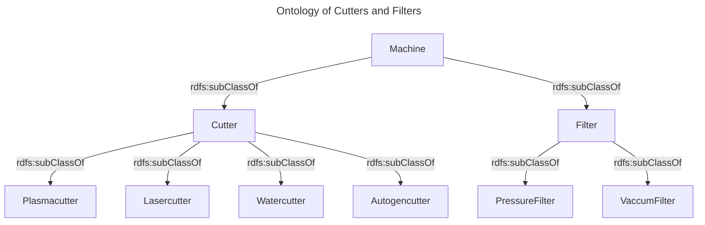
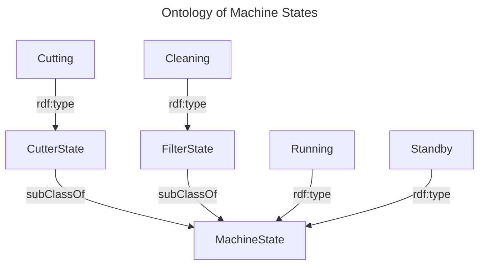

# Digital Twin Datamodel

The following motivates, descibes and defines version 0.1 of the Datamodel. It is in alpha stage and subject to changes.

## [JSON-LD](https://json-ld.org/) (JSON for Linked Data)

JSON-LD, which stands for "JavaScript Object Notation for Linked Data," is a powerful data serialization format that extends the capabilities of traditional JSON. Its strength lies in its ability to represent structured data in a way that is both human-readable and machine-understandable. JSON-LD is particularly well-suited for the web and semantic data integration for several key reasons:

 * **Semantic Structure:** JSON-LD allows you to add context to your data, defining the meaning of each piece of information. This semantic structure enables machines to understand the data and its relationships, fostering interoperability and knowledge sharing.

 * **Linked Data:** JSON-LD is designed to facilitate the linking of data across the web. It enables you to reference and interconnect data from various sources and domains, forming a comprehensive and coherent information ecosystem.

 * **SEO and Searchability:** Search engines like Google understand and favor JSON-LD for structuring data. Implementing JSON-LD can improve your website's visibility in search results by providing search engines with valuable information about your content.

 * **Interoperability:** JSON-LD supports the integration of data from diverse sources, making it an ideal choice for data exchange, data sharing, and data synchronization between applications, platforms, and services.

 * **Easy to Read:** JSON-LD retains the simplicity and human-readability of traditional JSON, making it accessible for both developers and non-technical users. Its natural syntax encourages widespread adoption.

 * **Standards-Based:** JSON-LD is based on W3C standards and recommendations, ensuring a well-defined and widely accepted approach to structuring and sharing linked data on the web.

In summary, JSON-LD is a versatile and powerful tool for structuring data with semantic meaning, linking data across the web, improving search engine visibility, fostering interoperability, and promoting data exchange. It plays a crucial role in the modern web ecosystem and is a valuable asset for businesses and organizations looking to harness the full potential of their data.

## JSON-LD Forms

Since JSON-LD represents graph data, it can become very explicit and detailed. However, In many cases aspects of a graph can also be simplified and described implicitly.

The following shows a so called *[compacted](https://www.w3.org/TR/json-ld11-api/#dfn-compact-form)* JSON-LD expression. It contains a *context* and a minimized key *name*:

```json
{
  "@context": {
    "name": "http://schema.org/name"
  },
  "@id": "https://iri/max.mustermann",
  "name": "Max Mustermann"
}
```

This is an implicit representation of a *[expanded](https://www.w3.org/TR/json-ld11-api/#dfn-expanded)* form
```json
[
  {
    "@id": "https://iri/max.mustermann",
    "http://schema.org/name": [
      {
        "@value": "Max Mustermann"
      }
    ]
  }
]
```
Try conversion in the *JSON-LD* [playground](https://json-ld.org/playground/#startTab=tab-expanded&json-ld=%7B%22%40context%22%3A%7B%22name%22%3A%22http%3A%2F%2Fschema.org%2Fname%22%7D%2C%22%40id%22%3A%22https%3A%2F%2Firi%2Fmax.mustermann%22%2C%22name%22%3A%22Max%20Mustermann%22%7D).


Note that in the Expanded form, the *context* is missing, but everything is now provided with *namespaces* and *@value* which indicates that "Max Mustermann" is a *Literal*, i.e. string, number or boolean.
The expanded form can easiliy be transformed into a *[RDF](https://www.w3.org/TR/rdf12-concepts/)* graph representation:


which can also be serialized as [turtle](https://www.w3.org/TR/rdf12-turtle/) graph:

```
@prefix schema: <http://schema.org/> .
<http://iri/max.mustermann/> schema:name "Max Mustermann" .
```

## NGSI-LD (Next Generation Service Interface for Linked Data)

[NGSI-LD](https://www.etsi.org/deliver/etsi_gs/CIM/001_099/009/01.07.01_60/gs_CIM009v010701p.pdf) is an open standard developed by the European Telecommunications Standards Institute (ETSI) as part of the NGSI (Next Generation Service Interface) framework. It extends the capabilities of JSON-LD to enable a powerful, standardized approach to managing and exchanging context information for the Internet of Things (IoT) and smart city applications.

Key features and concepts of NGSI-LD:

* **Linked Data Model:** NGSI-LD is based on the principles of Linked Data, making it a part of the Semantic Web ecosystem. It allows the representation of real-world entities and their attributes as linked data resources.

 * **Entity-Attribute-Value (EAV):** NGSI-LD follows an Entity-Attribute-Value (EAV) model where entities (e.g., IoT devices or physical objects) have attributes (e.g., temperature, location) with associated values (e.g., 25°C, GPS coordinates).

 * **Context Information:** NGSI-LD is designed for sharing context information about entities. This context information can include real-time data, historical data, metadata, and relationships between entities.

* **Interoperability:** One of the main goals of NGSI-LD is to enable interoperability between different IoT platforms, systems, and services. It provides a common data representation format and query language for IoT context information.

* **Standardized APIs:** NGSI-LD specifies a set of standardized APIs for querying, updating, and subscribing to context information. This helps developers create applications that can work with a variety of data sources and platforms.

* **Scalability:** NGSI-LD is designed to handle vast amounts of context information generated by IoT devices, sensors, and other sources, making it suitable for smart city and industrial IoT applications.

* **Semantic Descriptions:** Similar to JSON-LD, NGSI-LD uses semantic descriptions (context) to define the meaning of data attributes. This enables data to be easily understood and used by both humans and machines.

* **Real-Time Updates:** NGSI-LD supports real-time updates and notifications, making it ideal for applications that require immediate access to changing context information.

NGSI-LD is a significant advancement in the field of IoT, as it provides a standardized approach for managing and exchanging context data, enabling more efficient and interoperable IoT solutions. It leverages the power of Linked Data to create a dynamic and interconnected IoT ecosystem. NGSI-LD is already used heavily in smart city applications

## NGSI-LD Motivation

What does NGSI-LD bring to the table? What is missing? Lets take a look at a basic JSON-LD object:
```json
{
  "@context": {...},
  "@id": "urn:x:1",
  "machine_state": "Standby",
  "hasFilter": "urn:x:2"
}
```
What we see is a simple description of a machine. There are two fields, `machine_state` and `hasFilter`. The machine has an id `urn:x:1`, great. So I can refer to it in this uniqe way. However, how do I know what kind of machine this is? There might be an ontology of machines like:



If one wants to reference or reuse this ontology, one has to stay in this formal language model. Therefore, the vocabulary of this formal language has to be used. The vocabulary to describe a type in the semantic web is `type`. So the resulting object looks like:

```
{
  "@context": {...},
  "@id": "urn:x:1",
  "@type": "Lasercutter",
  "machine_state": "Standby",
  "temperature": 44,
  "hasFilter": "urn:x:2"
}
```

Next problem: What does the field `machine_state` contain? And what is meant by `hasFilter`. At its simplest, you want to know whether machine_state value comes from another ontology or whether it is a string. Also, you want to know whether `hasFilter` is a string or an IRI, etc. To do that, one can use the `@context` of JSON-LD. However, if you want to add more metadata to `machine_state` like a timestamp or unit value. You also want to know if an IRI describes an element of an ontology or another entitiy. What unit is the `temperature` value? 
```
{
  "@context": "https://uri.etsi.org/ngsi-ld/v1/ngsi-ld-core-context.jsonld",
  "id": "urn:x:1",
  "type": "Lasercutter",
  "machine_state": {
    "type": "Property",
    "value": { "@id": "http://ontology/Standby"},
    "observedAt": "2024-08-07T16:00:00Z",
    "createdAt": "2024-08-07T12:00:00Z",
    "modifiedAt": "2024-08-07T16:01:00Z"
    },
  "hasFilter": {
    "object": "urn:x:2",
    "type": "Relationship",
    "observedAt": "2024-01-01T16:00:00Z"
  },
  "temperature": {
    "type": "Property",
    "value": 44,
    "unitCode": "CEL",
    "observedAt": "2024-08-07T16:00:00Z"
  }
}
```
Since JSON-LD is just a serialization for graphs and NGSI-LD is an ontology withint JSON-LD, this can still be translated to a triples graph:

```
<urn:x:1> <http://www.w3.org/1999/02/22-rdf-syntax-ns#type> <https://uri.etsi.org/ngsi-ld/default-context/Lasercutter> .
<urn:x:1> <https://uri.etsi.org/ngsi-ld/default-context/hasFilter> _:b0 .
<urn:x:1> <https://uri.etsi.org/ngsi-ld/default-context/machine_state> _:b1 .
<urn:x:1> <https://uri.etsi.org/ngsi-ld/default-context/temperature> _:b2 .
_:b0 <http://www.w3.org/1999/02/22-rdf-syntax-ns#type> <https://uri.etsi.org/ngsi-ld/Relationship> .
_:b0 <https://uri.etsi.org/ngsi-ld/default-context/observedAt> "2024-01-01T16:00:00Z" .
_:b0 <https://uri.etsi.org/ngsi-ld/hasObject> <urn:x:2> .
_:b1 <http://www.w3.org/1999/02/22-rdf-syntax-ns#type> <https://uri.etsi.org/ngsi-ld/Property> .
_:b1 <https://uri.etsi.org/ngsi-ld/createdAt> "2024-08-07T12:00:00Z"^^<https://uri.etsi.org/ngsi-ld/DateTime> .
_:b1 <https://uri.etsi.org/ngsi-ld/default-context/observedAt> "2024-08-07T16:00:00Z" .
_:b1 <https://uri.etsi.org/ngsi-ld/hasValue> <http://ontology/Standby> .
_:b1 <https://uri.etsi.org/ngsi-ld/modifiedAt> "2024-08-07T16:01:00Z"^^<https://uri.etsi.org/ngsi-ld/DateTime> .
_:b2 <http://www.w3.org/1999/02/22-rdf-syntax-ns#type> <https://uri.etsi.org/ngsi-ld/Property> .
_:b2 <https://uri.etsi.org/ngsi-ld/default-context/observedAt> "2024-08-07T16:00:00Z" .
_:b2 <https://uri.etsi.org/ngsi-ld/hasValue> "44"^^<http://www.w3.org/2001/XMLSchema#integer> .
_:b2 <https://uri.etsi.org/ngsi-ld/unitCode> "CEL" .
```

## NGSI-LD forms

Since NGSI-LD is extending JSON-LD, it inherits the capability of creating different forms like *expanded* or *compacted*. In addition, it provides a simplification called *concise* form and a more explicit form, called *normalized* form.

NGSI-LD reuqires from every entity to have at least *id* and *type*. All other data is either a *property* or a *relationship*:
```json
{
    "@context": [
      "https://uri.etsi.org/ngsi-ld/v1/ngsi-ld-core-context.jsonld",
      {
        "@vocab": "https://industry-fusion.org/base/v0.1/"
      }
    ],
    "id": "urn:x:1",
    "type": "cutter",
    "hasFilter": {
      "type": "Relationship",
      "object": "urn:filter:1"
    },
    "machine_state": {
      "type": "Property",
      "value": "Testing"
    }
}

```

The *type* field in the *Properties* and *Relationship* is here redundant. It can be differentiated already by the `value` and `object fields`. That is why NGSI-LD defines a *concise* form which further reduces redundancy:

```json
{
    "@context": [
      "https://uri.etsi.org/ngsi-ld/v1/ngsi-ld-core-context.jsonld",
      {
        "@vocab": "https://industry-fusion.org/base/v0.1/"
      }
    ],
    "id": "urn:x:1",
    "type": "cutter",
    "hasFilter": {
      "object": "urn:filter:1"
    },
    "machine_state": "Testing"
}
```

Since NGSI-LD is JSON-LD compliant, it can be *compacted* and *extended*. Note that both forms, *normalized* and *concise* NGSI-LD, are *compacted* JSON-LD forms. The *expanded* **and** *normalized* form of the above example looks like

```json
[
  {
    "https://industry-fusion.org/base/v0.1/hasFilter": [
      {
        "https://uri.etsi.org/ngsi-ld/hasObject": [
          {
            "@id": "urn:filter:1"
          }
        ],
        "@type": [
          "https://uri.etsi.org/ngsi-ld/Relationship"
        ]
      }
    ],
    "@id": "urn:x:1",
    "https://industry-fusion.org/base/v0.1/machine_state": [
      {
        "@type": [
          "https://uri.etsi.org/ngsi-ld/Property"
        ],
        "https://uri.etsi.org/ngsi-ld/hasValue": [
          {
            "@value": "Testing"
          }
        ]
      }
    ],
    "@type": [
      "https://industry-fusion.org/base/v0.1/cutter"
    ]
  }
]
```

## Validation with JSON-Schema and SHACL

Validation of JSON objects is typically done with [JSON-Schema](https://json-schema.org/). A plain JSON object structure can therefore be validated. However, as described above, JSON-LD represent a graph and has different forms. For instance, the following two expressions are equivalent in JSON-LD but cannot be schemed with JSON-Schema:

Expression 1
```json
[{
    "@context": [
      "https://uri.etsi.org/ngsi-ld/v1/ngsi-ld-core-context.jsonld",
      {
        "@vocab": "https://industry-fusion.org/base/v0.1/"
      }
    ],
    "id": "urn:x:1",
    "type": "cutter",
    "hasFilter": {
      "type": "Relationship",
      "object": "urn:filter:1"
    },
    "machine_state": {
      "type": "Property",
      "value": "Testing"
    }
},
{
      "@context": [
      "https://uri.etsi.org/ngsi-ld/v1/ngsi-ld-core-context.jsonld",
      {
        "@vocab": "https://industry-fusion.org/base/v0.1/"
      }
    ],
    "id": "urn:y:1",
    "type": "filter",
    "machine_state": {
      "type": "Property",
      "value": "Testing"
    }
}
]
```

Expression 2

```json
{
    "@context": [
      "https://uri.etsi.org/ngsi-ld/v1/ngsi-ld-core-context.jsonld",
      {
        "@vocab": "https://industry-fusion.org/base/v0.1/"
      }
    ],
    "id": "urn:x:1",
    "type": "cutter",
    "hasFilter": {
      "type": "Relationship",
      "object": {
        "id": "urn:y:1",
        "type": "filter",
        "machine_state": {
          "type": "Property",
          "value": "Testing"
        }   
      }
    },
    "machine_state": {
      "type": "Property",
      "value": "Testing"
    }
}
```

In addition, JSON-schema is not able to properly process *Namespaces*.

Therefore, a proper validation must consider the Graph structure of JSON-LD. A standard, which allows to define Constraints within a Graph is [SHACL](https://www.w3.org/TR/shacl/).


## JSON-LD Validation with JSON-Schema

As shown in the last section, it is impossible to use JSON-Schema to validate JSON-LD objects properly. However, as a compromise, many non-linked data related attributes can be validated if one is applying a propoer normalization. Therefore, we use the JSON-Schema in the following to validate a *concise* NGSI-LD form with a pre-defined *context*.

In the following, we describe the validation schema.
We use the default *contex* https://industryfusion.github.io/contexts/v0.1/context.jsonld. An example for a *concise* form with this *conext* can be seen in the following. It contains an *ECLASS* type, one *ECLASS* property and attributes (properties and relationships) `machine_state` and `hasFilter` from the default vocabulary. The object has an ID expressed as URN:

```json
{
    "@context": "https://industryfusion.github.io/contexts/v0.1/context.jsonld",
    "machine_state": "Testing",
    "hasFilter": {
        "object": "urn:filter:1"
    },
    "eclass:0173-1#02-AAH880#003": "10",
    "id": "urn:x:1",
    "type": "eclass:0173-1#01-AKJ975#017"
}
```

In order to validate it with a JSON-Schema, first the base object must be described:

```json
 {
        "$schema": "https://json-schema.org/draft/2020-12/schema",
        "$id": "<URL-Encoded expanded type>",
        "title": "Plasmacutter",
        "description": "Plasmacutter template for IFF",
        "type": "object",
        "properties": {
           "type": {
            "const": "<compacted type>"
            },
            "id": {
              "type": "string",
              "pattern": "^urn:[a-zA-Z0-9][a-zA-Z0-9-]{1,31}:([a-zA-Z0-9()+,.:=@;$_!*'-]|%[0-9a-fA-F]{2})*$"
            }
        },
        "required": ["type", "id"],
        "allOf": [<urls describing further properties or relationships>]
    }
```
This specifies the mandatory `id` and `type` field of every NGSI-LD object. `id` must be an *URN* and `type` must contain a *compacted* form.
The `$schema` field must be https://json-schema.org/draft/2020-12/schema, the `$id` of the schema must be a valid URL with the additional constraint that all '#' fields **must be URL-Encoded**. An example for a schema and related data can be seen in the following:

```json
# JSON-Schema:
[{
    "$schema": "https://json-schema.org/draft/2020-12/schema",
    "$id": "https://industry-fusion.org/eclass%230173-1%2301-AKJ975%23017",
    "title": "Cutter",
    "description": "Cutter template for IFF",
    "type": "object",
    "properties": {
       "type": {
        "const": "eclass:0173-1#01-AKJ975#017"
        },
        "id": {
          "type": "string",
          "pattern": "^urn:[a-zA-Z0-9][a-zA-Z0-9-]{1,31}:([a-zA-Z0-9()+,.:=@;$_!*'-]|%[0-9a-fA-F]{2})*$"
        }
    },
    "required": ["type", "id"]
}]

# JSON-LD Object
{
    "@context": "https://industryfusion.github.io/contexts/v0.1/context.jsonld",
    "id": "urn:iff:abc123",
    "type": "eclass:0173-1#01-AKJ975#017"
}
```

The *properties* and *relationships* can be grouped and aggregated by the `allOf` array. In the following a *string* property is validated by a schema:

```json
{
        "$schema": "https://json-schema.org/draft/2020-12/schema",
        "$id": "https://industry-fusion.org/base-objects/v0.1/cutter/properties",
        "title": "Cutter properties",
        "description": "Properties for class cutter",
        "type": "object",
        "properties": {
            "machine_state": {
                "type": "string",
                "title": "Machine Status",
                "description": "Current status of the machine (Online_Idle, Run, Online_Error, Online_Maintenance, Setup, Testing)",
                "enum": [
                    "Online_Idle",
                    "Run",
                    "Online_Error",
                    "Online_Maintenance",
                    "Setup",
                    "Testing"
                ]
            }
        }
}
```
The following validates a *relationship*:


```json
 {
        "$schema": "https://json-schema.org/draft/2020-12/schema",
        "$id": "https://industry-fusion.org/base-objects/v0.1/cutter/relationships",
        "title": "IFF template for cutter relationship",
        "description": "Cutter template for IFF",
        "type": "object",
        "properties": {
            "hasFilter": {
                "relationship": "eclass:0173-1#01-ACK991#016",
                "$ref": "https://industry-fusion.org/base-objects/v0.1/link"
            }
        }
    },
    {
        "$schema": "https://json-schema.org/draft/2020-12/schema",
        "$id": "https://industry-fusion.org/base-objects/v0.1/link",
        "title": "IFF template for cutter relationship",
        "description": "Cutter template for IFF",
        "type": "object",
        "properties": {
            "object": {
                "type": "string",
                "pattern": "^urn:[a-zA-Z0-9][a-zA-Z0-9-]{0,31}:[a-zA-Z0-9()+,\\-.:=@;$_!*']*[a-zA-Z0-9()+,\\-.:=@;$_!*']$"
            }
        },
        "required": ["object"]
    },

```
Overall, the resulting full JSON-Schema looks like follows:

```json
# JSON-Schema:
[{
    "$schema": "https://json-schema.org/draft/2020-12/schema",
    "$id": "https://industry-fusion.org/eclass%230173-1%2301-AKJ975%23017",
    "title": "Cutter",
    "description": "Cutter template for IFF",
    "type": "object",
    "properties": {
       "type": {
        "const": "eclass:0173-1#01-AKJ975#017"
        },
        "id": {
          "type": "string",
          "pattern": "^urn:[a-zA-Z0-9][a-zA-Z0-9-]{1,31}:([a-zA-Z0-9()+,.:=@;$_!*'-]|%[0-9a-fA-F]{2})*$"
        }
    },
    "allOf": [
        {
            "$ref": "https://industry-fusion.org/base-objects/v0.1/cutter/properties"
        },
        {
            "$ref": "https://industry-fusion.org/base-objects/v0.1/cutter/relationships"
        }
    ],
    "required": ["type", "id"]
}]

# JSON-LD Object
{
    "@context": "https://industryfusion.github.io/contexts/v0.1/context.jsonld",
    "id": "urn:iff:abc123",
    "type": "eclass:0173-1#01-AKJ975#017",
    "hasFilter": {
        "object": "urn:iff:filter:1"
    },
    "machine_state": "Testing"
}

```

## Forbidden JSON-Schema keywords:
The following JSON-Schema Keywords from the standard are forbidded:

* anyOf, oneOf
* if, then, else
* prefixItems, items
* valid, error, annotations
* additionalProperties
* propertyNames
* $vocabulary, $defs
* multipleOf
* uniqueItems
* maxContains, minContains
* maxProperties, minProperties
* dependentRequired

## Added JSON-Schmea Keywords:
The following JSON-Schema Keywords are added to the standard:

* **relationship:** Contains the *compacted* type for a NGSI-LD relationship.
* **relationship_type** is further detailing the relationship type. There are two values allowed: `subcomponent` or `peer`

## Integrating ECLASS Properties
`ECLASS` provides additional data for every `IRDI` which can be added/mapped to `JSON-Schema`:

- `Preferred Name` is mapped to `title` field
- `Definition` is mapped to `description` field
- The unit symbol of `Unit` is mapped to `unit` field
- `Type` of the field is mapped to `datatype` and xsd-type as described [here](https://eclass.eu/support/technical-specification/data-model/datatype-to-xsd-mapping)
- The `JSON` `type` field of every `ECLASS` property is `string`.

For [example](./schema-ngsild-eclass/schema.json), the `ECLASS` property `eclass:0173-1#02-AAH880#003` is described in the `JSON-Schema` like so:

```json
 "eclass:0173-1#02-AAH880#003": {
                "type": "string",
                "datatype": "double",
                "title": "min. cutting current",
                "description": "specification of the minimum cutting current",
                "unit": "A"
            }
```

## Translating JSON-Schema to SHACL

## Tools
This section describes the tools which are used for validation, data conversion and SHACL creation. The tools can be found in the `./tools`

### Validation

The validation tool is `validate.js`. It validates only **concise** NGSI-LD objects.

#### Install

```
npm install
```

#### Usage

```
validate.js

Validate a concise NGSI-LD object with IFF Schema.

Options:
      --version   Show version number                                  [boolean]
  -s, --schema    Schema File                                [string] [required]
  -d, --datafile  File to validate. "-" reads from stdin [string] [default: "-"]
  -i, --schemaid  Schema-id to validate                      [string] [required]
  -h, --help      Show help                                            [boolean]

```

#### Examples

Validate object in file `examples/plasmacutter_data.json` directly:
```
node tools/validate.js -s examples/plasmacutter_schema.json -d examples/plasmacutter_data.json -i https://industry-fusion.org/eclass#0173-1#01-AKJ975#017
```

```
# Result:
The Datafile is compliant with Schema
```

Validate file from stdin:
```
jq '.[1]' examples/filter_and_cartridge_subcomponent_data.json | node ./tools/validate.js -s examples/filter_and_cartridge_subcomponent_schema.json -i https://industry-fusion.org/eclass%230173-1%2301-ACK991%23016
```

```
# Result:
The Datafile is compliant with Schema
```

### Convert JSON-Schema to SHACL

#### Install

```
npm install
```

#### Usage

```
jsonschema2shacl.js

Converting an IFF Schema file for NGSI-LD objects into a SHACL constraint.

Options:
      --version   Show version number                                  [boolean]
  -s, --schema    Schema File containing array of Schemas    [string] [required]
  -i, --schemaid  Schma-id of object to generate SHACL for   [string] [required]
  -c, --context   JSON-LD-Context                            [string] [required]
  -h, --help      Show help                                            [boolean]

```

#### Examples

```
node tools/jsonschema2shacl.js -s examples/plasmacutter_schema.json -i  https://industry-fusion.org/eclass#0173-1#01-AKJ975#017 -c https://industryfusion.github.io/contexts/v0.1/context.jsonld
```

```
# Result:

@prefix iffb: <https://industry-fusion.org/base/v0.1/>.
@prefix sh: <http://www.w3.org/ns/shacl#>.
@prefix ngsi-ld: <https://uri.etsi.org/ngsi-ld/>.

<https://industry-fusion.org/knowledge/v0.1/0173-1#01-AKJ975#017Shape>
    a sh:NodeShape;
    sh:property
            [
                sh:maxCount 1;
                sh:minCount 0;
                sh:nodeKind sh:BlankNode;
                sh:path iffb:hasFilter;
                sh:property
                        [
                            sh:class
                                <https://industry-fusion.org/eclass#0173-1#01-ACK991#016>;
                            sh:maxCount 1;
                            sh:minCount 1;
                            sh:nodeKind sh:IRI;
                            sh:path ngsi-ld:hasObject
                        ]
            ],
            [
                sh:maxCount 1;
                sh:minCount 1;
                sh:nodeKind sh:BlankNode;
                sh:path iffb:machine_state;
                sh:property
                        [
                            sh:in
                                    ( "Online_Idle" "Run" "Online_Error"
                                    "Online_Maintenance" "Setup" "Testing" );
                            sh:maxCount 1;
                            sh:minCount 1;
                            sh:nodeKind sh:Literal;
                            sh:path ngsi-ld:hasValue
                        ]
            ];
    sh:targetClass <https://industry-fusion.org/eclass#0173-1#01-AKJ975#017>.

```

### Create OWL Entities descriptions

The `entities.ttl` description contains all non validation relevant information about entities. It defines **domain** and **range** of attributes and more details, e.g. whether a NGSI-LD Relationship is a subcomponent or a peer relationship. The description is created in [OWL](https://www.w3.org/OWL/).

#### Install

```
npm install
```

#### Usage

```
jsonschema2owl.js

Converting an IFF Schema file for NGSI-LD objects into an OWL entity file.

Options:
      --version    Show version number                                 [boolean]
  -s, --schema     Schema File containing array of Schemas   [string] [required]
  -i, --schemaid   Schma-id of object to generate SHACL for  [string] [required]
  -c, --context    JSON-LD-Context                           [string] [required]
  -n, --namespace  default namespace (if not derived by context)        [string]
  -h, --help       Show help                                           [boolean]
```

#### Examples
```
node ./tools/jsonschema2owl.js -s ./examples/filter_and_cartridge_subcomponent_schema.json -c file:$PWD/./examples/context.jsonld -i https://industry-fusion.org/eclass#0173-1#01-ACK991#016
```
```
@prefix owl: <http://www.w3.org/2002/07/owl#>.
@prefix iffb: <https://industry-fusion.org/base/v0.1/>.
@prefix rdfs: <http://www.w3.org/2000/01/rdf-schema#>.
@prefix ngsi-ld: <https://uri.etsi.org/ngsi-ld/>.
@prefix b: <https://industryfusion.github.io/contexts/ontology/v0/base/>.

iffb:hasCartridge
    a owl:Property, b:SubComponentRelationship;
    rdfs:domain <https://industry-fusion.org/eclass%230173-1%2301-ACK991%23016>;
    rdfs:range ngsi-ld:Relationship.
iffb:machine_state
    a owl:Property;
    rdfs:domain <https://industry-fusion.org/eclass%230173-1%2301-ACK991%23016>;
    rdfs:range ngsi-ld:Property.
<https://industry-fusion.org/eclass#0173-1#01-ACK991#016> a owl:Class.

```

### Convert NGSI-LD forms

#### Install

```
npm install
```

#### Usage

```
jsonldConverter.js <filename>

Convert a JSON-LD file into different normal forms.

Options:
      --version    Show version number                                 [boolean]
  -n, --concise    Create concise/compacted form                       [boolean]
  -x, --expand     Create expanded form                                [boolean]
  -r, --normalize  Create normalized form                              [boolean]
  -c, --context    JSON-LD-Context                                      [string]
  -h, --help       Show help                                           [boolean]
```

#### Examples

```
node tools/jsonldConverter.js -r examples/plasmacutter_data.json
```

```
# Result:
[
  {
    "@context": "https://industryfusion.github.io/contexts/v0.1/context.jsonld",
    "id": "urn:iff:abc123",
    "type": "eclass:0173-1#01-AKJ975#017",
    "hasFilter": {
      "type": "Relationship",
      "object": "urn:iff:filter:1"
    },
    "machine_state": {
      "type": "Property",
      "value": "Testing"
    }
  }
]
```

```
node tools/jsonldConverter.js -x examples/plasmacutter_data.json
```

```
# Result:
[
  {
    "https://industry-fusion.org/base/v0.1/hasFilter": [
      {
        "https://uri.etsi.org/ngsi-ld/hasObject": [
          {
            "@id": "urn:iff:filter:1"
          }
        ]
      }
    ],
    "@id": "urn:iff:abc123",
    "https://industry-fusion.org/base/v0.1/machine_state": [
      {
        "@value": "Testing"
      }
    ],
    "@type": [
      "https://industry-fusion.org/eclass#0173-1#01-AKJ975#017"
    ]
  }
]
```


### Retrieve Subcomponents from NGSI-LD Service

#### Problem Statement
In NGSI-LD Relationships are used to define links between objects. However, there is in plain NGSI-LD no way to further detail the type of relationship, e.g. to describe whether it is a peer or a hierarchical Relationship. One way to add this kind of metadata is to add additional Properties to Relationships. For instance

```
{
        "@context": "https://industryfusion.github.io/contexts/tutorial/v0.1/context.jsonld",
        "id": "urn:iff:filter1",
        "type": "eclass:0173-1#01-ACK991#016",
        "machineState": "Testing",
        "hasCartridge": {
            "object": "urn:iff:cartridge1",
            "relationshipType": "base:SubcomponentRelationship"
        },
        "hasIdentification": {
            "object": "urn:iff:identification2",
            "relationshipType": "base:SubcomponentRelationship"
        }
    }
```

In this example, the Relationships *hasIdentifiation* and *hasCartridge* have a Property *relationshipType* which further describes whether the Relationship is hierarchical or not. The disadvantage of such approach is that every instance of this type has to add this additional metadata to its respective Relationships. And if it is missing, the Relationship might be interpreted wrong. In addition, it is waste of data in the case when the respective Relationships of an Entity are **always** subcomponents. In this case this metadata should be stored in the respective type definitions. For onboarding of assets the type of the Relationships is essential, since a Filter might be authorized to update its subcomponents such as a Cartridge but not other related machines like a Cutter. Therefore, the Relationsip type is important for the onboarding process to recieve the correct authorizations. In the following, we show how the onboarding of NGSI-LD Entities with subcomponents can be done.

### JSON-Schema definition of subcomponents

In case the datamodel is described as JSON-Schema, a Relationship can be defined to be a Peer relationsip or a Subcomponent as follows:

```
    {
        "$schema": "https://json-schema.org/draft/2020-12/schema",
        "$id": "https://industry-fusion.org/base-objects/v0.1/filter/relationships",
        "title": "IFF template for filter relationship",
        "description": "Filter template for IFF",
        "type": "object",
        "properties": {
            "hasCartridge": {
                "relationship": "eclass:0173-1#01-AKE795#017",
                "relationship_type": "subcomponent",
                "$ref": "https://industry-fusion.org/base-objects/v0.1/link"
            },
            "hasIdentification": {
                "relationship": "eclass:0173-1#01-ADN228#012",
                "relationship_type": "subcomponent",
                "$ref": "https://industry-fusion.org/base-objects/v0.1/link"
            }
        }
    }
```

The semantic description about the type of relationship can be generated with the *jsonschema2owl.js* script. In this case, it would look like

```
@prefix owl: <http://www.w3.org/2002/07/owl#>.
@prefix iffb: <https://industry-fusion.org/base/v0/>.
@prefix rdfs: <http://www.w3.org/2000/01/rdf-schema#>.
@prefix ngsi-ld: <https://uri.etsi.org/ngsi-ld/>.
@prefix b: <https://industryfusion.github.io/contexts/ontology/v0/base/>.

iffb:hasCartridge
    a owl:Property, b:SubComponentRelationship;
    rdfs:domain <https://industry-fusion.org/eclass%230173-1%2301-ACK991%23016>;
    rdfs:range ngsi-ld:Relationship.
iffb:hasIdentification
    a owl:Property, b:SubComponentRelationship;
    rdfs:domain <https://industry-fusion.org/eclass%230173-1%2301-ACK991%23016>;
    rdfs:range ngsi-ld:Relationship.
```

Finally, with this meta data in mind of all types, the *ids* of subcomponents can be retrieved directly from the NGSI-LD API with the `getSubcomponents.js` script:

```
getSubcomponents.js

Creating list of subcomponents of objects.

Positionals:
  root-id     ID of the object                                          [string]
  broker-url  URL of NGSI-LD broker
                               [string] [default: "http://ngsild.local/ngsi-ld"]

Options:
      --version   Show version number                                  [boolean]
  -e, --entities  Entity Files containing description of attributes      [array]
  -t, --token     Token for rest call                        [string] [required]
  -h, --help      Show help                                            [boolean]

```

### Example

Precondition:

* Local PDT deployment:
  * Process Data Twin is reached by URL `http://ngsild.local/ngsi-ld`
  * Keycloak can be reached by URL `http://keycloak.local`
  * Keycloak secrets for user `realm_user` is stored in secret `
* Installed: `kubectl`, `jq`, `nodejs` v20

First create the `entitiy.ttl` files:

```
node ./tools/jsonschema2owl.js -c https://industryfusion.github.io/contexts/tutorial/v0.1/context.jsonld -s examples/filter_and_cartridge_subcomponent_schema.json -i https://industry-fusion.org/eclass%230173-1%2301-ACK991%23016 > /tmp/filter_entity.ttl
node ./tools/jsonschema2owl.js -c https://industryfusion.github.io/contexts/tutorial/v0.1/context.jsonld -s examples/filter_and_cartridge_subcomponent_schema.json -i https://industry-fusion.org/eclass%230173-1%2301-AKE795%23017 > /tmp/cartridge_entity.ttl
node ./tools/jsonschema2owl.js -c https://industryfusion.github.io/contexts/tutorial/v0.1/context.jsonld -s examples/filter_and_cartridge_subcomponent_schema.json -i https://industry-fusion.org/eclass%230173-1%2301-ADN228%23012 > /tmp/identification_entity.ttl
```

In order to access the NGSI-LD Context broker, we need to generate a token:
```
KEYCLOAKURL=http://keycloak.local/auth/realms
NAMESPACE=iff
USER=realm_user
password=$(kubectl -n iff get secret/credential-iff-realm-user-iff -o jsonpath='{.data.password}'| base64 -d | xargs echo)
token=$(curl -d "client_id=scorpio" -d "username=${USER}" -d "password=$password" -d 'grant_type=password' "${KEYCLOAKURL}/${NAMESPACE}/protocol/openid-connect/token"| jq ".access_token"| tr -d '"')
```

The NGSI-LD context broker needs to know the instances of interest. So the example set of objects as defined in `examples/filter_and_cartridge_subcomponent_data.json` is submitted to the broker:

```
curl -vv -X POST -H "Authorization: Bearer $token" -d @"examples/filter_and_cartridge_subcomponent_data.json" http://ngsild.local/ngsi-ld/v1/entityOperations/create -H "Content-Type: application/ld+json"
```
Finally, the NGSI-LD context broker is contacted and all subcomponents are derived.

```
node ./tools/getSubcomponents.js -e /tmp/filter_entity.ttl -e /tmp/cartridge_entity.ttl -e /tmp/identification_entity.ttl -t $token urn:iff:filter1

#RESULT:
 -d urn:iff:cartridge1 -d urn:iff:identification1 -d urn:iff:identification2
```

Note that the result is deliverd in a format which can direcly used by the iff-agent onboarding scripts.