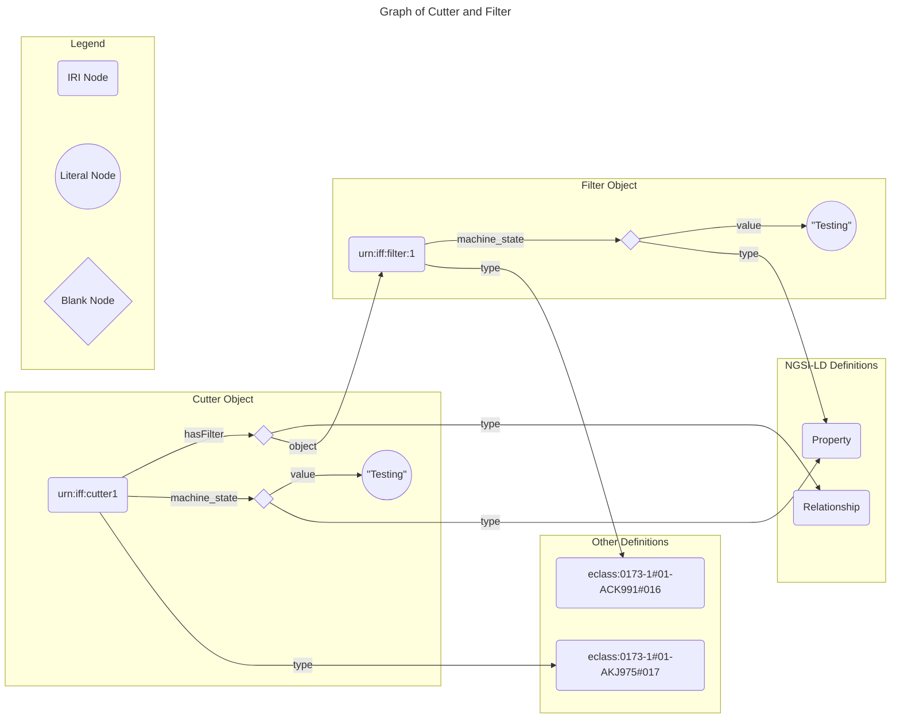

# Semantic Datamodel Tutorial

## Motivation
A fundamental difference between JSON-LD and JSON is, that JSON describe generic objects and JSON-LD graphs of relationships. A consequence of this is that two JSON-LD object are identical interpreted, if they represent the same graph. For instance, the following object

```json
[
    {
        "@context": "https://industryfusion.github.io/contexts/v0.1/context.jsonld",
        "id": "urn:iff:cutter1",
        "type": "eclass:0173-1#01-AKJ975#017",
        "hasFilter": {
            "type": "Relationship",
            "object": "urn:iff:filter1"
        },
        "machine_state": {
            "type": "Property",
            "value": "Testing"
        }
    },
    {
        "@context": "https://industryfusion.github.io/contexts/v0.1/context.jsonld",
        "id": "urn:iff:filter1",
        "type": "eclass:0173-1#01-ACK991#016",
        "machine_state": {
            "type": "Property",
            "value": "Testing"
        }
    }
]
```
represents the following graph:



The same graph can, however, be represented by different JSON-LD structures. For instance, this representation is equivalent to the graph above:

```json
[
    {
        "@context": "https://industryfusion.github.io/contexts/v0.1/context.jsonld",
        "id": "urn:iff:cutter1",
        "type": "eclass:0173-1#01-AKJ975#017",
        "hasFilter": {
            "type": "Relationship",
            "object": {
                "id": "urn:iff:filter1",
                "type": "eclass:0173-1#01-ACK991#016",
                "machine_state": {
                    "type": "Property",
                    "value": "Testing"
                }
            }
        },
        "machine_state": {
            "type": "Property",
            "value": "Testing"
        }
    }
]
```

The problem is that there are even more representations of the same graph. Therefore, it is challenging, to use a JSON-Schema which is focussing on the *syntactic* structures of an object and not so much on the linked representation. Moreover, it would be very complex, if not impossible, to create a compliant JSON-Schema which validates all potential representations of the graph above. This shows that linked data cannot be handled with classical JSON-tools. On the other hand, most developers in the IT world are used to handle their data with JSON and JSON-Schema. Therefore, a bridge is needed between the two technologies. It is clear that JSON-Schema cannot validate links between objects. But all non-linked data must be validatable with JSON-Schemas. The approach to reach that goal contains three steps:
1. Simplify the problem: Handle with JSON-Schema only single objects, e.g. only a *Cutter* or *Filter* object.
2. Transform the JSON-LD object into a canonical normal form which ensures that same (sub-)graphs are represented by identical objects.
3. Generate the SHACL constraints from JSON-Schemas
4. Validate single objects with JSON-Schema and linked objects with SHACL

Step 1. can be achieved straight forward. The other step need additional considerations.

## NGSI-LD: Transform JSON-LD Objects into a Canonical Normal Form

### RDF (Resource Description Framework)

The Resource Description Framework, commonly known as RDF, is a key technology underpinning the concept of linked data. Developed by the World Wide Web Consortium (W3C), RDF serves as a foundation for representing and linking diverse data on the web in a machine-readable format.
Key Concepts of RDF:

    Triple Structure: RDF represents information in triples, each consisting of a subject, predicate, and object. This structure forms the basis for creating statements about resources.

    Resource Identification: Resources are identified using Uniform Resource Identifiers (URIs), providing a globally unique and standardized way to reference entities on the web.

    Graph-Based Model: RDF employs a graph-based data model, enabling the creation of interconnected networks of information. This facilitates the creation of relationships between different pieces of data.

    Ontologies and Vocabularies: RDF can be enhanced with ontologies and vocabularies, such as RDF Schema (RDFS) and the Web Ontology Language (OWL), to provide a shared understanding of the meaning of terms and relationships.

A good introduction to RDF is given [here](https://cambridgesemantics.com/blog/semantic-university/learn-rdf/).


### JSON-LD

JSON-LD (JavaScript Object Notation for Linked Data) is closely related to RDF (Resource Description Framework) as it serves as a serialization format for expressing RDF data in JSON. Developed by the World Wide Web Consortium (W3C), JSON-LD is specifically designed to bring the principles of linked data to the world of JSON.

In JSON-LD, data is structured in a way that aligns with RDF's triple model, with subjects, predicates, and objects represented as JSON objects and values. The key feature of JSON-LD is its ability to seamlessly interoperate with RDF data by providing a simple and readable syntax while maintaining compatibility with the RDF data model.

By incorporating JSON-LD, developers can bridge the gap between JSON-based data modelling and the Semantic Web, fostering interoperability and enabling a wider range of applications to participate in the linked data ecosystem. JSON-LD facilitates the creation of documents that are both human-readable and machine-understandable, promoting the broader adoption of linked data principles in diverse environments such as manufacturing.

#### Setup Tutorial
To prepare the tutorial setup, execute the following command in the `datamodel/tools` directory:

```
make setup
```

After the setup, 5 tools must be available:
1. rdfpipe
2. pyshacl
3. validate.js
3. jsonldConverter.js
5. jsonschema2shacl.js


#### The @context
First exercise is to transform JSON-LD into RDF/turtle data:

```json
# JSON-LD Data:
{
    "@context": "https://industryfusion.github.io/contexts/v0.1/context.jsonld",
    "id": "urn:iff:cutter1",
    "type": "eclass:0173-1#01-AKJ975#017"
}

```
```
# Transform:
rdfpipe  -i json-ld -o ttl ../examples/simple_plasmacutter_data.json
```
```
# Result:
<urn:iff:abc123> a <https://industry-fusion.org/eclass#0173-1#01-AKJ975#017> .
```

The result is showing a single triple line. `a` is an abbreviation for `rdf:type`. I.e. the triple defines an object with `id` equal to `<urn:iff:abc123>` and type equal to `https://industry-fusion.org/eclass#0173-1#01-AKJ975#017`. But why was `eclass:0173-1#01-AKJ975#017` translated to `https://industry-fusion.org/eclass#0173-1#01-AKJ975#017`? To answer the question, we take a closer look to the `@context` field. When we resolve the url `https://industryfusion.github.io/contexts/v0.1/context.jsonld`, we get the following result:

```
wget -O - https://industryfusion.github.io/contexts/v0.1/context.jsonld 2> /dev/null
```
```json
# Result:
{ 
        "@context": [
                "https://uri.etsi.org/ngsi-ld/v1/ngsi-ld-core-context.jsonld",
                {
                    "@vocab": "https://industry-fusion.org/base/v0.1/",
                    "eclass": {
                        "@id": "https://industry-fusion.org/eclass#",
                        "@prefix": true
                    },
                    "xsd": {
                        "@id": "http://www.w3.org/2001/XMLSchema#",
                        "@prefix": true
                    },
                    "iffb": {
                        "@id": "https://industry-fusion.org/base/v0.1/",
                        "@prefix": true
                    },
                    "iffk": {
                        "@id": "https://industry-fusion.org/knowledge/v0.1/",
                        "@prefix": true
                    },
                    "rdf": {
                        "@id": "http://www.w3.org/1999/02/22-rdf-syntax-ns#",
                        "@prefix": true
                    },
                    "rdfs": {
                        "@id": "http://www.w3.org/2000/01/rdf-schema#",
                        "@prefix": true
                    },
                    "schema": {
                        "@id": "http://schema.org/",
                        "@prefix": true
                    },
                    "sh": {
                        "@id": "http://www.w3.org/ns/shacl#",
                        "@prefix": true
                    }
                }
        ]
}

```
One part seems to be related:

```json
"eclass": {
    "@id": "https://industry-fusion.org/eclass#",
    "@prefix": true
}
```
This is defining to replace in all IRI's, types and key in the JSON-LD object "eclass:" by `"https://industry-fusion.org/eclass#"`. This is in general the role of the @context. It defines namespaces like `eclass:` and types of fields in the JSON-LD object.

#### Expanded form
To get rid of the @context, everything in the JSON-LD object has to be transformed into an explicit state, so that no @context is needed.

In the following execise the JSON-LD object is expanded:

```
node ./jsonldConverter.js -x ../examples/simple_plasmacutter_data.json
```
```json
# Result:
[
  {
    "@id": "urn:iff:cutter1",
    "@type": [
      "https://industry-fusion.org/eclass#0173-1#01-AKJ975#017"
    ]
  }
]
```

You can see that as a result, the @context field is missing and the `eclass:` prefix has been expanded. Also, the fields `id` and `type` are resolved to `@id` and `@type`. This is defined in the NGSI-LD context `https://uri.etsi.org/ngsi-ld/v1/ngsi-ld-core-context.jsonld` which is part of the @context definition as well. We call this transformation an *expansion*.

#### Compacted Form

The inverse operation of *expansion* is a *compaction*. One problem of the *compaction* is, that the *expanded Form* does no longer contain a @context. So the @context has to be added back explicitly. With a fixed @context, the *compaction* is uniquely defined, i.e. there is no other *compacted form*, given an *expanded form* and a @context.
```
node ./jsonldConverter.js -n ../examples/simple_plasmacutter_data_expanded.json -c https://industryfusion.github.io/contexts/v0.1/context.jsonld
```
```json
# Result
[
  {
    "@context": "https://industryfusion.github.io/contexts/v0.1/context.jsonld",
    "id": "urn:iff:cutter1",
    "type": "eclass:0173-1#01-AKJ975#017"
  }
]
```

### NGSI-LD (Next Generation Services Interface for Linked Data)

Building upon the foundation laid by JSON-LD , NGSI-LD (Next Generation Services Interface for Linked Data) further extends the capabilities of linked data, offering a standardized framework for representing and exchanging information in the context of smart domain applications. Developed by the European Telecommunications Standards Institute (ETSI), NGSI-LD leverages the principles of RDF (Resource Description Framework) and JSON-LD to enhance the interoperability of data in a sharable format.
Key Aspects of NGSI-LD:

- **Semantic Interoperability:** NGSI-LD introduces a standardized way to model and express information about entities in a semantic format. This facilitates seamless communication and understanding between diverse systems, applications, and devices.

- **Contextualized Data:** NGSI-LD emphasizes the importance of contextual information. It allows for the representation of data not only with its raw values but also within the context of time, location, and logical dependencies, providing a richer and more meaningful representation of the data.

- **Standardized APIs:** NGSI-LD defines standardized Application Programming Interfaces (APIs) for managing linked data entities. This enables developers to create, read, update, and delete entities consistently, fostering a unified approach to data interaction.

- **Compatibility with RDF:** NGSI-LD aligns with RDF and embraces the concepts of linked data, ensuring compatibility with the broader Semantic Web. This allows for seamless integration with existing RDF-based systems and tools.

- **Flexible Entity-Relationship Model:** NGSI-LD is structured to allow flexible Entity-Relationship modelling. That makes it very suitable for Data Exchange.

NGSI-LD provides two normal forms, the *concise* and the *normalized* form.

An example for the *concise* form is shown below:

```json
{
    "@context": "https://industryfusion.github.io/contexts/v0.1/context.jsonld",
    "id": "urn:iff:cutter1",
    "type": "eclass:0173-1#01-AKJ975#017",
    "hasFilter": {
        "object": "urn:iff:filter:1"
    },
    "machine_state": "Testing"
}
```

To convert it into the *normalized* form, the `jsonldConverter.js` tool can be used.

```
node ./jsonldConverter.js -r ../examples/plasmacutter_data.json
```
```json
# Result:
[
  {
    "@context": "https://industryfusion.github.io/contexts/v0.1/context.jsonld",
    "id": "urn:iff:cutter1",
    "type": "eclass:0173-1#01-AKJ975#017",
    "hasFilter": {
      "type": "Relationship",
      "object": "urn:iff:filter:1"
    },
    "machine_state": {
      "type": "Property",
      "value": "Testing"
    }
  }
]
```

In order to convert a *normalized* form into a *concise* form, the same tool can be used:

```
node ./jsonldConverter.js -n ../examples/plasmacutter_data_normalized.json
```
```json
# Result
[
  {
    "@context": "https://industryfusion.github.io/contexts/v0.1/context.jsonld",
    "id": "urn:iff:cutter1",
    "type": "eclass:0173-1#01-AKJ975#017",
    "hasFilter": {
      "object": "urn:iff:filter:1"
    },
    "machine_state": "Testing"
  }
]
```
## Generate SHACL constraints from JSON-Schemas
In this part of the tutorial we will take a look at JSON-Schemas and how they relate to NGSI-LD and SHACL.


### JSON-Schema

More on JSON-Schema can be found [here](https://json-schema.org/). As described in the PDT [specification](./README.md), not all keywoards are allowed and some additinal keywords have been defined.
The object `urn:iif:cutter1` above, can be validated with the following JSON-schema:
```json
[
    {
        "$schema":  "https://json-schema.org/draft/2020-12/schema",
        "$id": "https://industry-fusion.org/eclass%230173-1%2301-AKJ975%23017",
        "title": "Cutter",
        "description": "Cutter template for IFF",
        "type": "object",
        "properties": {
           "type": {
            "const": "eclass:0173-1#01-AKJ975#017"
            },
            "id": {
              "type": "string",
              "pattern": "^urn:[a-zA-Z0-9][a-zA-Z0-9-]{1,31}:([a-zA-Z0-9()+,.:=@;$_!*'-]|%[0-9a-fA-F]{2})*$"
            }
        },
        "required": ["type", "id"],
        "allOf": [
            {
                "$ref": "https://industry-fusion.org/base-objects/v0.1/cutter/properties"
            },
            {
                "$ref": "https://industry-fusion.org/base-objects/v0.1/cutter/relationships"
            }
        ]
    },
    {
        "$schema": "https://json-schema.org/draft/2020-12/schema",
        "$id": "https://industry-fusion.org/base-objects/v0.1/cutter/relationships",
        "title": "IFF template for cutter relationship",
        "description": "Cutter template for IFF",
        "type": "object",
        "properties": {
            "hasFilter": {
                "relationship": "eclass:0173-1#01-ACK991#016",
                "$ref": "https://industry-fusion.org/base-objects/v0.1/link"
            }
        }
    },
    {
        "$schema": "https://json-schema.org/draft/2020-12/schema",
        "$id": "https://industry-fusion.org/base-objects/v0.1/link",
        "title": "IFF template for cutter relationship",
        "description": "Cutter template for IFF",
        "type": "object",
        "properties": {
            "object": {
                "type": "string",
                "pattern": "^urn:[a-zA-Z0-9][a-zA-Z0-9-]{0,31}:[a-zA-Z0-9()+,\\-.:=@;$_!*']*[a-zA-Z0-9()+,\\-.:=@;$_!*']$"
            }
        },
        "required": ["object"]
    },
    {
        "$schema": "https://json-schema.org/draft/2020-12/schema",
        "$id": "https://industry-fusion.org/base-objects/v0.1/cutter/properties",
        "title": "Cutter properties",
        "description": "Properties for class cutter",
        "type": "object",
        "properties": {
            "machine_state": {
                "type": "string",
                "title": "Machine Status",
                "description": "Current status of the machine (Online_Idle, Run, Online_Error, Online_Maintenance, Setup, Testing)",
                "enum": [
                    "Online_Idle",
                    "Run",
                    "Online_Error",
                    "Online_Maintenance",
                    "Setup",
                    "Testing"
                ]
            }
        },
        "required": [
            "machine_state"
        ]
    }
]
```

The validation can be executed with the `validate.js` tool as follows:
```
node ./validate.js -s ../examples/plasmacutter_schema.json -d ../examples/plasmacutter_data.json  -i https://industry-fusion.org/eclass#0173-1#01-AKJ975#017
```
```
# Result
The Datafile is compliant with Schema
```
### SHACL (Shapes Constraint Language)
SHACL, or the Shapes Constraint Language, is a W3C standard designed for validating and describing the structural constraints of RDF (Resource Description Framework) graphs. As an essential component of the Semantic Web stack, SHACL provides a powerful mechanism for expressing and enforcing data shapes, ensuring that RDF data adheres to specified constraints.

#### Key Concepts of SHACL
1. **Shapes:** In SHACL, a shape defines a set of conditions and constraints that RDF nodes and properties within a graph must satisfy. Shapes serve as blueprints for the expected structure of data, allowing for the definition of rules and expectations.

2. **Constraints:** SHACL introduces a variety of constraint types that can be applied to nodes and properties. These constraints include checks for data types, cardinality, uniqueness, and more. Constraints empower developers and data architects to express precise requirements for their data.

3. **Validation:** SHACL enables the validation of RDF data against defined shapes. By applying SHACL shapes to a dataset, developers can identify non-conforming instances and ensure data quality and consistency.

4. **Extensibility:** SHACL is highly extensible, allowing developers to create their own custom constraints and functions. This adaptability makes it suitable for a wide range of use cases and scenarios.

5. **Rules:** SHACL allows to execute rules which can change the graph based on constraints.


Shacl validation can be done with `pyshacl`:
```
pyshacl -s ../examples/plasmacutter_shacl.ttl -df json-ld ../examples/plasmacutter_and_filter_data.json
```
```
# Result:
Validation Report
Conforms: True

```
where option '-s' specifies the shacl file, '-df' the format of the input data file and the last parameter is the input data file which is validated against the shapes.

#### Conversion from JSON-Schema to SHACL
Basic SHACL shapes can be created from JSON-Schema by using the `jsonschema2shacl.js` tool.
For instace, the JSON-Schema for the plasmacutter above, can be converted by providing the schema to convert by option `-s`, the id of the single object by option '-i' and a context by option '-c':

```
node ./jsonschema2shacl.js -s ../examples/plasmacutter_schema.json -i  https://industry-fusion.org/eclass#0173-1#01-AKJ975#017 -c https://industryfusion.github.io/contexts/v0.1/context.jsonld
```
```
# Result:
@prefix iffb: <https://industry-fusion.org/base/v0.1/>.
@prefix sh: <http://www.w3.org/ns/shacl#>.
@prefix ngsi-ld: <https://uri.etsi.org/ngsi-ld/>.

<https://industry-fusion.org/knowledge/v0.1/0173-1#01-AKJ975#017Shape>
    a sh:NodeShape;
    sh:property
            [
                sh:maxCount 1;
                sh:minCount 0;
                sh:nodeKind sh:BlankNode;
                sh:path iffb:hasFilter;
                sh:property
                        [
                            sh:class
                                <https://industry-fusion.org/eclass#0173-1#01-ACK991#016>;
                            sh:maxCount 1;
                            sh:minCount 1;
                            sh:nodeKind sh:IRI;
                            sh:path ngsi-ld:hasObject
                        ]
            ],
            [
                sh:maxCount 1;
                sh:minCount 1;
                sh:nodeKind sh:BlankNode;
                sh:path iffb:machine_state;
                sh:property
                        [
                            sh:in
                                    ( "Online_Idle" "Run" "Online_Error"
                                    "Online_Maintenance" "Setup" "Testing" );
                            sh:maxCount 1;
                            sh:minCount 1;
                            sh:nodeKind sh:Literal;
                            sh:path ngsi-ld:hasValue
                        ]
            ];
    sh:targetClass <https://industry-fusion.org/eclass#0173-1#01-AKJ975#017>.

```

## Validate objects

Finally we can describe in detail the steps needed for JSON-LD Data validation with JSON-Schema, lined out in the first section.
1. Simplify the problem: Handle with JSON-Schema only single objects, e.g. only a *Cutter* or *Filter* object. For instance the [plasmacutter](./examples/plasmacutter_data.json) or [filter](./examples/filter_data.json) files in the [examples](./examples) directory.
2. Transform the JSON-LD object into a canonical normal form which ensures that same (sub-)graphs are represented by identical objects.

    We have introduced two canonical forms which are used for validation. The *concise* form is used for JSON-Schema validation. The *normalized* form is used for SHACL validation. The `jsonldConverter.js` tool can be used to transform on into another form.
3. Generate the SHACL constraints from JSON-Schemas

    For instance, the SHACL constraints for the plasmacutter and filter above can be generate by:
    ```
    node ./jsonschema2shacl.js -s ../examples/plasmacutter_and_filter_schema.json -i  https://industry-fusion.org/eclass#0173-1#01-AKJ975#017 -c https://industryfusion.github.io/contexts/v0.1/context.jsonld
    ```
    and
    ```
    node ./jsonschema2shacl.js -s ../examples/plasmacutter_and_filter_schema.json -i  https://industry-fusion.org/eclass#0173-1#01-ACK991#016 -c https://industryfusion.github.io/contexts/v0.1/context.jsonld
    ```
    respectively.
4. Validate single objects with JSON-Schema and linked objects with SHACL

    Validation of single object for plasmacutter with JSON-Schema works as follows:
    ```
    node ./validate.js -s ../examples/plasmacutter_and_filter_schema.json -d ../examples/plasmacutter_data.json  -i https://industry-fusion.org/eclass#0173-1#01-AKJ975#017
    ```
    ```
    # Result
    The Datafile is compliant with Schema
    ```

    Validation of single object with SHACL is possible but will always lead to an error when connected data is invovled. Let's look at the follwing example. Let's first create the SHACL file for the plasmacutter from the respective JSON-Schema and write it into `/tmp/shacl.ttl`:

    ```
    node ./jsonschema2shacl.js -s ../examples/plasmacutter_and_filter_schema.json -i  https://industry-fusion.org/eclass#0173-1#01-AKJ975#017 -c https://industryfusion.github.io/contexts/v0.1/context.jsonld >/tmp/shacl.ttl
    ```
    Then convert the *concise* plasmacutter object into a *normalized* form and dump it into `/tmp/plasmacutter_normalized.json`
    ```
    node ./jsonldConverter.js -r ../examples/plasmacutter_data.json  > /tmp/plasmacutter.json
    ```
    Let's now validate it with `pyshacl`:

    ```
    pyshacl -s /tmp/shacl.ttl -df json-ld /tmp/plasmacutter.json -f table
    ```
<font size="0">

```
# Result:
+----------+
| Conforms |
+----------+
|  False   |
+----------+

+-----+-----------+---------------------------+---------------------------+---------------------------+--------------------------+---------------------------+------------------+
| No. | Severity  | Focus Node                | Result Path               | Message                   | Component                | Shape                     | Value            |
+-----+-----------+---------------------------+---------------------------+---------------------------+--------------------------+---------------------------+------------------+
| 1   | Violation | Nc36a2a6f817a4801b2e11272 | https://uri.etsi.org/ngsi | Value does not have class | ClassConstraintComponent | n7a12443b3e1e4af981d55f56 | urn:iff:filter:1 |
|     |           | 7281841b                  | -ld/hasObject             |  <https://industry-fusion |                          | 7bca47abb2                |                  |
|     |           |                           |                           | .org/eclass#0173-1#01-ACK |                          |                           |                  |
|     |           |                           |                           | 991#016>                  |                          |                           |                  |
|     |           |                           |                           |                           |                          |                           |                  |
+-----+-----------+---------------------------+---------------------------+---------------------------+--------------------------+---------------------------+------------------+
```
</font>

The validation reports one error. The problem is that the link `hasFilter` must be linked to an object with a type `<https://industry-fusion.org/eclass#0173-1#01-ACK991#016>`. This cannot be fullfilled in a single object. But when we apply the same procedure to a JSON-LD list of objects which contain a plasmacutter AND a filter with linked ids, the validation will show that the resulting graph is conform with the Shacl SHAPE. This can be shown as follows:

First create the **normalized** form of the joint plasmacutter and filter object.
```
node ./jsonldConverter.js -r ../examples/plasmacutter_and_filter_data.json  > /tmp/plasmacutter_and_filter.json
```
Then validate it with pyshacl and the plasmacutter only shema:
```
node ./jsonschema2shacl.js -s ../examples/plasmacutter_and_filter_schema.json -i  https://industry-fusion.org/eclass#0173-1#01-AKJ975#017 -c https://industryfusion.github.io/contexts/v0.1/context.jsonld >/tmp/shacl.ttl
```
Finally, use `pyshacl` to validate:
```
pyshacl -s /tmp/shacl.ttl -df json-ld /tmp/plasmacutter_and_filter.json -f table
```
```
# Result:
+----------+
| Conforms |
+----------+
|   True   |
+----------+

```
