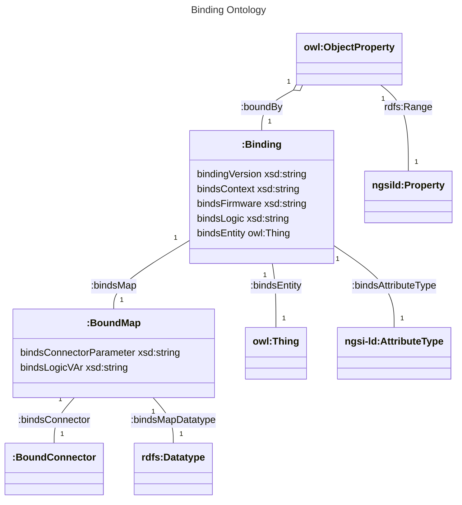

# Dataservice setup
Dataservice grabs data from different source and maps them into the data-model. The simplest setup is a 1:1 mapping which receives one value per NGSI-LD model parameter and forwards it directly. Advanced usecase is to get data from different sources and map it to a common model. A formal binding between the datamodel and the data sources is done and can be configured for different machine setup.
## OPCUA Module
Due to licency conflicts, the OPCUA module `asyncua` is NOT installed automatically and NOT statically used by the dataservice. Instead it must be installed manually from [pypi.org](https://pypi.org/project/asyncua/) or from the [GITHUB sources](https://github.com/FreeOpcUa/opcua-asyncio):

    pip3 install asyncua

## Setup and Activate Device
For this service to work, a multi-entity device activation is needed. That means that a device does not consist any longer of only one entity ID. A hierarchy of subcomponents with different device IDs can be supported.

## Binding Semantics

The terms needed for binding are described in https://industryfusion.github.io/contexts/staging/ontology/v0.1/binding.ttl.




### Classes
```
:Binding
    A binding contains all informations to calculate the value of a model attribute. For instance, to calculate ex:state you need to know where to get the metrics from (e.g. from a machine and an ontology) and how to calculate it e.g. take a numeric value from the machine and use the ontology to create an IRI.
Example:
    ex:myBinding a :Binding .
    ex:myBinding :bindsEntity urn:cutter:1 .
    ex:myBinding :bindsMap ex:map1 .
    ex:myBinding :bindsMap ex:map2 .
    ex:myBinding :bindingVersion "0.1"
    ex:myBinding :bindsFirmware "myFirmware"
    ex:myBinding :bindsLogic "WHERE { BIND(?var1) as ?value}"
    ex:myBinding :bindsAttributeType ngsi-ld:Property

:BoundMap
    A Bound Map contains a single map to define mapping from metrics to a model property. Several maps can be used to provide metrics for model properties. For instance it provides the rules to calculate the property ex:state with two maps:
Example:
    ex:map1 a :BoundMap .
    ex:map2 a :BoundMap .
    ex:map1 :bindsConnector :TestConnector .
    ex:map1 :bindsMapsDataType xsd:float .
    ex:map1 :bindsLogicVar "var1" .
    ex:map1 :bindsConnectorParameter 'mytestparam' .
    ex:map2 :bindsConnector :OPCUAConnector .
    ex:map2 :bindsMapsDataType xsd:boolean .
    ex:map2 :bindsLogicVar "var1" .
    ex:map2 :bindsConnectorParameter 'ns=3;i=5002' .
```
### Properties
```
:bindsLogic
    DataProperty: :bindsLogic
    Domain: 
        :Binding
    Range: 
        xsd:string
    Contains the "WHERE" part of a SPARQL expression. It is expected to deliver a ?value variable. The value can be build from BoundMap variables. If there is no bindslogic value and there is only one single BoundMap, the value is taken directly without SPARQL expression.

```
### SHACL Validation of Bindings

The basic structure of Bindings and Maps can be validated with SHACL. For instance the bindings in `examples/bindings.ttl` can be checkd by

```
pyshacl -s validation/bindings-validation-shacl.ttl examples/bindings.ttl 
```

## Use Dataservice to send testdata
Start dataservice with `startDataservice.py`:
    python3 ./startDataservice.py \<ontology-dir\> \<type\> \<binding-name\>

*\<ontology\>* is supposed to be downloadable from a directory containing different *.ttl files, *\<type\>* is the (in the ontology context) namespaced class (e.g. `ex:MyClass` if `ex:` is defined in the ontologies context) and *\<binding-name\>* is the name of a *.ttl file in the *bindings* subdirectory of the ontoloy.

Example (note `-d` for dry-run):

    python3 startDataservice.py -d -e filter_and_cartridge_subcomponent_entities.ttl examples/ urn:iff:filter1 examples/bindings.ttl

## Example Setup

In this example we are 
* creating entities in the NGSI-LD context broker,
* retrieving the subcomponents,
* onboard a device with subcomponents, and
* configure the dataservice to send example data to different entities in the hierarchy.

Preconditions:

* Local PDT deployment:
  * Process Data Twin is reached by URL `http://ngsild.local/ngsi-ld`
  * Keycloak can be reached by URL `http://keycloak.local`
  * Keycloak secrets for user `realm_user` is stored in secret `
* Installed: `kubectl`, `jq`, `nodejs` v20
* [Telepresence](https://github.com/telepresenceio/telepresence) deployed and connected for `iff` namespace, i.e. host `emqx-listeners` can be pinged from your hostsystem.
* [IFF Ngsild Agent]() is configured to connect to local PDT

### Create Entity in NGSI-LD

In order to access the NGSI-LD Context broker, we need to generate a token:
```
KEYCLOAKURL=http://keycloak.local/auth/realms
NAMESPACE=iff
USER=realm_user
password=$(kubectl -n iff get secret/credential-iff-realm-user-iff -o jsonpath='{.data.password}'| base64 -d | xargs echo)
token=$(curl -d "client_id=scorpio" -d "username=${USER}" -d "password=$password" -d 'grant_type=password' "${KEYCLOAKURL}/${NAMESPACE}/protocol/openid-connect/token"| jq ".access_token"| tr -d '"')
```
Submit `examples/filter_and_cartridge_subcomponent_data.json` to the broker:

```
curl -vv -X POST -H "Authorization: Bearer $token" -d @"examples/filter_and_cartridge_subcomponent_data.json" http://ngsild.local/ngsi-ld/v1/entityOperations/create -H "Content-Type: application/ld+json"
```

### Retrieve all subcomponents

Finally, the NGSI-LD context broker is contacted and all subcomponents are derived.

```
(cd ../datamodel; node ./tools/getSubcomponents.js -e /tmp/filter_entity.ttl -e /tmp/cartridge_entity.ttl -e /tmp/identification_entity.ttl -t $token urn:iff:filter1 )

#RESULT:
 -d urn:iff:cartridge1 -d urn:iff:identification1 -d urn:iff:identification2
```

### Onboard Device with subcomponents

Onboarding is done in [NgsildAgent](../../NgsildAgent). For the testsetup the onboarding can be done as follows:

```
( cd ../../NgsildAgent/util; ./init-device.sh  -d urn:iff:cartridge1 -d urn:iff:identification1 -d urn:iff:identification2 urn:iff:filter1 urn:iff:filter1 )
( cd ../../NgsildAgent/util; ./get-onboarding-token.sh -p $(kubectl -n iff get secret/credential-iff-realm-user-iff -o jsonpath='{.data.password}'| base64 -d) realm_user
)
( cd ../../NgsildAgent/util; ./activate.sh -f )
( cd ../../NgsildAgent; node ./iff-agent.js & )

```

### Start Dataservice

```
python3 startDataservice.py -e filter_and_cartridge_subcomponent_entities.ttl examples/ urn:iff:filter1 examples/bindings.ttl
```

