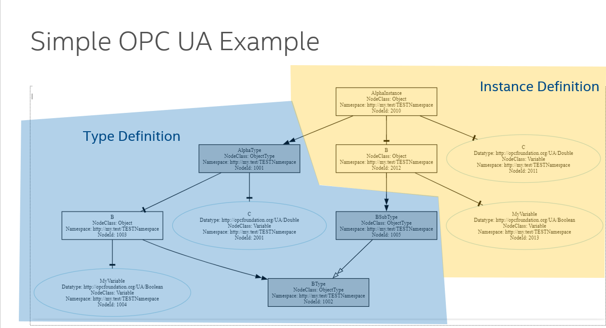
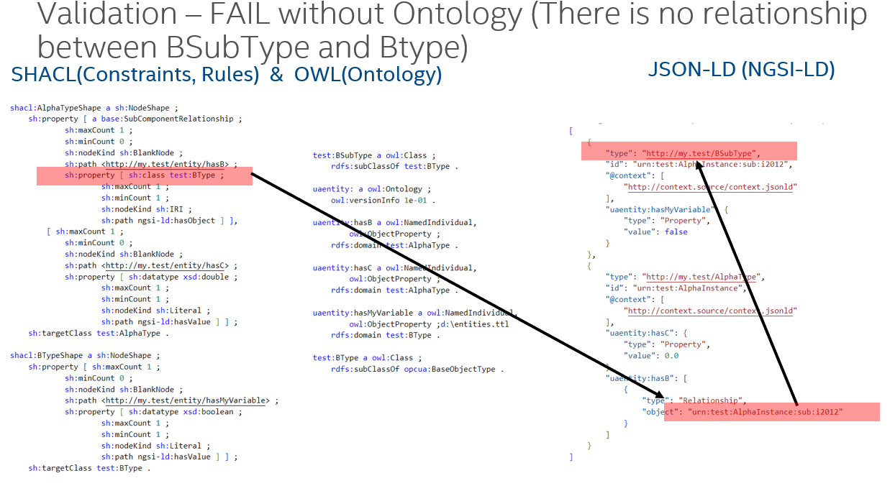
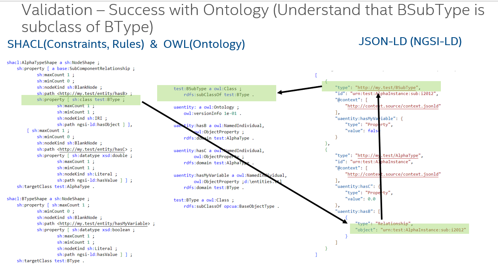

# Simple Example

An example nodeset can be found [here](./files/Example.NodeSet2.xml). It describes the following OPCUA Model:


The Type definition contains an `AlphaType` which has a subcomponent `B` of type `BType`. `AlphaType` has a data variable `C`. Template object `B` has a data variable `MyVariable` and a subclass `BSubType`.

The transformation needs `python3` and `bash` and was tested on Linux. The commands have to be adapted to run in other environments.
The conversion of OPCUA data contains 3 steps:

1. Convert the relevant Companion Specifications to OWL
2. Convert the target nodeset to OWL
3. Extract SHACL and NGSI-LD files from OWL

## Convert the Companion Specifications to OWL

To transform the data, first the relevant OPCUA companion specifications must be transformed into an OWL representation. For our tutorial, only the OPCUA core specification is needed:

```
export NODESET_VERSION=UA-1.05.03-2023-12-15
export BASE_ONTOLOGY=https://industryfusion.github.io/contexts/staging/ontology/v0.1/base.ttl
export CORE_NODESET=https://raw.githubusercontent.com/OPCFoundation/UA-Nodeset/${NODESET_VERSION}/Schema/Opc.Ua.NodeSet2.xml

python3 nodeset2owl.py ${CORE_NODESET} -i ${BASE_ONTOLOGY} -v http://example.com/v0.1/UA/ -p opcua -o core.ttl

```
The result of this step is the file `core.ttl` which contains all the base 
definitions of OPCUA translated to OWL. 

## Convert the Target Nodeset to OWL

This file can now be used to transform the example nodeset into a semantic representation:

```
export NODESET_VERSION=UA-1.05.03-2023-12-15
export BASE_ONTOLOGY=https://industryfusion.github.io/contexts/staging/ontology/v0.1/base.ttl
export CORE_NODESET=https://raw.githubusercontent.com/OPCFoundation/UA-Nodeset/${NODESET_VERSION}/Schema/Opc.Ua.NodeSet2.xml
python3 ./nodeset2owl.py docs/files/Example.NodeSet2.xml -i ${BASE_ONTOLOGY} core.ttl -v http://example.com/v0.1/UA/ -p example -o example.ttl

```
The result of this step is the file `example.ttl` which contains the OWL representation of the [Example.Nodeset2.xml](./files/Example.NodeSet2.xml) file.

## Extract SHACL and NGSI-LD files from OWL

Now, having `core.ttl` and `example.ttl` finally the instance description in `NGSI-LD` and the `SHACL` constraints can be extracted. The following parameters have to be added:

`-t` The type of the root Object which should be extracted (in this case `http://my.test/AlphaType`)
`-n` The namespace of the NGSI-LD objects (use `http://demo.machine/` if the default @context is used)
`-i` the prefix for the object URNs (must start with urn, e.g. `urn:test)

```
python3 ./extractType.py -t http://example.org/AlphaType -n http://demo.machine/  example.ttl
```

As a result, the following files are created:

- `instances.jsonld` The NGSI-LD based instances
- `entities.ttl` The extracted part of the OWL ontology only related to the instances
- `shacl.ttl` The SHACL rules which have been extracted from the nodeset files
- `bindings.ttl` Which contains the rules how to map a live OPCUA service to the NGSI-LD datamodel

## Validation of Instances

To validate whether the instances fit to the OPCUA specification a SHACL validator can be used, for instance `pyshacl`. `pyshacl` can be installed as follows:

```
pip3 install pyshacl
```

Then the validation can be executed as follows:

```
pyshacl -s shacl.ttl  -df json-ld instances.jsonld
```

As a result we get

```
Validation Report
Conforms: False
Results (1):
Constraint Violation in ClassConstraintComponent (http://www.w3.org/ns/shacl#ClassConstraintComponent):
        Severity: sh:Violation
        Source Shape: [ sh:class example:BType ; sh:maxCount Literal("1", datatype=xsd:integer) ; sh:minCount Literal("1", datatype=xsd:integer) ; sh:nodeKind sh:IRI ; sh:path ngsi-ld:hasObject ]
        Focus Node: [ <https://uri.etsi.org/ngsi-ld/hasObject> <urn:test:AlphaInstance:sub:i2012> ; rdf:type <https://uri.etsi.org/ngsi-ld/Relationship> ]
        Value Node: <urn:test:AlphaInstance:sub:i2012>
        Result Path: ngsi-ld:hasObject
        Message: Value does not have class example:BType
```

SHACL reports an error that the subcomponent `B` is not of type `BType`. But, as seen at the beginning, since B is of type `BSubtype` it should be fine, too. But since SHACL has in this case no details about the ontology, for instance the subtypes, it cannot validate it positive. This is showin in the picture below:



Once the ontology (in this case included in the file `entities.ttl`) is considered in the validation, SHACL is reporting success:

```
pyshacl -s shacl.ttl  -e entities.ttl -df json-ld instances.jsonld
```
will lead to the following report:

```
Validation Report
Conforms: True
```
This is explained in the picture below.



# Advanced Example: Build the Pump Example

In this section, we are going to build one of the official OPCUA examples, the instance example for a pump:

    https://raw.githubusercontent.com/OPCFoundation/UA-Nodeset/UA-1.05.03-2023-12-15/Pumps/instanceexample.xml
    

## Build the dependent Companion Specifications

Looking at the raw file, it can be determined that there is no `<Models>` description. But, alternatively, the dependencies in the `<NamespaceUris>` is considered:

    <NamespaceUris>
        <Uri>http://yourorganisation.org/InstanceExample/</Uri>
        <Uri>http://opcfoundation.org/UA/Pumps/</Uri>
        <Uri>http://opcfoundation.org/UA/Machinery/</Uri>
        <Uri>http://opcfoundation.org/UA/DI/</Uri>
    </NamespaceUris>

This list suggests that the dependencies are `core.ttl`, `devices.ttl`, `machinery.ttl` and `pump.ttl`.

    NODESET_VERSION=UA-1.05.03-2023-12-15
    CORE_NODESET=https://raw.githubusercontent.com/OPCFoundation/UA-Nodeset/${NODESET_VERSION}/Schema/Opc.Ua.NodeSet2.xml
    DI_NODESET=https://raw.githubusercontent.com/OPCFoundation/UA-Nodeset/${NODESET_VERSION}/DI/Opc.Ua.Di.NodeSet2.xml
    MACHINERY_NODESET=https://raw.githubusercontent.com/OPCFoundation/UA-Nodeset/${NODESET_VERSION}/Machinery/Opc.Ua.Machinery.NodeSet2.xml
    PUMPS_NODESET=https://raw.githubusercontent.com/OPCFoundation/UA-Nodeset/${NODESET_VERSION}/Pumps/Opc.Ua.Pumps.NodeSet2.xml
    BASE_ONTOLOGY=https://industryfusion.github.io/contexts/staging/ontology/v0.1/base.ttl
    PUMP_EXAMPLE_NODESET=https://raw.githubusercontent.com/OPCFoundation/UA-Nodeset/${NODESET_VERSION}/Pumps/instanceexample.xml

    python3 nodeset2owl.py ${CORE_NODESET} -i ${BASE_ONTOLOGY} -p opcua -o core.ttl
    python3 nodeset2owl.py  ${DI_NODESET} -i ${BASE_ONTOLOGY} core.ttl  -p devices -o devices.ttl
    python3 nodeset2owl.py ${MACHINERY_NODESET} -i ${BASE_ONTOLOGY} core.ttl devices.ttl -p machinery -o machinery.ttl
    python3 nodeset2owl.py  ${PUMPS_NODESET} -i ${BASE_ONTOLOGY} core.ttl devices.ttl machinery.ttl -p pumps -o pumps.ttl
    python3 nodeset2owl.py  ${PUMP_EXAMPLE_NODESET} -i ${BASE_ONTOLOGY} core.ttl devices.ttl machinery.ttl pumps.ttl -n http://yourorganisation.org/InstanceExample/  -p pumpexample -o pumpexample.ttl


The extraction of the resulting SHACL, NGSI-LD and OWL we need again determine the root object type, which is http://opcfoundation.org/UA/Pumps/PumpType, and the ontology containing the pump example `pumpexample.ttl`. The other parameters  for `-n` and `-i` stay the same, compared to the simple example above.

    python3 ./extractType.py -t http://opcfoundation.org/UA/Pumps/PumpType -n http://demo.machine/ pumpexample.ttl -i urn:test


Again the resulting `instances.jsonld`, `shacl.ttl` and `entities.ttl` can be validated by `pyshacl`:

    pyshacl -s shacl.ttl -e entities.ttl -df json-ld instances.jsonld

which will be successful:

    Validation Report
    Conforms: True


