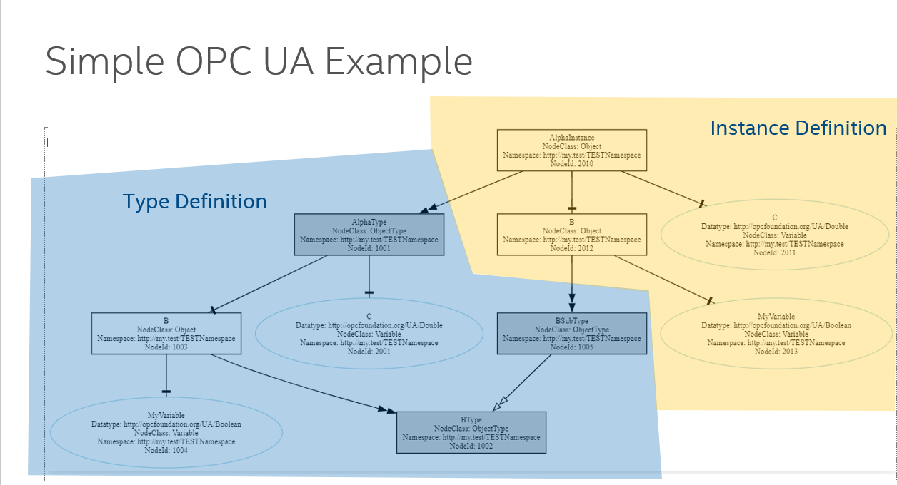
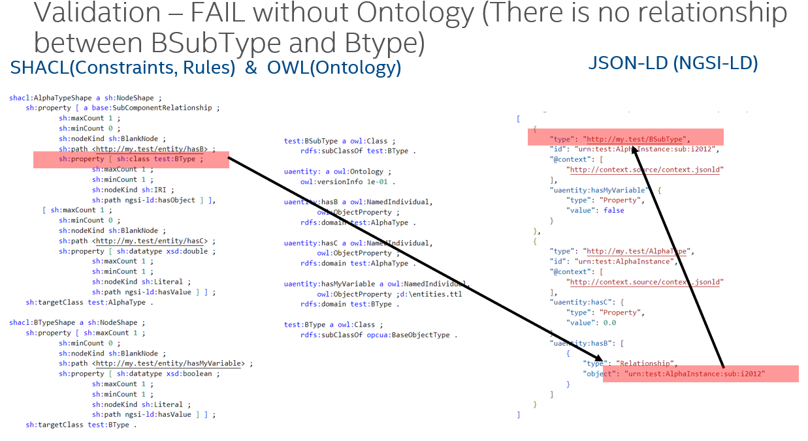
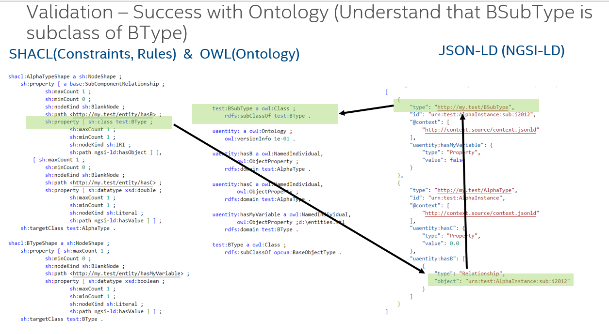

# Simple Example

This tutorial ends in **instance validation**, which is validation type 2 of 3.
See the [Validation Overview](./validation-overview.md) for how it relates to
[ontology validation](./ontology-validation.md) and
[Virtual Type validation](./virtual-type-validation.md).

An example nodeset can be found [here](./files/Example.NodeSet2.xml). It describes the following OPCUA Model:


The Type definition contains an `AlphaType` which has a subcomponent `B` of type `BType`. `AlphaType` has a data variable `C`. Template object `B` has a data variable `MyVariable` and a subclass `BSubType`.

The transformation needs `python3` and `bash` and was tested on Linux. The commands have to be adapted to run in other environments.
The conversion of OPCUA data contains 3 steps:

1. Convert the relevant Companion Specifications to OWL
2. Convert the target nodeset to OWL
3. Extract SHACL and NGSI-LD files from OWL

## Convert the Companion Specifications to OWL

To transform the data, first the relevant OPCUA companion specifications must be transformed into an OWL representation. For our tutorial, only the OPCUA core specification is needed:

```
export NODESET_VERSION=UA-1.05.03-2023-12-15
export BASE_ONTOLOGY=https://industryfusion.github.io/contexts/staging/ontology/v0.3/base.ttl
export BASE_ONTOLOGY_NS=https://industryfusion.github.io/contexts/ontology/v0/base/
export CORE_NODESET=https://raw.githubusercontent.com/OPCFoundation/UA-Nodeset/${NODESET_VERSION}/Schema/Opc.Ua.NodeSet2.xml

python3 nodeset2owl.py ${CORE_NODESET} -i ${BASE_ONTOLOGY} -b ${BASE_ONTOLOGY_NS} -burl ${BASE_ONTOLOGY} -v http://example.com/v0.1/UA/ -p opcua -o core.owl.ttl

```
The result of this step is the file `core.owl.ttl` which contains all the base 
definitions of OPCUA translated to OWL. 

`BASE_ONTOLOGY` and `BASE_ONTOLOGY_NS` are two different strings and both are
needed: the first is the fetchable base ontology *document*, the second is the
*term namespace* the `base:` IRIs inside it are minted under. These are the same
values `translate_default_nodesets.make` uses, so
`make -f translate_default_nodesets.make core.owl.ttl` is an equivalent
shortcut for this step.

## Convert the Target Nodeset to OWL

This file can now be used to transform the example nodeset into a semantic representation:

```
python3 ./nodeset2owl.py docs/files/Example.NodeSet2.xml -i ${BASE_ONTOLOGY} core.owl.ttl -b ${BASE_ONTOLOGY_NS} -burl ${BASE_ONTOLOGY} -v http://example.com/v0.1/example/ -p example -o example.owl.ttl

```
The result of this step is the file `example.owl.ttl` which contains the OWL representation of the [Example.Nodeset2.xml](./files/Example.NodeSet2.xml) file.

A nodeset and every nodeset it depends on must be built against the *same* base
ontology, so keep using the `BASE_ONTOLOGY`/`BASE_ONTOLOGY_NS` exported above
for the rest of this tutorial.

## Extract SHACL and NGSI-LD files from OWL

Now, having `core.owl.ttl` and `example.owl.ttl` finally the instance description in `NGSI-LD` and the `SHACL` constraints can be extracted. The following parameters have to be added:

`-t` The type of the root Object which should be extracted (in this case `http://example.org/AlphaType`)
`-n` The namespace of the NGSI-LD objects (use `http://demo.machine/` if the default @context is used)
`-i` the prefix for the object URNs (must start with urn, e.g. `urn:test`)

```
python3 ./owl2instances.py -t http://example.org/AlphaType -n http://demo.machine/ example.owl.ttl -i urn:test
```

As a result, the following files are created:

- `instances.jsonld` The NGSI-LD based instances
- `entities.ttl` The extracted part of the OWL ontology only related to the instances
- `shacl.ttl` The SHACL rules which have been extracted from the nodeset files
- `bindings.ttl` Which contains the rules how to map a live OPCUA service to the NGSI-LD datamodel

## Validation of Instances

To validate whether the instances fit to the OPCUA specification a SHACL validator can be used, for instance `pyshacl`. `pyshacl` can be installed as follows:

```
pip3 install pyshacl
```

Then the validation can be executed as follows:

```
pyshacl -s shacl.ttl  -df json-ld instances.jsonld
```

As a result we get

```
Validation Report
Conforms: False
Results (1):
Constraint Violation in ClassConstraintComponent (http://www.w3.org/ns/shacl#ClassConstraintComponent):
        Severity: sh:Violation
        Source Shape: [ sh:class example:BType ; sh:maxCount Literal("1", datatype=xsd:integer) ; sh:minCount Literal("1", datatype=xsd:integer) ; sh:nodeKind sh:IRI ; sh:path ngsi-ld:hasObject ]
        Focus Node: [ <https://uri.etsi.org/ngsi-ld/hasObject> <urn:testnodei2012> ; rdf:type <https://uri.etsi.org/ngsi-ld/Relationship> ]
        Value Node: <urn:testnodei2012>
        Result Path: ngsi-ld:hasObject
        Message: Value does not have class example:BType
```

SHACL reports an error that the subcomponent `B` is not of type `BType`. But, as seen at the beginning, since B is of type `BSubtype` it should be fine, too. But since SHACL has in this case no details about the ontology, for instance the subtypes, it cannot validate it positive. This is showin in the picture below:



Once the ontology (in this case included in the file `entities.ttl`) is considered in the validation, SHACL is reporting success:

```
pyshacl -s shacl.ttl  -e entities.ttl -df json-ld instances.jsonld
```
will lead to the following report:

```
Validation Report
Conforms: True
```
This is explained in the picture below.


### Using validate.py instead

`pyshacl` is invoked directly above so that it is clear what is actually being
checked against what. This repository also ships `validate.py`, which wraps the
same evaluation and defaults `-s` to `shacl.ttl` and `-e` to `entities.ttl`, so
the successful run above is simply:

```
python3 validate.py instances.jsonld
```

```
Validation Conforms: True
No validation errors found.
```

`-m instance` is the default mode, so it does not have to be given. Adding `-x`
prints an extended report: for every violation it also resolves the failing
shape back to its name and path, and dumps the offending entity as nested JSON.
On a large model that context is usually what makes a report actionable:

```
python3 validate.py -x instances.jsonld
```

`validate.py` exits with status `1` when validation fails, which makes it usable
in a CI pipeline.

## The other two validations

Instance validation answers "does *this object* conform to the type it claims to
be?". It does not tell you whether the nodeset that produced the shapes is itself
well formed, nor whether the type hierarchy is logically satisfiable at all.
Those are separate checks:

- [Ontology Validation](./ontology-validation.md) checks the nodeset itself —
  `HasComponent`, `HasProperty`, `ValueRank`, `ModellingRule` usage.
- [Virtual Type Validation](./virtual-type-validation.md) uses a DL reasoner to
  find type declarations that no instance could ever satisfy.

See the [Validation Overview](./validation-overview.md) for how the three relate.


# Advanced Example: Build the Pump Example

In this section, we are going to build one of the official OPCUA examples, the instance example for a pump:

    https://raw.githubusercontent.com/OPCFoundation/UA-Nodeset/UA-1.05.03-2023-12-15/Pumps/instanceexample.xml
    

## Build the dependent Companion Specifications

Looking at the raw file, it can be determined that there is no `<Models>` description. But, alternatively, the dependencies in the `<NamespaceUris>` is considered:

    <NamespaceUris>
        <Uri>http://yourorganisation.org/InstanceExample/</Uri>
        <Uri>http://opcfoundation.org/UA/Pumps/</Uri>
        <Uri>http://opcfoundation.org/UA/Machinery/</Uri>
        <Uri>http://opcfoundation.org/UA/DI/</Uri>
    </NamespaceUris>

This list suggests that the dependencies are `core.owl.ttl`, `di.owl.ttl`, `machinery.owl.ttl` and `pumps.owl.ttl`.

    NODESET_VERSION=UA-1.05.03-2023-12-15
    CORE_NODESET=https://raw.githubusercontent.com/OPCFoundation/UA-Nodeset/${NODESET_VERSION}/Schema/Opc.Ua.NodeSet2.xml
    DI_NODESET=https://raw.githubusercontent.com/OPCFoundation/UA-Nodeset/${NODESET_VERSION}/DI/Opc.Ua.Di.NodeSet2.xml
    MACHINERY_NODESET=https://raw.githubusercontent.com/OPCFoundation/UA-Nodeset/${NODESET_VERSION}/Machinery/Opc.Ua.Machinery.NodeSet2.xml
    PUMPS_NODESET=https://raw.githubusercontent.com/OPCFoundation/UA-Nodeset/${NODESET_VERSION}/Pumps/Opc.Ua.Pumps.NodeSet2.xml
    BASE_ONTOLOGY=https://industryfusion.github.io/contexts/staging/ontology/v0.3/base.ttl
    BASE_ONTOLOGY_NS=https://industryfusion.github.io/contexts/ontology/v0/base/
    PUMP_EXAMPLE_NODESET=https://raw.githubusercontent.com/OPCFoundation/UA-Nodeset/${NODESET_VERSION}/Pumps/instanceexample.xml

    python3 nodeset2owl.py ${CORE_NODESET} -i ${BASE_ONTOLOGY} -b ${BASE_ONTOLOGY_NS} -burl ${BASE_ONTOLOGY} -v http://example.com/v0.1/UA/ -p opcua -o core.owl.ttl
    python3 nodeset2owl.py ${DI_NODESET} -i ${BASE_ONTOLOGY} core.owl.ttl -b ${BASE_ONTOLOGY_NS} -burl ${BASE_ONTOLOGY} -v http://example.com/v0.1/DI/ -p di -o di.owl.ttl
    python3 nodeset2owl.py ${MACHINERY_NODESET} -i ${BASE_ONTOLOGY} core.owl.ttl di.owl.ttl -b ${BASE_ONTOLOGY_NS} -burl ${BASE_ONTOLOGY} -v http://example.com/v0.1/Machinery/ -p machinery -o machinery.owl.ttl
    python3 nodeset2owl.py ${PUMPS_NODESET} -i ${BASE_ONTOLOGY} core.owl.ttl di.owl.ttl machinery.owl.ttl -b ${BASE_ONTOLOGY_NS} -burl ${BASE_ONTOLOGY} -v http://example.com/v0.1/Pumps/ -p pumps -o pumps.owl.ttl
    python3 nodeset2owl.py ${PUMP_EXAMPLE_NODESET} -i ${BASE_ONTOLOGY} core.owl.ttl di.owl.ttl machinery.owl.ttl pumps.owl.ttl -b ${BASE_ONTOLOGY_NS} -burl ${BASE_ONTOLOGY} -n http://yourorganisation.org/InstanceExample/ -v http://example.com/v0.1/pumpexample/ -p pumpexample -o pumpexample.owl.ttl

The whole chain, including the dependency order, is also encoded in
`translate_default_nodesets.make`, so

    make -f translate_default_nodesets.make pumpexample.owl.ttl

builds exactly the same five files. Expect a few minutes: `pumps.owl.ttl` alone
is several megabytes of Turtle.


The extraction of the resulting SHACL, NGSI-LD and OWL we need again determine the root object type, which is http://opcfoundation.org/UA/Pumps/PumpType, and the ontology containing the pump example `pumpexample.owl.ttl`. The other parameters  for `-n` and `-i` stay the same, compared to the simple example above.

    python3 ./owl2instances.py -t http://opcfoundation.org/UA/Pumps/PumpType -n http://demo.machine/ pumpexample.owl.ttl -i urn:test


Again the resulting `instances.jsonld`, `shacl.ttl` and `entities.ttl` can be validated by `pyshacl`:

    pyshacl -s shacl.ttl -e entities.ttl -df json-ld instances.jsonld

which will be successful:

    Validation Report
    Conforms: True

The intermediate files this chain produced are also good inputs for the other
two validations, now on a real companion specification rather than a toy one:

    python3 validate.py -m ontology -ni di.owl.ttl

    make -f translate_default_nodesets.make core.vt.owl.ttl di.vt.owl.ttl machinery.vt.owl.ttl pumps.vt.owl.ttl
    python3 validate.py -m vt pumps.vt.owl.ttl

The ontology check is shown on `di.owl.ttl` because it is small enough to finish
in seconds; the same command works on `machinery.owl.ttl` or `pumps.owl.ttl`,
just far more slowly.

Note that the Virtual-Types targets have to be listed in dependency order:
`pumps.vt.owl.ttl` `owl:imports` `machinery.vt.owl.ttl`, which imports
`di.vt.owl.ttl` and `core.vt.owl.ttl`, and the Makefile does not chain the
`*.vt.owl.ttl` targets for you.

See [Ontology Validation](./ontology-validation.md) and
[Virtual Type Validation](./virtual-type-validation.md).


