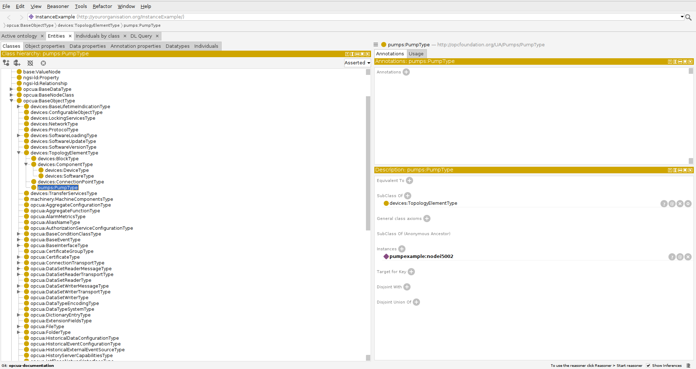
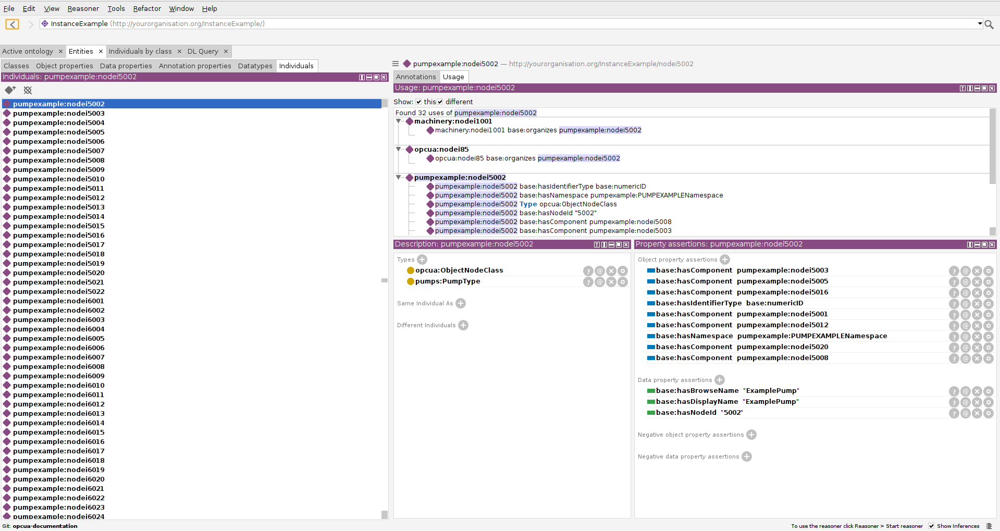

# Tools

## Protégé

[Protégé](https://protege.stanford.edu/) is a free, open-source platform that provides a growing user community with a suite of tools to construct domain models and knowledge-based applications with ontologies [7].
Download and install the version for your platform. Once it is installed, you can use Protégé to browse and analyse the OWL files which have been created in the sections before. Start it and open the `example.ttl` file (*File=>Open*). You see that the just created `pumpexample` is imported with all dependent companion specifications. In order to have a more compact visualization select *render by prefix* in the *View* menu.
One can then browse the ontology, e.g. the opcua object types. In order to see them, select the *Entities* Tab. Then you can browse through the class hierarchy as shown below:

In this example the `pumps:PumpType` is selected and is showing the instances on the right side. It is then possible to click through the graph and subcomponents and query fields and structures.

There are different query options, like SPARQL, DL-Queries and searches for regular expression.

## Fuseki (SPARQL query)
 TBD

