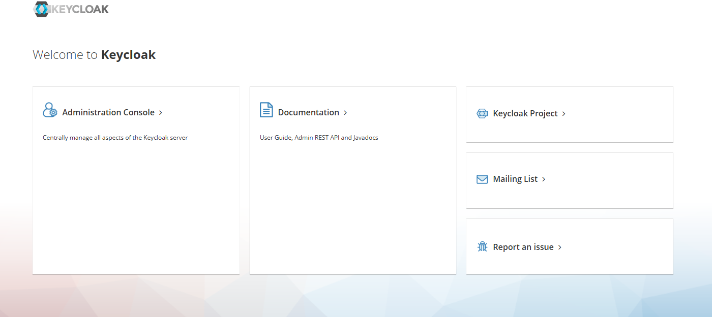
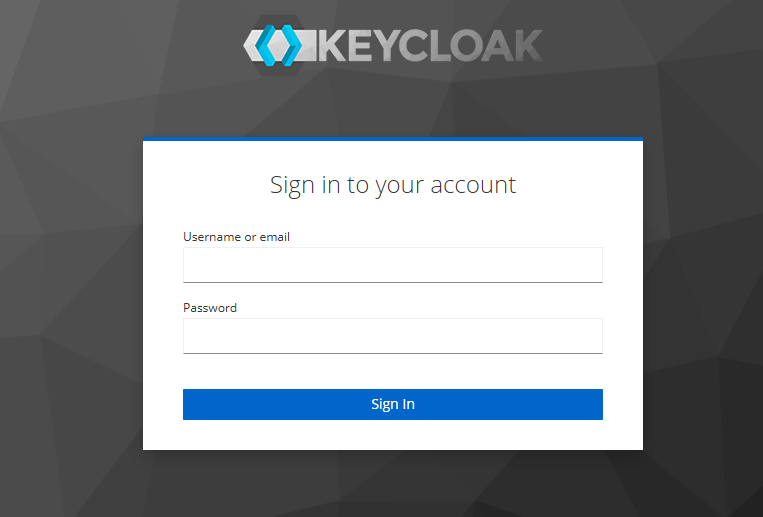
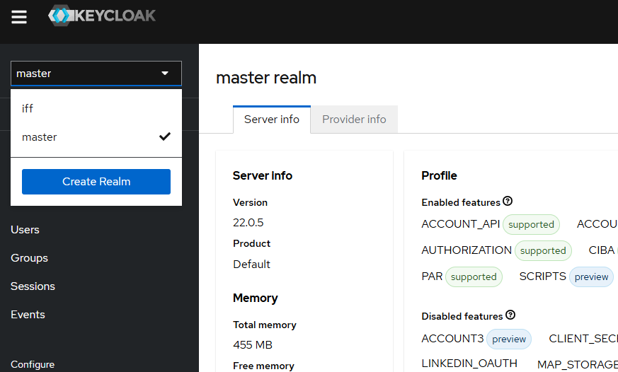
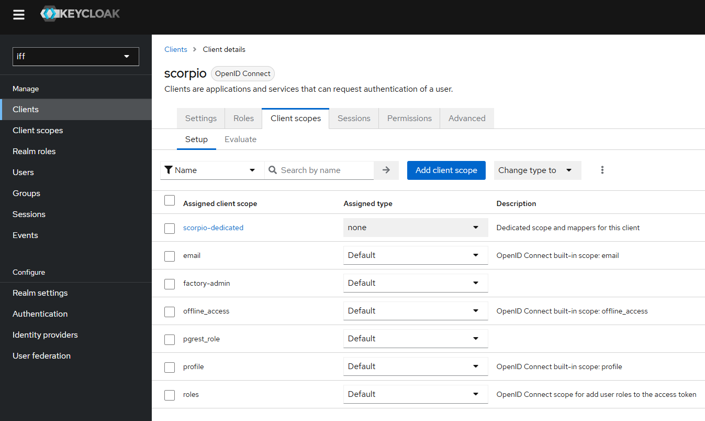
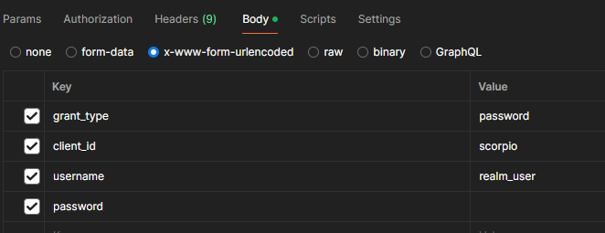
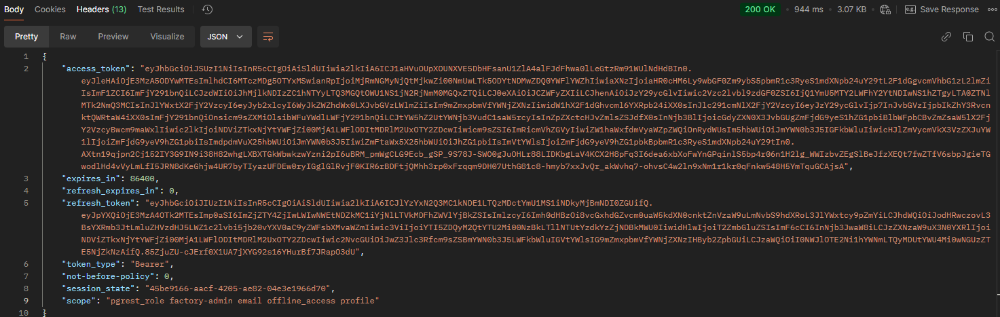
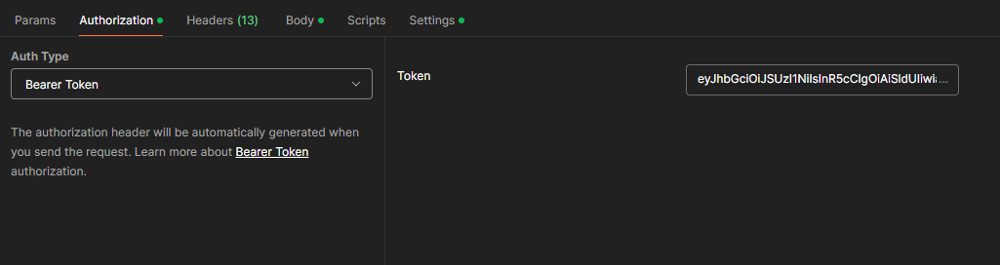
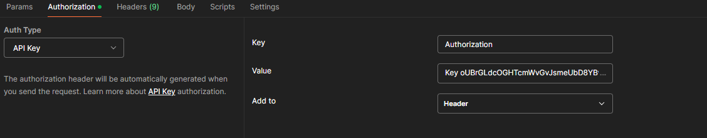

## IndustryFusion Digital Twin REST API overview

### What is the use of the Digital Twin (DT) REST API?

Digital Twin consists of multiple open-source components namely, 

1. Keycloak - Access Management to all DT services.
2. Scorpio Broker - NGSI-LD Context broker which lets to manage (CRUD) digital assets.
3. PGRest - Wrapper to PostgreSQL database, serves time-series for the asset data.
4. Alerta - Serves alerts from the streaming validation jobs.

All these above services are utilized in the Digital Twin framework. Each of these services have seperate REST API documentation which can be utilized and used for the IFF Asset data.

### When to use Digital Twin REST API?

If the interaction is directly with Digital Twin, these REST APIs can be utilized to create assets and interact with it. For example, if a machine/asset needs to be created digitally, Scorpio Broker API lets to create and manage assets with the Authorization token from Keycloak. Then, once the gateway is connected to the machine and IFF agent sends data to the digital asset, PGRest can be used to see the data wuth time-series stamps. Then, when the SHACL rules are implemented with streaming jobs, the Alerta API can be used to see the alerts generated according to the rules in real-time. 

If the interaction is intended from IndustryFusion-X ecosystem, which is the commercial implementation of IndutryFusion open-source, the user must follow the registration of the company in ifric.org, and must use industryfusion-x.org to create Process Digital Twin (PDT) assets in the platform. Then, the user must use the dedicated hardwares and Industryfusion-x Factory Suite in which the user can use the Factory Manager UI application to interact with DigitalTwin services.

### Sequence of Digital Twin API usage

Once the DigitalTwin is deployed on Kubernetes, as the output, four URL endpoints (Keycloak, Scorpio, PGRest, Alerta) will be exposed for the user to access REST APIs. 

#### 1. Get access token from Keycloak

Visit Keyclock UI: keycloak-endpoint/auth/



Click on 'Administration Console'.



Username is 'admin', using below command fetch the password from DT deployment.

`kubectl -n iff get secret/keycloak-initial-admin -o=jsonpath='{.data.password}' | base64 -d | xargs echo`




Select 'iff' realm in the above screen.



Different clients has different scopes. In this example, the client 'scorpio' will be used to access all APIs in this documentation. Make sure the 'scorpio' client has the above shown scopes. If not present, add them using 'Add Client scope'. 

**POST keycloak-endpoint/auth/realms/iff/protocol/openid-connect/token**

**Body:**



Fetch the password 'realm_user' for the request using the below command.

`kubectl -n iff get secret/credential-iff-realm-user-iff -o jsonpath='{.data.password}'| base64 -d | xargs echo`


**Response:**




#### 2. Define and Create the Asset in Scorpio Broker

**Asset Definition:**

A basic JSON-LD/NGSI-LD asset looks like below.

```json
{
    "id": "urn:asset:1",
    "type": "http://www.industry-fusion.org/schema#bendingMachine",
    "http://www.industry-fusion.org/fields#active_current": {
        "type": "Property",
        "value": 222
    }
}

```

**POST scorpio-endpoint/ngsi-ld/v1/entities/**



Use the Keycloak access_token from last step in the header as Bearer token and use the JSON example asset in the body.

#### 3. Create Streaming Validation Jobs

The Digital Twin (DT) application generates alerts based on semantic models. Two important files, knowledge.ttl and shacl.ttl, define the rules for generating these alerts.

Create a new folder, for example, 'demo' inside semantic-model/kms/.

Create files called knowledge.ttl and shacl.ttl in the demo folder.

**knowledge.ttl**

```
# baseURI: http://www.industry-fusion.org/schema

@prefix : <http://www.industry-fusion.org/schema#> .
@prefix owl: <http://www.w3.org/2002/07/owl#> .
@prefix rdf: <http://www.w3.org/1999/02/22-rdf-syntax-ns#> .
@prefix rdfs: <http://www.w3.org/2000/01/rdf-schema#> .
@prefix schema: <https://industry-fusion.com/schema#> .
@prefix xsd: <http://www.w3.org/2001/XMLSchema#> .

<http://www.industry-fusion.org/schema>
  rdf:type owl:Ontology ;
  owl:versionInfo "Created with TopBraid Composer" ;
.
:bendingMachine
  rdf:type rdfs:Class ;
.

```

**shacl.ttl**

```
@prefix : <http://www.industry-fusion.org/fields#> .
@prefix fields: <https://www.industry-fusion.com/fields#> .
@prefix owl: <http://www.w3.org/2002/07/owl#> .
@prefix rdf: <http://www.w3.org/1999/02/22-rdf-syntax-ns#> .
@prefix rdfs: <http://www.w3.org/2000/01/rdf-schema#> .
@prefix schema: <http://www.industry-fusion.org/schema#> .
@prefix sh: <http://www.w3.org/ns/shacl#> .
@prefix xsd: <http://www.w3.org/2001/XMLSchema#> .

<http://www.industry-fusion.org/fields>
  rdf:type owl:Ontology ;
  owl:imports <http://www.industry-fusion.org/schema> ;
.

:active_current
  rdf:type sh:NodeShape ;
  sh:property [
      rdf:type sh:PropertyShape ;
      sh:path <http://www.industry-fusion.org/fields#active_current> ;
      sh:maxCount 1 ;
      sh:minCount 1 ;
      sh:name "active_current" ;
      sh:nodeKind sh:BlankNode ;
      sh:order "1" ;
      sh:property [
          sh:path <https://uri.etsi.org/ngsi-ld/hasValue> ;
          sh:maxCount 1 ;
          sh:maxInclusive "500" ;
          sh:minCount 1 ;
          sh:minInclusive "100" ;
          sh:nodeKind sh:Literal ;
        ] ;
    ] ;
  sh:targetClass schema:bendingMachine ;
.

<http://www.industry-fusion.org/fields#active_current>
  rdf:type rdf:Property ;
.

```

The above files defines validation rules for type bendingMachine, and gives alerts if the data being sent to the active_current property is above 500 and below 100.

Now, to deploy these rules as jobs in DT, follow the below commands.

`cd /DigitalTwin/semantic-model/shacl2flink`

`make setup`

`KMS_DIR=./../kms/demo make prepare-kms`

`make flink-deploy`


#### 4. Send data to the Digital Asset using IFF Agent

To start the agent, Go to NgsildAgent folder and run the following commands.

```bash
npm install
cp config/config.json.template config/config.json
./iff-agent.js
```

Go to NgsildAgent/util directory of DigitalTwin. To send/update the data to the asset created in last step use the following commands.

```bash
./init-device.sh urn:asset:1 gatewayid
password=$(kubectl -n iff get secret/credential-iff-realm-user-iff -o jsonpath='{.data.password}'| base64 -d)
./get-onboarding-token.sh -p ${password} realm_user
./activate.sh -f
./send_data.sh "http://www.industry-fusion.org/fields#active_current" "501"
```

#### 5. Access Time-series data of the digital asset from PGRest

Once the data is sent to the asset, timeseries data of the asset can be retrieved using PGRest API.

**GET pgrest-endpoint/pgrest/entityhistory?entityId=eq.urn:asset:1**


Use the Keycloak access_token in header.

**Response:**

```json
    {
        "observedAt": "2024-08-29T09:23:39+00:00",
        "modifiedAt": "2024-08-29T09:23:39+00:00",
        "entityId": "urn:asset:1",
        "attributeId": "http://www.industry-fusion.org/fields#active_current",
        "attributeType": "https://uri.etsi.org/ngsi-ld/Property",
        "datasetId": "@none",
        "nodeType": "@value",
        "value": "501",
        "valueType": null,
        "index": 0
    }
```


#### 6. Access alerts from Alerta

As the value sent to the asset in the above step is above 500. The Alerta API can be used to fetch alerts based on the validation rules.

**GET alerta-endpoint/alerta/api/alerts**

Alerta needs a seperate API key for authorization. Fetch the key and send it in headers as shown below.

Alerta Key: `kubectl -n iff get secret/alerta -o jsonpath='{.data.alerta-admin-key}'| base64 -d`




**Response**

```json
{
    "alerts": [],
    "autoRefresh": true,
    "lastTime": "2024-11-06T17:00:08.645Z",
    "message": "not found",
    "more": false,
    "page": 1,
    "pageSize": 50,
    "pages": 0,
    "severityCounts": {},
    "status": "ok",
    "statusCounts": {},
    "total": 0
}
```

### API Documentation & Postman collections

#### Keycloak

API Documentation: [Click here](https://www.keycloak.org/docs/latest/authorization_services/index.html#_service_authorization_api)

Postman Collection: [Click here](keycloak.postman_collection.json)

#### Scorpio Broker

API Documentation: [Click here](https://scorpio.readthedocs.io/en/latest/API_walkthrough.html#)

Postman Collection: [Click here](Scorpio_Broker_latest.postman_collection.json)

#### PGRest

API Documentation: [Click here](https://docs.postgrest.org/en/stable/references/api/tables_views.html#read)

Postman Collection: [Click here](pgrest.postman_collection.json)

#### Alerta

API Documentation: [Click here](https://docs.alerta.io/api/reference.html)

Postman Collection: [Click here](https://www.postman.com/api-evangelist/server-density/folder/t2fcqfc/alerts?action=share&creator=29168847&ctx=documentation)