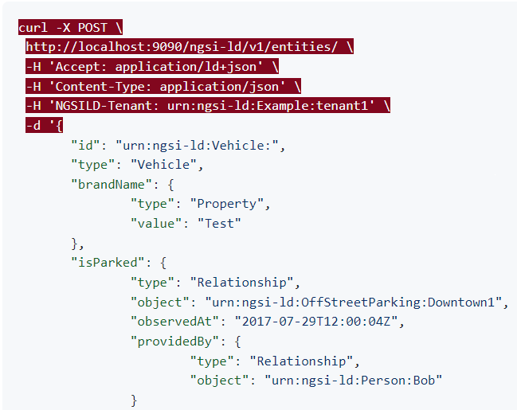
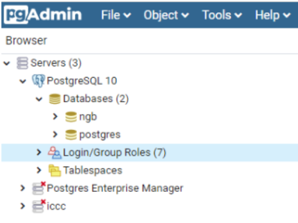
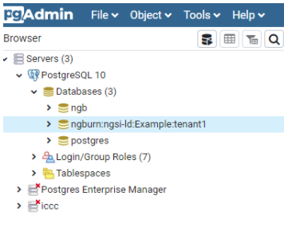
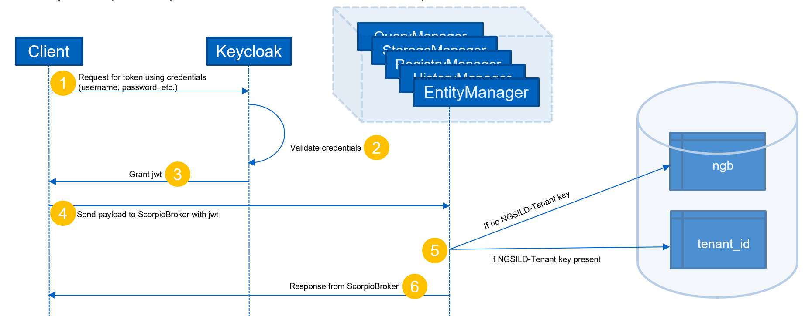

# **Multi-tenancy Concept for Digital Twin**

**1. Introduction**

Multi-tenancy is a software architecture paradigm where a single instance of software is shared among multiple _groups_ of users called tenants. Tenants are logically isolated from one another and do not have access to each other's data. They have equal access (or at least opportunity to access) to the system's resources.

Multi-tenancy is a cost-effective alternative to running dedicated systems for individual tenants and ensures that current resources are utilized to the fullest.

**2. Multi-tenancy support in existing Scorpio Broker**

Scorpio Broker implements soft multi-tenancy, i.e., tenants are trusted to be non-malicious and strict isolation is not implemented.

Tenants are created by using the _NGSILD-Tenant_ header as defined in the ETSI NGSI-LD specification. Tenants are created when the header is present in the context of a create (Entity, Subscription, Registration) operation. If a POST request is made with this header present, Scorpio Broker processes the value of this header as the tenant's name.

There is a single instance of PostgreSQL database which is shared by the tenants. Each tenant is assigned their own separate table within the database. There is no additional authentication for performing I/O operations across various tables within the database; the default database user credentials are utilized to authenticate all tenants. If the tenant header is not present, the payload is recorded in the default table.

 

As of November 2021, there are no plans to implement additional isolation for tenants.

NGSI-LD specification defines support for multi-tenancy using headers. It does not provide any separate API to manage (create, update, delete) tenants explicitly i.e there is no tenant management.

**3. Multi-tenancy support in Keycloak**

Keycloak supports multi-tenancy using the concept of Realms.

Realms are logical collections of Keycloak objects - Users, Clients, Roles and Groups. Realms are isolated from one another and can only manage and authenticate their own members.

The Keycloak documentation does not explicitly specify how multi-tenancy is implemented within the stack. However, we can deduce that it is probably not using database-level isolation. Here's how: While Keycloak ships with an embedded RDBMS called H2, it recommends users to replace it with a more "production-grade" database or HA cluster. The documentation doesn't mention requiring separate databases for each realm in this section, and so we can conclude that they are not using isolated persistence to support multiple realms.

**4. Multi-tenancy support integrating Scorpio Broker and Keycloak**

Integration of Scorpio Broker and Keycloak to achieve multi-tenancy can take any of the below two approaches:

- A Keycloak realm per tenant (i.e., each unique value for _NGSILD-Tenant_ header)
- A Keycloak realm for all tenants

**4.1 A Keycloak realm per tenant**

The clients of Scorpio APIs must be registered as **"users"** within Keycloak for them to be authenticated to communicate with Scorpio Broker services. Users are realm-level objects, and all the users belonging to a single tenant can be registered under a single realm.

Scorpio Broker application is compliant with microservices patterns, and each of the microservices must be registered as **"clients"** within Keycloak. _Clients_ too are realm-level objects. Users within a realm would not be able to communicate with Scorpio Broker components unless the latter belong to the same realm as the former.

To enable Scorpio Broker services to essentially "belong" to multiple realms, they need to be registered with multiple realms. A Keycloak client is an entity that identifies itself with Keycloak using a _client ID_ and _client secret_ to establish trust between Scorpio and Keycloak. Therefore, if any Scorpio Broker microservice is registered in multiple realms, it will be provided with multiple client secrets, one for each realm. Every time a new tenant is registered, the Scorpio Broker must be updated with the tenant onboarding.

Additionally, the realm name must be passed as a header in the API requests.

**4.2 Single Keycloak Realm across Tenants**

Having users and tenants assigned to a single realm leads to a simplified configuration. Users can be added to Keycloak at any time irrespective of the _NGSILD-Tenant_ header. When the API request triggers a Scorpio Broker microservice, the latter creates a new table within its database instance to achieve multi-tenancy.

**5. Summary**

In this document, we explored the ways in which Scorpio Broker and Keycloak have implemented multi-tenancy. We also presented two approaches to achieve multi-tenancy for Keycloak integration with Scorpio Broker.

**References**

1. [https://github.com/Scorpio Broker /Scorpio Broker /blob/development/docs/en/source/multiTenant.rst](https://github.com/ScorpioBroker/ScorpioBroker/blob/development/docs/en/source/multiTenant.rst)
2. [https://docbox.etsi.org/ISG/CIM/Open/NGSI-LDv1.3.1-New\_Features\_and\_Changes.pdf](https://docbox.etsi.org/ISG/CIM/Open/NGSI-LDv1.3.1-New_Features_and_Changes.pdf)
3. [https://github.com/Scorpio Broker /Scorpio Broker /issues/267](https://github.com/ScorpioBroker/ScorpioBroker/issues/267)
4. [https://www.keycloak.org/docs/latest/server\_installation/#\_database](https://www.keycloak.org/docs/latest/server_installation/#_database)