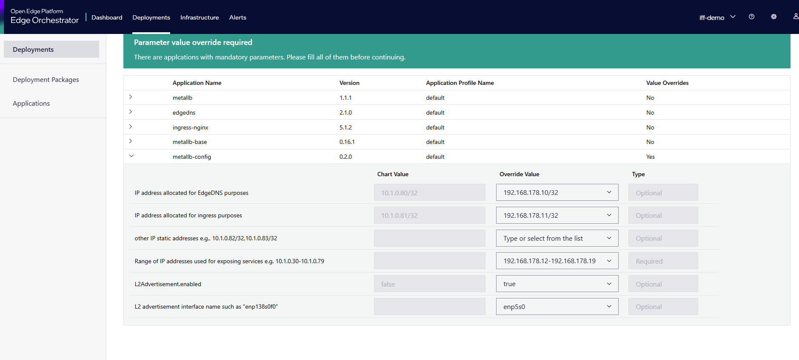

## Running IFF-PDT on Open Edge Platform EMF hosted edge node

The setup manual includes the following sections and their details.

The documentation has two parts:

1. Infrastructure Layer - Provisioning of central Server Hardware, OS, Kubernetes, EMF  [[Edge Manageability Framework](https://github.com/open-edge-platform/edge-manageability-framework)] for managing gateways inside the factory, Gateway hardware preparation from Open Edge Platform EMF and supporting services.
2. Application Layer - Provisioning of DigitalTwin on the above central server, DigitalTwin API interaction for creating Asset objects and validation jobs, Building and deploying Gateway services, interaction with DigitalTwin APIs.

**Note:** The Infrastructure layer utilizes OEP  [[Open Edge Platform](https://github.com/open-edge-platform)] cloud hosted Edge Manageability Framework. The application layer is independent of Infrastructure layer. Any existing or new Kubernetes cluster at Edge or Cloud can be used for both server and gateway service deployments. Make sure the IFF-Akri controller and PDT services are deployed properly on desired Kubernetes cluster by setting KUBECONFIG variable before installation procedures.


### Infrastructure Layer
 Provision edge node as per OEP EMF flow with running kubernetes cluster.
 See documents for further details [[EMF Onboard Edge Nodes](https://docs.openedgeplatform.intel.com/edge-manage-docs/dev/user_guide/set_up_edge_infra/edge_node_onboard.html) ]

### Application Layer

1. Install required binaries like helm, helmfile, bats as listed in PDT helm README for hosted K8 cluster
2. Remove/comment cert-manager from install_operators.sh and uninstall_operators.sh as its already installed.
3. Start installing using [helm installation instruction of hosted k8s](https://github.com/yshashix/DigitalTwinScorpio/tree/main/helm) using oep.yaml environment and dockerhub access. Do following steps from 4 on another console after namespaces are created as steps from 4 is used to make it successfully installed. 
   ```
   git checkout v0.7.0
   cd ../test
   bash ./install-platform.sh -c all
   ```
   Use order flag deployment if some fails in middle and session expire
   Example 1:
   ```
   bash ./install-platform.sh -c apply -t order=third
   ```
4. By default application installed on edge node using helm/kubectl command will not have network policies to allow Egress/Ingress in OEP Edge Node. So add this network policies to different namespaces installed using install PDT script like iff,emqx-operator-system,minio-operator.
Create network-policy.yaml with below content and apply 
   ```
   apiVersion: networking.k8s.io/v1
   kind: NetworkPolicy
   metadata:
   name: debug-egress
   spec:
   policyTypes:
   - Egress
   egress:
   - {}
   ---

   apiVersion: networking.k8s.io/v1
   kind: NetworkPolicy
   metadata:
   name: debug-ingress
   spec:
   policyTypes:
   - Ingress
   ingress:
   - {}
   
   $ kubectl apply -f network-policy.yaml -n iff ( also for ns: minio-operator,emqx-operator-system)
   ```

5.  Apply loadbalancer deployment package from extension list with Metallb+ nginx- ingress with sample config as per image. Sometimes need to assign external IP manually for ingress-nginx-controller-controller service from ingress-nginx namespace to let nginx-ingress have external IP which will be assigned to ingress (keycloak,alerta,emqx,ngsild)
   

6. Configure edge-dns or rke2-dns config management Corefile for your domain name added as per oep environment file [oep-testing.industry-fusion.com], see test/setup-local-ingress.sh for idea
   ```
   $ kubectl edit cm rke2-coredns-rke2-coredns -n kube-system -o yaml

   - add in Corefile as below, mark addition after ready  till fallthrough your domain name with external IP

   apiVersion: v1
   data:
      Corefile: ".:53 {\n    errors\n    health {\n        lameduck 5s\n    }\n    ready\n
    \   hosts { \n        192.168.178.11  oep-testing.industry-fusion.com \n     fallthrough\n    }\n    kubernetes  cluster.local  cluster.local in-addr.arpa ip6.arpa {\n        pods insecure\n        fallthrough in-addr.arpa
    ip6.arpa\n        ttl 30\n    }\n    prometheus  0.0.0.0:9153\n    forward  .
    /etc/resolv.conf\n    cache  30\n    loop\n    reload\n    loadbalance\n}"

   ```

7. Update keycloak ingress with below as ingress redirect for http traffic to https in default scenario and for https we need signed certificate. We use in environment http for now.
   ```
   $ kubectl edit ingress keycloak-iff-ingress -n iff -o yaml
   Add below line in annotation:
   nginx.ingress.kubernetes.io/force-ssl-redirect: "false"
   nginx.ingress.kubernetes.io/ssl-redirect: "false"
   ```


